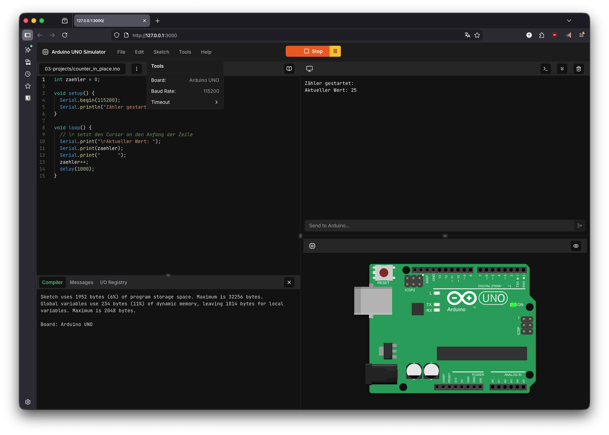
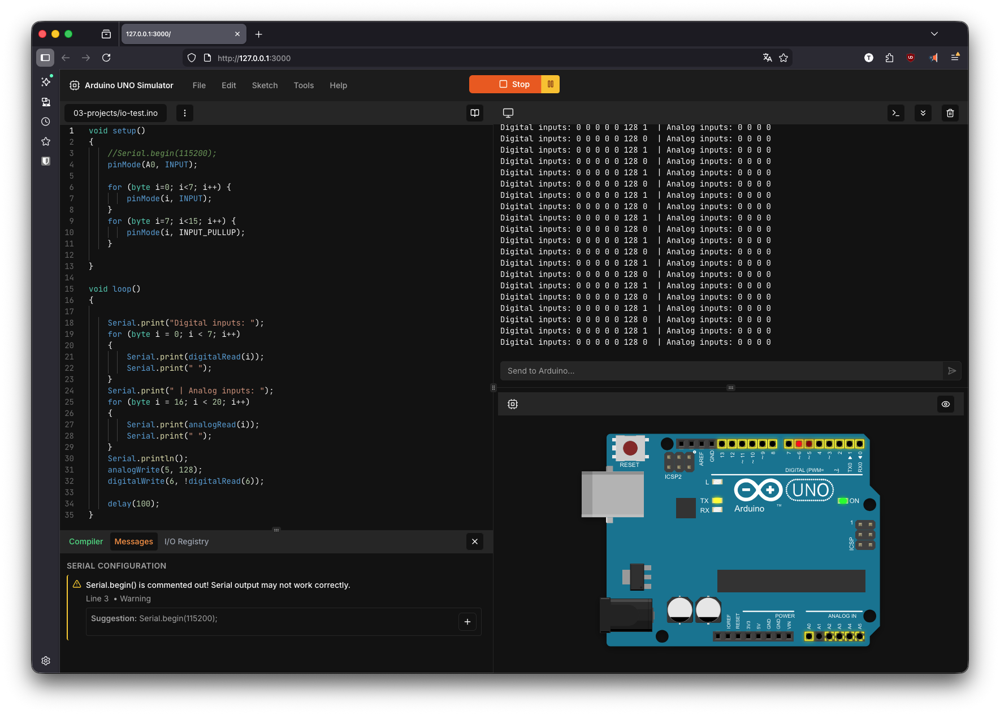
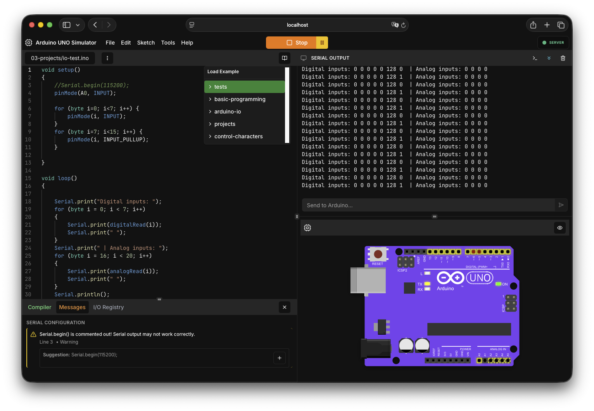

# UnoSim

[](https://github.com/MoDevIO/UnoSim)
[](https://github.com/MoDevIO/UnoSim/commits)
<br>
[](https://github.com/MoDevIO/UnoSim/actions/workflows/ci.yml)
[](https://modevio.github.io/UnoSim/)
<br>
[](https://github.com/MoDevIO/UnoSim/issues)
[](https://github.com/MoDevIO/UnoSim/pulls)

A web-based Arduino simulator that provides an interactive code editor, compilation and Arduino Preview for Arduino sketches directly in the browser.

## Preview

<p align="center">
   
   
</p>
<p align="center">
   
</p>

## Features

- **Code Editor**: Monaco editor integration for writing Arduino sketches with syntax highlighting
- **Compilation**: Compile Arduino code directly in the browser
- **Serial Monitor**: Real-time output display from simulated Arduino execution
- **Pause/Resume Simulation**: Pause running sketches to inspect state, change pin values, and resume execution
- **Arduino Preview**: A preview of analog/digital inputs and outputs directly in the Arduino SVG
- **Web-based**: No installation required, run entirely in the browser
- **Modern UI**: Built with React and TailwindCSS for a responsive, professional interface
- **I/O Registry**: You can see what Pins are used in your Program!

## Tech Stack

- **Frontend**: React, TypeScript, Vite, TailwindCSS, Radix UI
- **Backend**: Node.js (TypeScript), Express, WebSocket support
- **Editor**: Monaco Editor
- **Testing**: Vitest with React Testing Library
- **Build Tools**: Vite, esbuild

## Installation (only for Linux/MacOS)

### Prerequisites

- Node.js (v18 or higher)
- npm or yarn

### Setup

1. Clone the repository:

```bash
git clone https://github.com/MoDevIO/UnoSim.git
cd UnoSim
```

2. Install dependencies:

```bash
npm install
```

3. Start the dev-server:

```bash
npm run dev:full
```

This will start both the backend server and the frontend development server.

## Notes for running tests (optional)

The repository contains a **robust, fast test pipeline**:

1. **Unit tests** (Vitest + React Testing Library) cover business logic and UI
   components. A full run exercises **869 tests with zero skips** and completes in
   about 25 seconds on a modern laptop.
2. **Minimal E2E smoke flow** comprises three Playwright tests that verify a
   compile‑and‑run cycle, serial output and basic dialogs. This file lives in
   `e2e/smoke-and-flow.spec.ts` and the entire suite now takes ~16 seconds instead
   of the previous 400+ second harness. Old specs have been archived/ignored.
3. Heavier **integration/load tests** under `tests/server/` are marked skipped by
   default; set `SKIP_LOAD_TESTS=1` locally if you don’t have enough CPU or want a
   quick check.

Local quick‑check example:

```bash
SKIP_LOAD_TESTS=1 npm test
```

In CI, use a sufficiently‑powered runner and leave `SKIP_LOAD_TESTS` unset so the
performance tests run as intended.

> 🧹 After our recent refactor the pipeline runs in under a minute and should be
> very stable – feel free to run it before pushing changes.

## License

MIT License - See [LICENSE](LICENSE) for details

This project uses third-party open-source dependencies.
See [THIRD_PARTY_LICENSES.txt](THIRD_PARTY_LICENSES.txt) for details.

## Contact & Support

### Getting Help

- **Issues & Bugs**: Use the [GitHub Issues](https://github.com/modevio/UnoSim/issues) tracker
- **Feature Requests**: Create an [Pull Request](https://github.com/modevio/UnoSim/pulls)
- **Questions**: Open a discussion or check existing issues

### Project Maintainers

- **Mo Tiltmann** (MoDevIO) - Couven-Gymnasium, Aachen
- **Tom Tiltmann** (ttbombadil) - Technische Hochschule, Köln

### Additional Resources

- [Arduino Official Documentation](https://www.arduino.cc/reference/)
- [Monaco Editor Documentation](https://microsoft.github.io/monaco-editor/)
- [React Documentation](https://react.dev/)
### Architecture & Performance

The backend utilizes an Adapter Pattern for compilation:

- PooledCompiler: Automatically manages task distribution.

- Worker Isolation: Each compilation task runs in a separate thread, reducing API latency by ~30% under concurrent load.

- Graceful Shutdown: Intelligent SIGTERM handling ensures all worker threads and file handles are closed properly.

## Docker

This repository includes a Dockerfile that builds the project using Node.js v25.2.1.

- Build the image:

```bash
docker build -t unowebsim:latest .
```

- Run the container (exposes port 3000):

```bash
docker run --rm -p 3000:3000 -e NODE_ENV=production unowebsim:latest
```

- Alternatively use docker-compose:

```bash
docker-compose up --build
```

The server will be available at http://localhost:3000
