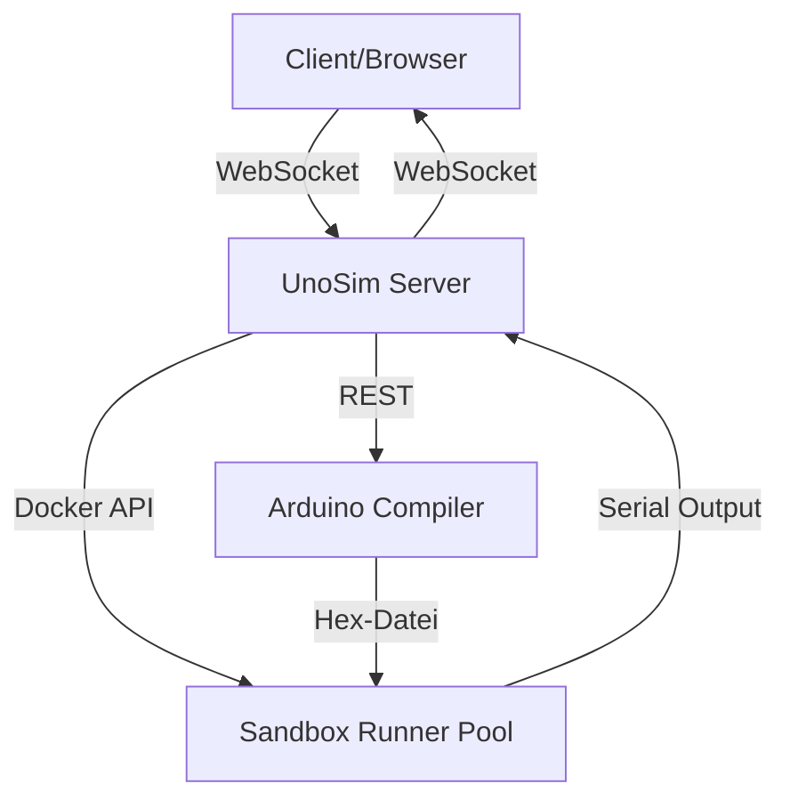

# UnoSim Architekturübersicht

Status: current

Diese Datei beschreibt die grundlegende Architektur von UnoSim mit Fokus auf Datenflüsse und Verantwortlichkeiten.

## 📊 Datenfluss-Diagramm

## 🏗️ Architekturkomponenten

### 1. Client (Frontend)
- **Verantwortung:** UI-Interaktion, WebSocket-Kommunikation, State-Management
- **Technologie:** React 18, TypeScript, Vite, TailwindCSS
- **Hauptkomponenten:**
  - `ArduinoSimulatorPage` – Haupt-Seite mit Simulator-UI (753 Zeilen, Composition Root)
  - `useCompileAndRun` – Orchestrator für Compile→Start und State-Komposition (361 Zeilen, Phase 2.1 abgeschlossen)
  - `useSimulatorExternalControl` – Externe Steuerung, Reconnect-Queue und Status-Events
  - `use-compile-controller.ts` – Compile-Mutation, Parser-/Registry-Updates und Compile-State (94% Coverage)
  - `use-simulation-controller.ts` – Simulation-Mutationen, WebSocket-Kommandos und Lifecycle (100% Coverage)
  - `use-ui-feedback-adapter.ts` – Toasts, Debug-Meldungen, Glitch- und Pin-Konflikt-Feedback (310 Zeilen, 98.8% Coverage)
  - `useArduinoSimulatorPage` – Composition Root für ViewModels

### 2. UnoSim Server (Backend)
- **Verantwortung:** WebSocket-Server, REST-API, Compilation-Queue, Sandbox-Management
- **Technologie:** Node.js/Express, TypeScript, WebSocket (ws)
- **Hauptkomponenten:**
  - `routes/status.routes.ts` – Status- und Metriken-Endpunkte
  - `routes/simulation.ws.ts` – WebSocket-Registration und Komposition der Simulations-Handler
  - `routes/simulation/ws-message-router.ts` – Dekodierung, Validierung und Dispatch eingehender WebSocket-Nachrichten
  - `routes/simulation/ws-session-manager.ts` – Client-Session-State, Runner-Release und Worker-Total-Broadcasts
  - `routes/simulation/ws-output-buffer.ts` – Serial-Output-Batching und WebSocket-Sende-Helper
  - `services/compiler-with-fallback.ts` – Compilation mit Fallback-Mechanismus
  - `services/sandbox-runner-pool.ts` – Pool für Docker-Sandboxen
  - `services/sandbox-runner.ts` – Einzelne Sandbox-Instanz

### 3. Arduino Compiler
- **Verantwortung:** Sketch-Kompilierung, Header-Verarbeitung, Cache-Management
- **Technologie:** arduino-cli (Docker-basiert oder lokal)
- **Hauptkomponenten:**
  - `services/arduino-compiler.ts` – Haupt-Compiler-Logik
  - `services/compiler-with-fallback.ts` – Fallback-Mechanismus für Compilation
  - Cache: In-Memory-Cache für schnelle Rekompilationen

### 5. Execution Phases (Phase 2.6 decomposed)
- **Verantwortung:** Sandbox-Lifecycle, Compile-Gatekeeping, Stream-Verarbeitung
- **Technologie:** TypeScript, Dependency-Injection via Context-Objekte
- **Extrahierte Phasen:**
  - `server/services/sandbox/execution-phases/prepare-phase.ts` – Compilation mit Gatekeeper (Phase 2.6, 95.7% Coverage)
  - Weitere Phasen in Planung (Cleanup, Timeout, Stream, Start)

### 6. Parser-Module (Phase 2.10 extrahiert)
- **Verantwortung:** Arduino C++ Code-Analyse, I/O-Registry, Hardware-Kompatibilität
- **Technologie:** TypeScript, funktionale Parser-Kombinatoren
- **Extrahierte Module:**
  - `shared/parsers/hardware-compatibility-parser.ts` – Pin-Konflikte, Pull-Up/Pull-Down Erkennung
  - `shared/parsers/pin-conflicts-parser.ts` – Pin-Mehrfachverwendung, Konfliktdetektion
  - `shared/parsers/structure-parser.ts` – Setup/Loop-Struktur, Funktionsdefinitionen
  - `shared/parsers/performance-parser.ts` – Timing-kritische Muster, delay()-Erkennung
  - `shared/parsers/serial-configuration-parser.ts` – Baud-Rate, Serial-Konfiguration

### 5. Sandbox Runner Pool
- **Verantwortung:** Verwaltung von Docker-Containern für Sketch-Ausführung
- **Technologie:** Docker, Node.js Worker Threads
- **Hauptmerkmale:**
  - **Warm Containers:** Vorgehaltene Container für schnelle Startzeiten
  - **Isolation:** Jeder Sketch läuft in eigenem Container
  - **Ressourcenkontrolle:** CPU/Memory/PID-Limits pro Container

## 🔄 Datenflüsse im Detail

### Compile-Flow
1. Client sendet Code an Server via REST (`/api/compile`)
2. Server leitet an Compiler weiter (mit Fallback-Mechanismus)
3. Compiler kompiliert Code zu Hex-Datei (mit Cache)
4. Hex-Datei wird an Sandbox Runner Pool übergeben
5. Sandbox Runner führt Sketch aus (Docker oder lokal)
6. Serial Output wird an Client gesendet (via WebSocket)

### Simulation-Flow
1. Client sendet `start_simulation` via WebSocket
2. Server validiert Session und acquired Runner aus Pool
3. ExecutionManager startet Prepare-Phase (Compilation mit Gatekeeper)
4. Bei Erfolg: Runner führt Sketch aus und streamt Serial Output
5. Client empfängt Serial Output und aktualisiert UI
6. Bei `pause_simulation` oder `stop_simulation`: Runner wird gestoppt/returned

### Status-Flow
1. Client fragt `/api/status` ab
2. Server aggregiert Metriken von:
   - Sandbox Runner Pool (verfügbare/genutzte Runner)
   - Compile Semaphore (aktive/queued Compilations)
   - Server-Konfiguration (zentral in `server/config.ts`)
3. Client zeigt Status in Header an

## 📌 Verantwortlichkeiten (State Ownership)

| Komponente | Verantwortung |
|-----------|---------------|
| `ArduinoSimulatorPage` | UI-State und ViewModel-Komposition |
| `useCompileAndRun` | Props-Merging, State-Komposition und Compile→Start-Orchestrierung |
| `use-compile-controller.ts` | Compile-Mutation, Compile-State, Parser-Messages und I/O-Registry |
| `use-simulation-controller.ts` | Simulation-State, Start/Stop/Pause/Resume und WebSocket-Sendelogik |
| `use-ui-feedback-adapter.ts` | UI-Seiteneffekte für Toasts, Debug-Ausgaben und Konfliktwarnungen |
| `useArduinoSimulatorPage` | Composition Root für Hook-Wiring, State-Derivation und UI-Seiten-Effekte |
| `useSimulatorExternalControl` | Externe API, Reconnect-Queue und Simulation-/Server-Status-Events |
| `simulation.ws.ts` | WebSocket-Registration, Handler-Komposition und Simulations-Orchestrierung |
| `ws-message-router.ts` | Raw-Message-Konvertierung, Protokollvalidierung und Handler-Dispatch |
| `ws-session-manager.ts` | Client-Session-State, Runner-Cleanup und Worker-Total-Broadcasts |
| `ws-output-buffer.ts` | Serial-Output-Batching und sichere WebSocket-Ausgabe |
| `sandbox-runner-pool.ts` | Runner-Lebenszyklus und Pool-Management |
| `arduino-compiler.ts` | Compilation und Cache-Logik |

`ArduinoSimulatorPageState` wird für die Page-Übergabe in sieben fachliche
ViewModels gegliedert:

| ViewModel | Inhalt |
|-----------|--------|
| `compile` | Compile-Status, Compile-Aktionen und Compiler-Panel-Zustand |
| `simulation` | Start/Stop/Pause/Resume, Simulation-Status und Timeout |
| `serial` | Serial-Ausgabe, Eingabe, View-Modus und Aktivitätsanzeigen |
| `pins` | Pin-Zustände, Pin-Monitor und Analog-/Digital-Steuerung |
| `files` | Tabs, Dateiaktionen, Editorbefehle und Datei-Input |
| `connection` | Backend-/WebSocket-Status, Worker- und Telemetriedaten |
| `layout` | Responsive Layout, Slots, Panel-Refs und globale UI-Aktionen |

## 🔒 Sicherheits- und Betriebsmodell

### Sandbox-Sicherheit
- **Isolation:** Jeder Sketch läuft in eigenem Docker-Container
- **Ressourcenlimits:** CPU, Memory, PID-Limits pro Container
- **Read-Only Filesystem:** Container haben nur lesenden Zugriff auf Dateisystem
- **Timeouts:** Maximale Laufzeit pro Sketch (60 Sekunden)

### WebSocket-Sicherheit
- **Authentifizierung:** Gateway-Modus mit `X-UnoSim-*` Headern (ADR 0001)
- **Origin-Check:** Nur erlaubte Origins können Nachrichten senden/empfangen
- **Rate-Limiting:** Begrenzung der Nachrichtenfrequenz

### Deployment-Modi
- **Local Mode:** Server und Simulation laufen lokal (für Entwicklung)
- **Docker Mode:** Server in Container, Simulation lokal (für Performance-Tests)
- **Production Mode:** Server und Simulation in Containern (für Produktion)
- **Gateway Mode:** Reverse-Proxy mit Authentication (für Produktion)

### Config-Zentralisierung (Phase 2.7)
- **Zentrale Konfiguration:** `server/config.ts` als Single Source of Truth
- **Environment-Variablen:** Validierte Parser mit Type-Safety
- **Status:** Teilweise umgesetzt (einige deferred items)

## 📊 Metriken und Observability

Der UnoSim Server sammelt folgende Metriken:

- **Sandbox Runner:** Verfügbare, genutzte, maximale Runner
- **Compile Slots:** Aktive, queued, maximale Compilations
- **WebSocket Sessions:** Verbundene, verbindende Clients
- **Serial Output:** Bytes pro Sekunde, Drop-Rate
- **Pin States:** Änderungen pro Sekunde, Batch-Größen

Diese Metriken sind über `/api/status` und WebSocket-Events verfügbar.

## 🔄 Versionierung und API-Kontrakte

- **REST API:** Versionierung über URL-Pfad (`/api/v1/status`)
- **WebSocket:** Versionierung über Handshake-Nachrichten
- **Deprecation:** Legacy-Felder und API-Endpunkte werden mit `@deprecated` markiert und nach 2 Major-Releases entfernt

---

**Siehe auch:**
- `docs/PROJECT_ANALYSIS_REPORT_2026-09-04.md` – Detaillierte Projektanalyse
- `docs/TESTING_STANDARDS.md` – Teststrategie und -konventionen