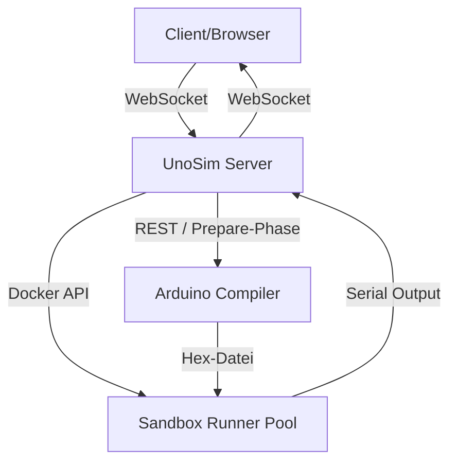

# UnoSim Architekturübersicht

Status: current  
Zielrolle: architecture-overview

Diese Datei beschreibt die grundlegende Architektur von UnoSim mit Fokus auf Datenflüsse und Verantwortlichkeiten.

## Governance-Grenzen

- Dieses Dokument ist der aktuelle Architekturüberblick. Es beschreibt Komponenten, Datenflüsse, State Ownership und Betriebsmodell bewusst zusammenfassend.
- Verbindliche Detailentscheidungen bleiben in den ADRs: ursprünglicher
  Gateway-Vertrag in `adr/0001-authentication-and-gateway-contract.md` und
  optionale Benutzeranmeldung in
  `adr/0008-optional-gateway-authentication.md`, UnifiedScrollArea in
  `adr/0002-unified-scroll-area.md`, Skalierung/HA in
  `adr/0003-scalability-and-ha-model.md`, die historische
  Tutor-Pilotentscheidung in `adr/0004-repository-based-tutor-curriculum.md`,
  die dynamische Examples-Auswahl in
  `adr/0005-browser-scoped-external-examples.md` und der aktuelle
  Course-Content-/Tutor-Vertrag in
  `adr/0006-unified-course-content-and-tutor-strategy.md`.
- Die mastery-driven didaktische Phasenentscheidung ist in `adr/0007-mastery-driven-tutor-progression.md` normativ ergänzt.
- Externe iframe-API-Verträge liegen in `EXTERNAL_API.md`; Feature-Details liegen in den thematischen SSOT-Dateien unter `../ssot/`.
- Versionsverträge: REST `1.0.0` (`Accept-Version`/`X-UnoSim-API-Version`), WebSocket `1.0.0` (`handshake.protocolVersion`) und iframe `postMessage` `1.4.0`; inkompatible Änderungen benötigen eine neue Major-Version und Migration.
- Neben normativer Dokumentation enthält der Tree als historisch oder nicht
  normativ gekennzeichnete Analysen, Pläne und Berichte (Kennzeichnung im
  Dokumentkopf). Sie beschreiben einen Stand oder eine Entscheidungsgrundlage,
  keinen Vertrag; maßgeblich bleiben dieses Dokument, die ADRs und die SSOTs.

## 📊 Datenfluss-Diagramm

```mermaid
graph TD
    A[Client/Browser] -->|WebSocket| B[UnoSim Server]
    B -->|REST / Prepare-Phase| C[Arduino Compiler]
    B -->|Docker API| D[Sandbox Runner Pool]
    C -->|Hex-Datei| D
    D -->|Serial Output| B
    B -->|WebSocket| A
```

## 🏗️ Architekturkomponenten

### 1. Client (Frontend)
- **Verantwortung:** UI-Interaktion, WebSocket-Kommunikation, State-Management
- **Technologie:** React 18, TypeScript, Vite, TailwindCSS
- **Hauptkomponenten:**
  - `ArduinoSimulatorPage` – schlanker Seiteneinstieg; die Komposition liegt in `useArduinoSimulatorPage`
  - `useCompileAndRun` – Orchestrator für Compile→Start und State-Komposition
  - `useSimulatorExternalControl` – Externe Steuerung, Reconnect-Queue und Status-Events
  - `use-compile-controller.ts` – Compile-Mutation, Parser-/Registry-Updates und Compile-State
  - `use-simulation-controller.ts` – Simulation-Mutationen, WebSocket-Kommandos und Lifecycle
  - `use-ui-feedback-adapter.ts` – Toasts, Debug-Meldungen, Glitch- und Pin-Konflikt-Feedback
  - `useArduinoSimulatorPage` – Composition Root für ViewModels

### 2. UnoSim Server (Backend)
- **Verantwortung:** WebSocket-Server, REST-API, Compilation-Queue, Sandbox-Management
- **Technologie:** Node.js/Express, TypeScript, WebSocket (ws)
- **Hauptkomponenten:**
  - `routes/status.routes.ts` – Status- und Metriken-Endpunkte
  - `routes/simulation.ws.ts` – WebSocket-Registration und Komposition der Simulations-Handler
  - `routes/simulation/ws-message-router.ts` – Dekodierung, Validierung und Dispatch eingehender WebSocket-Nachrichten
  - `routes/simulation/ws-session-manager.ts` – Client-Session-State, Runner-Release und Worker-Total-Broadcasts
  - `routes/simulation/ws-output-buffer.ts` – Serial-Output-Batching und WebSocket-Sende-Helper
  - `services/compiler-with-fallback.ts` – Compilation mit Fallback-Mechanismus
  - `services/sandbox-runner-pool.ts` – Pool für Docker-Sandboxen
  - `services/sandbox-runner.ts` – Einzelne Sandbox-Instanz

### 3. Arduino Compiler
- **Verantwortung:** Sketch-Kompilierung, Header-Verarbeitung, Cache-Management
- **Technologie:** arduino-cli (Docker-basiert oder lokal)
- **Hauptkomponenten:**
  - `services/arduino-compiler.ts` – Haupt-Compiler-Logik
  - `services/compiler-with-fallback.ts` – Fallback-Mechanismus für Compilation
  - Cache: ein In-Memory-Ergebniscache der Route (ohne HEX) und ein
    Festplatten-Cache für HEX und Compiler-Ausgabe. Beide sind über die
    Sketch-Identität aus Code, Headern, Entry-File und FQBN adressiert;
    Worker-Pool und direkter Compiler teilen dieselben Einträge.
  - Der REST-Compile läuft mit `arduino-cli` im Backend, nicht in einer
    Sandbox. Includes außerhalb des eingereichten Projekts (absolut, `..`,
    berechnet) werden vor dem Compile abgewiesen; das HEX verlässt den Server
    nicht.
  - Kapazität: Im Docker-Betrieb begrenzt der Worker-Pool (höchstens 8 Worker,
    höchstens 500 wartende Compiles, 30 s Wartezeit) und antwortet bei
    Erschöpfung mit `503 SYSTEM_BUSY`; abgestürzte Worker werden mit Backoff neu
    gestartet. Lokal und als Fallback bei ausgefallenem Pool begrenzt der
    Gatekeeper (`COMPILE_MAX_CONCURRENT`).

### 4. Sandbox Runner Pool
- **Verantwortung:** Verwaltung von Runner-Leases und Docker-Containern für Sketch-Ausführung
- **Technologie:** Docker-API und pro Ausführung kurzlebige Sandbox-Container. Node.js Worker Threads gehören zum Compiler Worker Pool, nicht zum Runner-Pool.
- **Hauptmerkmale:**
  - **Runner-Pool:** Vorgehaltene Runner-Objekte; Sandbox-Container werden pro Ausführung gestartet und anschließend bereinigt.
  - **Wiederverwendung:** Jeder Lauf trägt eine Generation und ein Abbruchsignal. Ein gestoppter Lauf, der noch auf einen Start-Slot wartet, startet nicht mehr und berührt den Folgelauf auf demselben Runner nicht; Ereignisse eines ersetzten Kindprozesses werden verworfen. Den Reset vor der Wiederverwendung besitzt der Runner (`resetForReuse`).
  - **Verwaiste Container:** Jeder Sandbox-Container trägt das Label `unosim.owner=<host>:<pid>`. Beim Start entfernt das Backend Container seiner eigenen früheren Inkarnation (z. B. nach einem Absturz); andere UnoSim-Instanzen auf demselben Docker-Host bleiben unberührt.
  - **Isolation:** Jeder Sketch läuft in eigenem Container
  - **Ressourcenkontrolle:** CPU/Memory/PID-Limits pro Container

### 5. Execution pipeline
- **Verantwortung:** Sandbox-Lifecycle, Compile-Gatekeeping, Stream-Verarbeitung
- **Technologie:** TypeScript, Dependency-Injection via Context-Objekte
- **Extrahierte Phasen:**
  - `server/services/sandbox/execution-phases/prepare-phase.ts` – Compilation mit Gatekeeper
  - Weitere Phasen kapseln Cleanup, Timeout, Stream und Start

### 6. Parser-Module
- **Verantwortung:** Arduino C++ Code-Analyse, I/O-Registry, Hardware-Kompatibilität
- **Technologie:** TypeScript, funktionale Parser-Kombinatoren
- **Extrahierte Module:**
  - `shared/parsers/hardware-compatibility-parser.ts` – Pin-Konflikte, Pull-Up/Pull-Down Erkennung
  - `shared/parsers/pin-conflicts-parser.ts` – Pin-Mehrfachverwendung, Konfliktdetektion
  - `shared/parsers/structure-parser.ts` – Setup/Loop-Struktur, Funktionsdefinitionen
  - `shared/parsers/performance-parser.ts` – Timing-kritische Muster, delay()-Erkennung
  - `shared/parsers/serial-configuration-parser.ts` – Baud-Rate, Serial-Konfiguration

### Statische I/O-Analyse

Die statische Pin-/I/O-Analyse wird zentral durch `analyzeStaticIO(code)` in
`shared/io-registry-parser.ts` erzeugt. `CodeParser.parseAll()` erzeugt dieses
Ergebnis einmal und übergibt es an die Hardware- und Konfliktparser; die
Registry-Funktion `parseStaticIORegistry()` bleibt ein kompatibler Wrapper.
Nicht eindeutig statisch auflösbare Fälle bleiben konservativ ungelöst und
können weiterhin nur durch die Runtime-Erkennung sichtbar werden.

### Unified Course Content

Course Content is one effective public GitHub repository/ref selection with two
capability-scoped outputs: the Examples core capability and the optional Tutor
capability. The server resolves the ref to one immutable repository + revision
snapshot. Valid Examples remain usable when the optional Tutor descriptor,
manifest, topic, strategy, hash, or binding is invalid.

~~~text
Course Content repository + ref
        -> server ref resolution
        -> immutable repository + revision snapshot
             /                         \
        Examples                  Tutor topics/strategy
                                      -> fact matcher
                                      -> deterministic planner
                                      -> TutorService / LLMProvider
~~~

The Tutor uses the same SketchFactExtractor, TopicMatcher, LearningPlanner,
TutorService, and provider boundary established by the pilot. The normalized
EffectiveTutorStrategy is always present. The built-in built-in-default policy
is used without a repository, for Examples-only repositories, for topic
mismatches, and after any invalid Tutor capability. A valid repository strategy
may control the free Tutor without providing topics.

The current sketch remains factual authority. Embedded Example annotations only
prioritize applicable topics and strategies; edited code can make an embedded
topic inapplicable. They may also provide bounded teacher learning objectives,
which remain additional didactic emphasis and are passed separately from the
cleaned sketch source. Topic planning and strategy selection are independent: a
Topic describes what should be learned, learning objectives describe
Example-specific emphasis, while EffectiveTutorStrategy describes how the Tutor
teaches. Every normal Tutor request uses exactly one effective strategy,
including arbitrary/local sketches, strategy-only repositories, Topic
mismatches, Examples-only repositories, no repository, and invalid Tutor
capability fallback. A no-Topic free Tutor keeps a valid repository
defaultStrategy; it does not silently reset to built-in-default. Repository
data enters only structured didactic context. The application-owned
system prompt, safety rules, provider isolation, privacy rules, response
validation, and editor boundary are never repository-controlled.

For an active applicable Topic, the Tutor additionally tracks the application-
owned session-local didactic phase `LEARN`, `DEEPEN`, or `EXPAND`. Deterministic
Topic mastery is derived from the existing concept mastery criteria; the LLM
cannot declare mastery. After mastery, currently applicable unmastered Topics
are selected by normal precedence and remain in LEARN; only when none remain
does the mastered Topic enter DEEPEN. DEEPEN changes to EXPAND after bounded
successful transfer evidence. A changed sketch reruns Topic matching, and a
newly selected unmastered Topic starts in LEARN. An unresolved unmastered Topic
blocks DEEPEN/EXPAND in a safe `LEARN` content-exhaustion state. A mastered
Topic made inapplicable by a sketch edit is suspended, not erased; if it later
matches again in the same session, its retained DEEPEN/EXPAND phase resumes.
A free Tutor without an active Topic remains available with its
EffectiveTutorStrategy but does not claim formal Topic mastery. This state is
pinned to the same opaque Tutor session and immutable Course revision and is
not a persistent learner profile.

The server extracts an optional terminal `@unosim-tutor` annotation from only
the declared main `.ino` file before the Example leaves the Course Content
boundary. The browser/editor, compiler, and simulator receive cleaned source
without the annotation. A structurally recognized invalid or unterminated
annotation is stripped or hidden deterministically, keeps valid Examples
usable, and invalidates the complete repository Tutor capability; no partial
Tutor bundle or teacher metadata may leak to the student.

The old separate Tutor source is superseded. The in-tree curriculum files are
fixtures and authoring examples only. The normative details are in
[ssot_function_definition_CourseContent.md](../ssot/ssot_function_definition_CourseContent.md),
[adr/0006-unified-course-content-and-tutor-strategy.md](adr/0006-unified-course-content-and-tutor-strategy.md),
[adr/0007-mastery-driven-tutor-progression.md](adr/0007-mastery-driven-tutor-progression.md),
[ssot_function_definition_LearningQuestions.md](../ssot/ssot_function_definition_LearningQuestions.md),
and the deterministic quality gates in
[ssot_function_definition_TutorQuality.md](../ssot/ssot_function_definition_TutorQuality.md).

### Dynamic Course Content selection

Server/deployment configuration remains the default source. A browser may
select one public GitHub repository and ref as a non-sensitive personal
preference. That same override affects Examples and Tutor for that browser
only. It does not change the operator default or another browser's state.
Reset removes only the local override. The browser contacts UnoSim, never
GitHub, and does not provide authoritative revision identity.

~~~text
Browser Course Content preference
  -> request-scoped repository/ref metadata
  -> server validation and ref resolution
  -> immutable repository + revision context
  -> capability-scoped Examples/Tutor validation
  -> shared repository + revision cache
~~~

After the refresh TTL, a moving ref is resolved again. A new revision is
activated only after complete core validation and capability-scoped Tutor
validation. A Tutor-only failure leaves valid Examples active and activates no
partial Tutor bundle. Last-known-good content is scoped to the same
repository/ref and exact revision rules prevent cross-source fallback.

The initial default remains ttbombadil/unosim-examples with ref main.
Tutor question responses receive an opaque server-issued Course Content session
handle when repository context is active. Follow-up dialogs use that handle and
remain pinned to the server-derived revision; browser repository/ref/revision
metadata is request context only and never content authority. Changing the
browser selection clears the client dialog and starts a new context.
Requests of one Tutor session run one after another, so overlapping requests
(double submit, retry) cannot overwrite each other's progression evidence.
The current session store is process-local in-memory state with a one-hour TTL,
so Tutor session pinning is supported by the current single-backend topology.
Horizontal multi-instance deployment would require shared Tutor-session state
or an explicitly designed equivalent such as sticky-session guarantees.
The detailed source contract remains in
[ssot_function_definition_ExternalExamples.md](../ssot/ssot_function_definition_ExternalExamples.md)
and [adr/0005-browser-scoped-external-examples.md](adr/0005-browser-scoped-external-examples.md).

## 🔄 Datenflüsse im Detail

### Compile-Flow
1. Client sendet Code an Server via REST (`/api/compile`)
2. Server leitet an Compiler weiter (mit Fallback-Mechanismus)
3. Compiler kompiliert Code zu Artefakten/Diagnosen (mit Cache)
4. REST-Compile liefert das Compile-Ergebnis an den Client zurück

Die Simulation nutzt denselben Compilerpfad in der Prepare-Phase, startet den Runner aber über den WebSocket-Simulationsfluss.

### Simulation-Flow
1. Client sendet `start_simulation` via WebSocket
2. Server validiert Session und acquired Runner aus Pool
3. ExecutionManager startet Prepare-Phase (Compilation mit Gatekeeper)
4. Bei Erfolg: Runner führt Sketch aus und streamt Serial Output
5. Client empfängt Serial Output und aktualisiert UI
6. Bei `pause_simulation` oder `stop_simulation`: Runner wird gestoppt/returned

### Status-Flow
1. Client fragt `/api/status` ab; einfache Health-Probes nutzen `/api/health`, Compose-Readiness nutzt `/api/readiness`
2. Server aggregiert Metriken von:
   - Sandbox Runner Pool (verfügbare/genutzte Runner)
   - Compile-Kapazität (Worker-Pool im Docker-Betrieb, sonst Gatekeeper) und Sandbox-Start-Slots
   - Server-Konfiguration (zentral in `server/config.ts`)
3. Client zeigt Status in Header an

## 📌 Verantwortlichkeiten (State Ownership)

| Komponente | Verantwortung |
|-----------|---------------|
| `ArduinoSimulatorPage` | UI-State und ViewModel-Komposition |
| `useCompileAndRun` | Props-Merging, State-Komposition und Compile→Start-Orchestrierung |
| `use-compile-controller.ts` | Compile-Mutation, Compile-State, Parser-Messages und I/O-Registry |
| `use-simulation-controller.ts` | Simulation-State, Start/Stop/Pause/Resume und WebSocket-Sendelogik |
| `use-ui-feedback-adapter.ts` | UI-Seiteneffekte für Toasts, Debug-Ausgaben und Konfliktwarnungen |
| `useArduinoSimulatorPage` | Composition Root für Hook-Wiring, State-Derivation und UI-Seiten-Effekte |
| `useSimulatorExternalControl` | Externe API, Reconnect-Queue und Simulation-/Server-Status-Events |
| `simulation.ws.ts` | WebSocket-Registration, Handler-Komposition und Simulations-Orchestrierung |
| `ws-message-router.ts` | Raw-Message-Konvertierung, Protokollvalidierung und Handler-Dispatch |
| `ws-session-manager.ts` | Client-Session-State, Runner-Cleanup und Worker-Total-Broadcasts |
| `ws-output-buffer.ts` | Serial-Output-Batching und sichere WebSocket-Ausgabe |
| `sandbox-runner-pool.ts` | Runner-Lebenszyklus und Pool-Management |
| `arduino-compiler.ts` | Compilation und Cache-Logik |
| Browser Settings | optionale, nur lokal persistierte Course-Content-Auswahl für Examples und Tutor |
| Course Content API | Ermittlung von Default oder request-scoped Browser-Override, immutable Revision und capability-scoped Status |
| `ExamplesRepository` / Course snapshot | gemeinsamer Repository-/Ref-Source-Cache, immutable Revision-Snapshots, Examples-Kernvalidierung, optionaler Tutor-Bundle-Status und atomare LKG-Aktivierung |
| Tutor planning path | `EffectiveTutorStrategy`, fact-grounded topic selection, deterministic planning und Built-in-Fallback |

`ArduinoSimulatorPageState` wird für die Page-Übergabe in sieben fachliche
ViewModels gegliedert:

| ViewModel | Inhalt |
|-----------|--------|
| `compile` | Compile-Status, Compile-Aktionen und Compiler-Panel-Zustand |
| `simulation` | Start/Stop/Pause/Resume, Simulation-Status und Timeout |
| `serial` | Serial-Ausgabe, Eingabe, View-Modus und Aktivitätsanzeigen |
| `pins` | Pin-Zustände, Pin-Monitor und Analog-/Digital-Steuerung |
| `files` | Tabs, Dateiaktionen, Editorbefehle und Datei-Input |
| `connection` | Backend-/WebSocket-Status, Worker- und Telemetriedaten |
| `layout` | Responsive Layout, Slots, Panel-Refs und globale UI-Aktionen |

## 🔒 Sicherheits- und Betriebsmodell

Der Gateway-Vertrag ist in ADR 0001
(`adr/0001-authentication-and-gateway-contract.md`) festgehalten; ADR 0008
(`adr/0008-optional-gateway-authentication.md`) präzisiert, dass
Benutzeranmeldung optional ist. Die folgenden Punkte sind eine
Architektur-Zusammenfassung und ersetzen die ADRs nicht.

### Sandbox-Sicherheit
- **Isolation:** Jeder Sketch läuft in eigenem Docker-Container
- **Ressourcenlimits:** CPU, Memory, PID-Limits pro Container
- **Dateisystem:** Read-only Root-Dateisystem; read-only `/sandbox`-Bind-Mount für Sketch und Build-Quellen; beschreibbares `/sandbox-work`-tmpfs für Binary und relative Laufzeitdateien, begrenzt auf 64 MiB und 4096 Inodes; beschreibbares, auf 64 MiB begrenztes `noexec`-`/tmp`-tmpfs
- **Timeouts:** Laufzeit pro Simulation standardmäßig 60 Sekunden, je Start 1–300 Sekunden

### WebSocket-Sicherheit
- **Gateway-Identität:** Docker-Modus verlangt gültige `X-UnoSim-*`-Header;
  das Gateway darf eine Benutzeranmeldung verlangen oder den Subject aus der
  Client-IP ableiten (ADR 0008)
- **Origin-Check:** Im Gateway-Modus nur exakt erlaubte Origins; lokal zusätzlich derselbe Host. Der Check ersetzt keine Gateway-Identität.
- **Rate-Limiting:** Simulationsstarts pro Identität; alle Nachrichten einer Verbindung über einen Token-Bucket (500/s, Burst 1000, Überschuss wird verworfen); höchstens 1 MiB ausstehende Sketch-Eingabe
- **Heartbeat:** Ping alle 30 Sekunden (`WS_HEARTBEAT_INTERVAL_MS`); eine Verbindung ohne Pong wird getrennt und gibt Runner und Reservierung frei
- **Isolation:** Der Kompatibilitäts-Fallback für `start_simulation` ohne `code` nutzt nur den zuletzt kompilierten Code derselben Identität

### Runtime-Profile

- **Lokale Entwicklung (`UNOSIM_SERVER_MODE=local`):** Backend, Kompilierung
  und Sketch-Ausführung laufen auf der Entwicklungsmaschine. Eine lokale
  Session identifiziert den einzelnen vertrauenswürdigen Entwickler. Docker
  wird nicht verwendet.
- **Docker (`UNOSIM_SERVER_MODE=docker`):** Backend läuft im Container und jede
  Simulation in einer kurzlebigen Docker-Sandbox. Ein vertrauenswürdiges
  Gateway ist verpflichtend; Benutzeranmeldung ist optional. Dockerfehler
  führen nicht zu lokaler Ausführung.
- **Docker-Testprofil:** Nur `NODE_ENV=test` darf mit
  `UNOSIM_DOCKER_TEST_BYPASS_GATEWAY=1` die externe Gateway-Identität
  ersetzen. Sandbox-Ausführung und Docker-Readiness bleiben aktiv.

### Zentrale Konfiguration
- **Zentrale Konfiguration:** `server/config.ts` als Single Source of Truth
- **Environment-Variablen:** Validierte Parser mit Type-Safety
- **Course Content:** Config bleibt Source of Truth für Default-Repository,
  Default-Ref und Refresh-TTL. Eine Browserpräferenz ist nur ein
  request-scoped Override für beide optionalen Fähigkeiten und keine zweite
  serverweite Konfiguration. Obsolete separate Tutor-Source-Variablen werden
  als Startup-Tombstones abgelehnt.
- **Status:** `server/config.ts` leitet Ausführung und
  Gateway-Identitätsprüfung aus dem Runtime-Profil ab. Frühere unabhängige
  Mode- und Compatibility-Schalter
  werden abgelehnt. Aktuelle Anforderungen stehen in `INSTALL_SERVER.md` und
  `SECURITY.md`.

## 📊 Metriken und Observability

Der UnoSim Server sammelt folgende Metriken:

- **Sandbox Runner:** Verfügbare, genutzte, maximale Runner
- **Compile Slots:** Aktive, queued, maximale Compilations
- **WebSocket Sessions:** Verbundene, verbindende Clients
- **Serial Output:** Bytes pro Sekunde, Drop-Rate
- **Pin States:** Änderungen pro Sekunde, Batch-Größen

Diese Metriken sind über `/api/status` und WebSocket-Events verfügbar. `/api/health` prüft nur die HTTP-Erreichbarkeit; `/api/readiness` meldet, ob der Sandbox-Pool initialisiert und bereit ist.

## 🔄 Versionierung und API-Kontrakte

- **REST API:** Versionierung über `apiVersion`, den Response-Header
  `X-UnoSim-API-Version` und den optionalen Request-Header `Accept-Version`; die
  aktuellen Routen bleiben beispielsweise `/api/status`.
- **WebSocket:** Versionierung über Handshake-Nachrichten
- **Deprecation:** Legacy-Felder und API-Endpunkte werden mit `@deprecated` markiert und nach 2 Major-Releases entfernt

---

**Siehe auch:**
- [`adr/0001-authentication-and-gateway-contract.md`](adr/0001-authentication-and-gateway-contract.md) – ursprünglicher Gateway-Vertrag
- [`adr/0008-optional-gateway-authentication.md`](adr/0008-optional-gateway-authentication.md) – Benutzeranmeldung am Gateway ist optional
- [`adr/0004-repository-based-tutor-curriculum.md`](adr/0004-repository-based-tutor-curriculum.md) – historische, durch ADR 0006 supersedierte Tutor-Pilotentscheidung
- [`adr/0005-browser-scoped-external-examples.md`](adr/0005-browser-scoped-external-examples.md) – Zielarchitektur für dynamische External Examples
- [`adr/0006-unified-course-content-and-tutor-strategy.md`](adr/0006-unified-course-content-and-tutor-strategy.md) – aktueller einheitlicher Course-Content-/Tutor-Vertrag
- [`../ssot/ssot_function_definition_CourseContent.md`](../ssot/ssot_function_definition_CourseContent.md) – Normativer Course-Content-Vertrag
- [`../ssot/ssot_function_definition_ExternalExamples.md`](../ssot/ssot_function_definition_ExternalExamples.md) – Fachlicher Examples-Vertrag
- [`SCALABILITY.md`](SCALABILITY.md) – historische Kapazitätsmessung; aktuelle Werte in [`CAPACITY_VALIDATION_PLAN.md`](CAPACITY_VALIDATION_PLAN.md)
- [`TESTING_STANDARDS.md`](TESTING_STANDARDS.md) – Teststrategie und -konventionen
