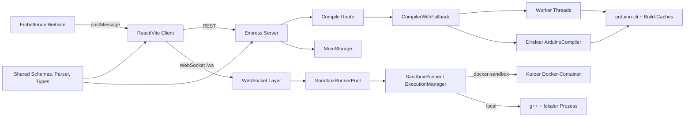

# UnoSim: Projektanalyse und priorisierter Handlungsplan

**Stand:** 3. September 2026
**Analysierter Stand:** Branch `main`, Commit `ca653dde`  
**Umfang:** Frontend, Backend, Shared Code, Docker/Deployment, CI, Tests und Dokumentation

## 0. AP-00 — Testfeedback vor weiteren Refactorings beschleunigen

**Priorität:** sofort, vor AP-01.4 und allen weiteren größeren Arbeitspaketen.
**Ziel:** Die häufige Refactoring-Schleife muss deterministisch in unter 30 Sekunden
antworten. Echte Arduino-, Docker-, Browser- und Lasttests bleiben verbindliche
separate Gates, laufen aber nicht bei jeder kleinen Codeänderung gemeinsam.

### 0.1 Gemessener Ist-Zustand

Die Analyse basiert auf den Läufen vom 2. September 2026 und dem vorhandenen
`run-tests_output.log`:

| Beobachtung | Evidenz | Auswirkung |
|---|---:|---|
| `npm test` vermischt alle Testklassen | regulär ca. 111–133 s, Ausreißer 929 s | keine verlässliche lokale Feedbackzeit |
| Das heutige `test:fast` ist nicht schnell | 58,66 s im protokollierten Lauf | Pre-Push bleibt unnötig teuer |
| Fünf Worker-/Cache-Suites kompilieren vielfach real | je ca. 27–87 s; zusammen Dutzende nahezu identische Sketch-Kompilationen | CPU-/I/O-Konkurrenz und lange Schleifen |
| `serial-flow.test.ts` läuft parallel zu anderen Toolchain-Suites | wiederholt 3–4 Timeouts; ein Einzeltest-Ausreißer mit 821 s | rotes und stark schwankendes Gesamt-Gate |
| Globale Umgebung ist `jsdom` | nur 7 von 136 Testdateien wählen explizit `node`; aggregiert ca. 108–146 s Environment-Zeit | Server-/Shared-Tests bezahlen Browserkosten |
| `tests/setup.ts` gilt für jede Testdatei | Setup aggregiert ca. 16–24 s; Docker-Aufräumprüfung wird über den globalen `afterAll` pro Datei registriert | unnötige Prozesse und Seiteneffekte |
| `test:unit`, `test:ci` und Coverage starten faktisch die Gesamtsuite | CI installiert deshalb selbst für den „Unit“-Job Arduino CLI/Core | langsame CI und falsche Taxonomie |
| Mindestens 133 reale `setTimeout`-Nutzungen in Tests | zwei Pool-Tests warten absichtlich je 10 s; ein Cache-Test real 3,1 s | vermeidbare Wall-Clock-Zeit und Flakes |
| Mehrere Lasttests prüfen nur `toBeDefined`, Promise-Anzahl oder immer erfüllte `allSettled`-Resultate | besonders in den vier Worker-Pool-Suites | hohe Kosten bei geringer Defekterkennung |

Vitest 4 führt Testdateien standardmäßig parallel aus; `maxWorkers` und
`fileParallelism` sind die aktuellen Steuergrößen. Die vorhandene Option
`threads: false` bildet diesen Vertrag nicht nachvollziehbar ab. Außerdem laufen
`setupFiles` vor jeder Testdatei, während `globalSetup`/Teardown einmal pro
Testprojekt ausgeführt werden. Diese Unterschiede müssen die neue Konfiguration
explizit nutzen.

### 0.2 Verbindliche Ziel-Taxonomie

| Suite | Inhalt | Externe Voraussetzungen | Lokales Budget | Ausführung |
|---|---|---|---:|---|
| `test:unit` | reine Client-, Server- und Shared-Unit-Tests; gemockte Prozess-/Zeitgrenzen | keine | <30 s | während Refactoring, Pre-Push, erster CI-Job |
| `test:related` | statisch abhängige Unit-Tests zu geänderten Dateien plus explizite Characterization Tests | keine | <15 s | nach jedem kleinen Implementierungsschritt |
| `test:integration` | Dateisystem, Worker und wenige echte `arduino-cli`-Canaries | Arduino CLI/Core | <120 s | pro abgeschlossenem Arbeitspaket |
| `test:docker` | Sandbox-FS, Netzwerk, Limits, Lifecycle und ein Serial-End-to-End-Smoke | Docker + Sandbox-Image | <180 s | P0-/Sandbox-Änderungen und CI |
| `test:e2e` | Nutzerflüsse im Browser | Browser + laufendes System | <180 s | Epic-/Merge-Gate |
| `test:load` | explizite 50/100/200-Client-Kapazitätsläufe | definierter Testhost | separat | geplant/manuell, nicht Pre-Push |

### 0.3 Umsetzungstasks

- [x] AP-00.1: Laufzeiten, externe Abhängigkeiten, Umgebungen und schwache
  Assertions inventarisieren.
- [x] AP-00.2: Vitest in benannte Projekte `unit-node`, `unit-client`,
  `integration-toolchain`, `integration-docker` und `load` teilen. Node ist
  Standard; JSDOM und React-Setup gelten ausschließlich für Clienttests.
- [x] AP-00.3: Globales Setup teilen: minimales gemeinsames Logger-/Mock-Cleanup,
  React/JSDOM-Setup nur im Clientprojekt und Docker-Cleanup einmalig im
  Docker-Gate statt einmal pro Testdatei.
- [x] AP-00.4: Kanonische npm-Skripte implementieren. `test:fast` wird Alias für
  `test:unit`; `test:related` nutzt Vitests Importgraph; Hook, CI und
  `run-tests.sh` rufen ausschließlich diese Skripte auf und duplizieren keine
  Exclude-Listen.
- [x] AP-00.5: Zeit abstrahieren. Kein Unit-Test darf absichtlich Sekunden warten.
  - [x] AP-00.5a: Pool-Reset- und Acquire-Grenzen injizierbar machen; Timeout-Timer
    nach erfolgreichem Reset zuverlässig löschen.
  - [x] AP-00.5b: Cache-TTL-, Registry-Debounce- und Batcher-Tests auf virtuelle
    Zeit beziehungsweise injizierte Uhren umstellen.
  - [x] AP-00.5c: Verbleibende Zustandssequenz- und Stress-Wartezeiten durch
    kontrollierbare Scheduler ersetzen oder aus dem Unit-Gate verschieben.
- [x] AP-00.6: Echte Compilerfälle konsolidieren.
  - [x] AP-00.6a: Queue-, Fehler-, Shutdown- und Backpressure-Semantik mit
    kontrollierten Fake-Workern testen; abgestürzte Worker dürfen aktive oder
    wartende Compiles nicht hängen lassen.
  - [x] AP-00.6b: Die vier redundanten Worker-Pool-„Lasttests“ durch wenige echte
    Canaries mit jeweils einzigartiger Invariante ersetzen; Reporting-only- und
    tautologische Assertions entfernen.
  - [x] AP-00.6c: Den vermeintlichen Cache-Lock-Compilerfall auf die tatsächlich
    verwendete File-Lock-Grenze korrigieren und verbleibende reale
    Kompilationen inventarisieren.
- [x] AP-00.7: `serial-flow` stabilisieren.
  - [x] AP-00.7a: Helper-Timeout und Fehlerpfade müssen Runner und Kindprozess
    garantiert stoppen; losgelöste Diagnose-Timer entfernen.
  - [x] AP-00.7b: Format-, Flush- und Reihenfolgevarianten in einen eindeutigen
    echten End-to-End-Smoke konsolidieren; redundante Kompilationen entfernen.
  - [x] AP-00.7c: Toolchain-/Docker-Suites ressourcenbegrenzt dreimal ohne
    Timeout oder Prozessleck ausführen.
- [x] AP-00.8: Messbares Budget-Gate ergänzen.
  - [x] AP-00.8a: JSON-Artefakt mit Suite-Gesamtdauer, Status und zehn langsamsten
    Tests ohne zusätzlichen Testlauf erzeugen.
  - [x] AP-00.8b: Suite-spezifische Budgets als lokale und CI-verbindliche
    Exit-Code-Prüfung integrieren und Artefakte in CI hochladen.
  - [x] AP-00.8c: Budget-Gates dreimal hintereinander grün ausführen und
    Referenzwerte dokumentieren.
- [x] AP-00.9: Coverage nur aus deterministischen Unit-/gezielten
  Integrationsprojekten aggregieren; Last-, Reporting- und redundante
  Toolchain-Szenarien nicht für Statement-Coverage ausführen.

**Zwischenmessung nach AP-00.4 (2. September 2026):** Drei aufeinanderfolgende
Unit-Läufe waren mit 25,97 s, 25,70 s und 25,47 s grün (je 122 Dateien, 1.494
Tests plus ein Skip). Das isolierte Toolchain-Gate lief in 86,00 s grün (5
Dateien, 24 Tests), das Docker-Gate in 106,37 s (7 Dateien, 32 Tests). Der
Importgraph-Lauf für die zentrale Datei `server/security/access-control.ts` war
mit 20,24 s zwar grün, überschreitet aber noch das Zielbudget von 15 s und bleibt
Optimierungsbedarf für AP-00.5 bis AP-00.8.

**Nachmessung AP-00.5a:** Durch injizierte 5-ms-Resetgrenzen in den betroffenen
Tests und das Löschen erledigter Timeout-Timer sank der Unit-Gesamtlauf auf
13,73 s. Die zuvor je 10 s wartenden Resetfälle benötigen nun je 6 ms; der
Recovery-Stresstest sank von 10,06 s auf 70 ms.

**Nachmessung AP-00.5b:** Cache-TTL, zwei Registry-Heartbeatfolgen und vier
Pin-State-Batcher-Fälle benötigen zusammen nur noch 32 ms Testzeit statt rund
7,5 s realer Wartezeit. Der Hochfrequenzfall erzeugt nun tatsächlich 200
Änderungen und prüft die zwei erwarteten deduplizierten Zustände exakt.

**Nachmessung AP-00.5c:** Prozess-/Sandbox-Stress sowie der 50-Client-Test sind
jetzt den Toolchain-/Load-Projekten zugeordnet. Die verbleibende gemockte
WebSocket-Zustandsfolge nutzt kurze kontrollierte Laufzeiten; kein einzelner
Unit-Test benötigt noch eine Sekunde. Der Unit-Gesamtlauf sank auf 7,58 s (118
Dateien, 1.472 Tests), der zuvor 20,24 s lange Related-Lauf auf 3,08 s. Das um
zwei Prozessfälle erweiterte Toolchain-Gate bleibt mit 93,21 s unter seinem
120-s-Budget.

**Nachmessung AP-00.6a:** Fünf kontrollierte Worker-Tests decken FIFO, Nutzung
aller Worker vor Queueing, strukturierte und fehlerhafte Antworten, Worker-Crash
sowie Shutdown in zusammen 6 ms ab. Bei `error`/`exit` werden der aktive Auftrag
und – falls kein Worker mehr lebt – alle wartenden Aufträge jetzt garantiert
abgelehnt; `activeWorkers` zählt tatsächlich laufende Aufträge.

**Nachmessung AP-00.6b:** Vier Suiten mit 21 Tests und insgesamt 135 aufgerufenen,
überwiegend identischen Kompilationen wurden durch zwei echte Canaries ersetzt.
Der Erfolgsfall verlangt ein nichtleeres HEX-Binary, der Fehlerfall konkrete
Arduino-CLI-Diagnostik. Das gesamte Toolchain-Gate sank von 93,21 s auf 18,24 s.

**Nachmessung AP-00.6c:** Der entfernte „Core-Cache“-Integrationstest verwendete
den Worker-Lock nicht und verglich entgegen seinem Namen keine Binaries. Die
tatsächliche exklusive File-Erzeugung, Timeout- und Freigabesemantik wird nun mit
injizierbarem 1-ms-Pollintervall dreimal stabil in 58–70 ms geprüft. Nur die zwei
Canaries in `compiler-canaries.test.ts` rufen im Standard-Gate Arduino CLI zur
Sketch-Kompilation auf; alle Compiler-Unit-Tests mocken Prozess oder
Compile-Grenze. Das Toolchain-Gate benötigt jetzt 12,44 s.

**Nachmessung AP-00.7a:** Vier deterministische Helper-Tests beweisen in zusammen
5 ms, dass Fallback-Timeout, Compile- und Laufzeitfehler erst nach abgeschlossenem
`runner.stop()` zurückkehren und der Erfolgsfall seinen Fallback-Timer löscht. Der
zuvor losgelöste, bis zu 30 s weiterpollende Diagnose-Loop wurde entfernt.

**Nachmessung AP-00.7b:** Zwölf separat kompilierte Serial-Szenarien wurden durch
einen 3,11-s-Smoke ersetzt. Ein Sketch prüft nun gemeinsam verzögerte Prints,
HEX-, Float-, beliebige und ungültige Basen, Byte-/Write-Ausgabe,
Steuerzeichen, Flush beim schnellen Exit sowie die Reihenfolge von `setup()` und
`loop()`.

**Nachmessung AP-00.7c:** Drei aufeinanderfolgende Referenzläufe von Toolchain-
und Docker-Gate waren vollständig grün. Die Laufzeiten betrugen 12,31 s / 84,41 s
(gesamt 97,61 s), 14,93 s / 84,57 s (gesamt 101,18 s) und 12,81 s / 86,96 s
(gesamt 100,91 s). Alle 21 Docker-Tests bestanden in jedem Lauf; die seriellen
Flooding- und Backpressure-Prüfungen meldeten keine Datenlücken. Nach dem dritten
Lauf waren weder UnoSim-Sandbox-Container noch Vitest-/Compiler-Prozesse übrig;
`check-leaks.sh` bestätigte null aktive oder geleakte Compiler-Prozesse.

**Nachmessung AP-00.8a/b:** Der neue Reporter erzeugt während des vorhandenen
Laufs ein maschinenlesbares JSON-Artefakt mit Status, Gesamtdauer, Zählerständen
und den zehn langsamsten Einzeltests. Unit (30 s), Related (15 s), Toolchain
(120 s), Docker (180 s) und Coverage (60 s) besitzen explizite Budgets; eine
Überschreitung setzt den Prozess auf Exit-Code 1. Der negative Selbsttest mit
einem 1-ms-Budget scheiterte wie vorgesehen. Der erste instrumentierte Unit-Lauf
blieb mit 8,97 s deutlich im Budget, der Related-Lauf mit 3,38 s ebenfalls. CI
lädt die Unit-/Coverage-, Toolchain- und Docker-Messartefakte auch bei Fehlern
für 14 Tage hoch.

**Nachmessung AP-00.8c:** Das Unit-Budget-Gate bestand die Referenzserie mit
8,97 s, 9,70 s und 9,49 s bei jeweils 1.475 grünen Tests und 30-s-Budget; auch
die dazwischenliegenden Kontrollläufe waren grün. Die instrumentierten
External-Gates bestanden mit 12,73 s von 120 s (Toolchain) und 80,60 s von 180 s
(Docker). Alle vier kontrollierten Artefakte meldeten `status: passed`,
`budgetExceeded: false` und genau zehn Slow-Test-Einträge. Der abschließende
Leak-Check fand weder Compilerprozesse noch verbliebene Sandbox-Container.

**Nachmessung AP-00.9:** `test:coverage` führt ausschließlich die Projekte
`unit-client` und `unit-node` aus. Der grüne Lauf umfasste 119 Dateien und 1.475
Tests, benötigte inklusive V8-Coverage 11,67 s von 60 s Budget und erreichte
77,90 % Statements, 67,98 % Branches, 77,30 % Functions sowie 79,13 % Lines.
Das Coverage-JSON enthält weder Testdateien noch Load-, Toolchain- oder
Docker-Szenarien.

### 0.4 Akzeptanzkriterien

- `npm run test:unit` benötigt weder Docker noch Arduino CLI, läuft dreimal in
  Folge grün und auf der dokumentierten Referenzmaschine jeweils unter 30 s.
- Kein Server-/Shared-Test startet JSDOM; Docker-Cleanup läuft höchstens einmal pro
  Docker-Testlauf.
- Die Unit-Suite enthält keine reale Wartezeit über 100 ms und keine echte
  Sketch-Kompilation.
- Toolchain-Tests laufen ressourcenbegrenzt und `serial-flow` besteht dreimal in
  Folge ohne Timeout; ein Fehler beendet Runner, Prozesse und Timer sofort.
- Jede verbleibende echte Kompilation prüft eine einzigartige Invariante. Tests,
  die beide Ausgänge akzeptieren oder nur ihre eigene Promise-Anzahl bestätigen,
  sind ersetzt oder entfernt.
- Pre-Push führt die Unit-Suite aus; CI startet Unit, Toolchain, Docker und E2E als
  getrennte, parallel planbare Jobs mit eigenen Zeitbudgets und Artefakten.
- Der vollständige Epic-/Merge-Lauf ist grün und reproduzierbar; Lasttests bleiben
  außerhalb dieses Standard-Gates.

**Technische Referenzen:** [Vitest Test Projects](https://vitest.dev/guide/projects),
[Test Environments](https://vitest.dev/config/environment),
[Setup Files](https://vitest.dev/config/setupfiles),
[Parallelism](https://vitest.dev/guide/parallelism),
[CLI/related](https://vitest.dev/guide/cli) und
[Reporters](https://vitest.dev/guide/reporters).

## 1. Management Summary

UnoSim besitzt eine tragfähige technische Basis: TypeScript ist strikt konfiguriert, Frontend und Backend sind grundsätzlich getrennt, die Simulationslogik wurde in spezialisierte Services zerlegt und die Testabdeckung ist mit rund 80 % Statements beziehungsweise 70 % Branches ordentlich. Der Produktions-Build funktioniert und Knip findet im konfigurierten Importgraphen keine unreferenzierten Dateien oder Exporte.

Vor einem öffentlichen oder nicht vollständig vertrauenswürdigen Mehrbenutzerbetrieb bestehen jedoch kritische Risiken. Die Anwendung bietet aktuell keine Authentifizierung, exponiert einen globalen Test-Reset, validiert eingehende WebSocket-Nachrichten nicht zur Laufzeit und übernimmt Header-Dateinamen sowie Test-IDs aus Requests ohne sichere Pfadbegrenzung. Zusätzlich widerspricht die tatsächliche Sandbox-Härtung teilweise der Dokumentation: Das Root-Dateisystem ist nicht read-only, ein Host-Cache wird schreibbar in den Container eingebunden und ein Timeout von `0` erlaubt unbegrenzte Laufzeit.

Die größte strukturelle Belastung ist nicht fehlende Modularisierung, sondern eine unvollständig abgeschlossene Refaktorierung. Mehrere sehr große Orchestratoren bestehen parallel zu Kompatibilitäts-Wrappern; insbesondere wird `useCompileAndRun` auf der Hauptseite indirekt zweimal instanziiert. Das führt zu dupliziertem State, No-op-Parametern und Ref-Brücken. Auf dem Server existieren ebenfalls mehrere überlappende Begrenzungs-, Cache- und Konfigurationsschichten.

**Gesamturteil:** gute Grundlage für lokale Nutzung und kontrollierte Schulungsumgebungen; für einen öffentlichen Dienst sind zuerst die P0-Maßnahmen umzusetzen. Ein Komplettumbau ist nicht erforderlich. Die sinnvollste Reihenfolge ist: Vertrauensgrenzen schließen, Tests stabilisieren, Orchestrierung konsolidieren, Dokumentation neu baselinen.

## 2. Methodik und verifizierter Zustand

Die Analyse kombiniert statische Quellcodeprüfung, Import-/Exportanalyse, Konfigurationsvergleich, Build, Typprüfung, Lint, Testlauf und Dependency-Audit.

| Prüfung | Ergebnis |
|---|---|
| `npm run check` | bestanden |
| `npx eslint .` | bestanden, 4 Warnungen in Tests |
| `npx knip` | bestanden, keine gemeldeten unreferenzierten Dateien/Exporte |
| `npm run build` | bestanden |
| `npm run test:fast` | **fehlgeschlagen**: 1 Timeout, 1.502 bestanden, 23 übersprungen |
| Coverage-Artefakt | 79,81 % Statements, 80,97 % Lines, 77,99 % Functions, 70,02 % Branches |
| `npm audit --omit=dev` | 14 Meldungen: 7 high, 5 moderate, 2 low, 0 critical |

Der fehlgeschlagene Test ist `tests/integration/worker-pool.scalability.test.ts` im Fall „handles staggered user pattern“. Er überschreitet nach realen Arduino-Kompilierungen das eigene 60-Sekunden-Limit. Damit ist das derzeitige `test:fast` weder zuverlässig schnell noch ein grünes Baseline-Gate.

Der Build erzeugt zusätzlich zwei relevante Warnsignale:

- `use-telemetry-store.ts` wird gleichzeitig statisch und dynamisch importiert; der dynamische Import erzeugt daher keinen eigenen Chunk.
- Die größten minifizierten Browser-Chunks sind Monaco mit ca. 3,68 MB, Recharts mit ca. 514 KB und der Haupt-Chunk mit ca. 513 KB.

Nicht durchgeführt wurden der vollständige Docker-/Playwright-/Lasttestlauf und aktive Exploit-Tests. Sicherheitsbefunde beruhen auf erreichbaren Codepfaden und sollten durch gezielte Regressionstests bestätigt werden.

## 3. Architekturübersicht

### 3.1 Positiv

- `server/config.ts` bildet die zwei unabhängigen Achsen Server-Modus und Simulations-Modus verständlich ab.
- Compiler, Prozesssteuerung, Timeout, Streaming, Registry und Dateisystem sind in eigene Services getrennt.
- Docker-Ausführung verwendet kein Netzwerk, CPU-/RAM-/PID-Limits, `no-new-privileges` und `cap-drop=ALL`.
- WebSocket-Ausgaben und Pin-Updates werden gebatcht; Backpressure und Telemetrie sind explizit modelliert.
- Das Shared-Verzeichnis reduziert grundsätzlich Protokolldrift zwischen Client und Server.
- Graceful-Shutdown-Logik und Caching sind vorhanden, auch wenn beide noch Lücken haben.
- Die hohe Zahl fokussierter Unit- und Integrationstests ist eine gute Basis für weitere Refaktorierung.

### 3.2 Architektur-Schwächen

| Bereich | Bewertung | Begründung |
|---|---:|---|
| Modularität | 3/5 | Viele spezialisierte Services, aber mehrere Kernmodule mit 800+ Zeilen und starke Orchestrator-Kopplung |
| Typ- und Schemaqualität | 4/5 | Striktes TypeScript und Zod-Schema vorhanden; Eingangsgrenzen nutzen das Schema jedoch nicht konsequent |
| Testbarkeit | 4/5 | Breite Testsuite und gute Coverage; „fast“-Suite enthält reale, langsame Kompilationen und ist aktuell rot |
| Security | 2/5 | Gute Container-Basismaßnahmen, aber offene APIs/WS, Test-Endpunkt, Pfadvalidierung und Dependency-Befunde |
| Skalierbarkeit | 2/5 | Einzelprozess mit In-Memory-State und lokalen Singletons; 200 Runner sind konfiguriert, nicht nachgewiesen |
| Betrieb/Observability | 2/5 | Health/Status und Logs vorhanden; Readiness prüft Abhängigkeiten nicht belastbar und Shutdown ist unvollständig |
| Dokumentation | 2/5 | Viel fachliches Wissen, aber widersprüchliche Ist-, Soll- und historische Aussagen |
| Frontend-Performance | 3/5 | Lazy Loading teilweise vorhanden; Monaco und Sprachmodule dominieren den initialen Build |

## 4. Kritische Befunde

### F-01: Öffentliche Steuerflächen ohne Authentifizierung oder Rollenmodell — P0

`server/routes/auth.routes.ts` ist ein importierter, aber leerer Platzhalter. REST-Routen, WebSocket und Sketch-Verwaltung sind ohne Authentifizierung erreichbar. Besonders kritisch ist `POST /api/test-reset` in `server/routes.ts`: Jeder erreichbare Client kann damit alle laufenden Simulationen stoppen. Auch die WebSocket-Verbindung prüft weder Authentifizierung noch den `Origin`-Header.

Das pro-WebSocket implementierte Start-Limit ist keine belastbare Schutzgrenze, weil eine neue Verbindung einen neuen Limiter-Eintrag erhält. Für eine rein lokale Einzelplatzinstallation kann das akzeptabel sein; es widerspricht aber der dokumentierten Empfehlung für öffentliche Mehrbenutzersysteme.

**Maßnahme:** Test-Endpunkte nur unter explizitem Test-Flag registrieren; danach Authentifizierungs-/Autorisierungskonzept oder vorgeschalteten vertrauenswürdigen Gateway-Vertrag definieren. WebSocket-Upgrades müssen dieselbe Vertrauensgrenze verwenden.

### F-02: Unvalidierte Pfade und Request-Strukturen — P0

Die Compile-Route destrukturiert `headers`, `fqbn` und `libraries` direkt aus `req.body`. Später wird `header.name` mit `join(sketchDir, header.name)` als Dateipfad verwendet. Ein Name mit `../` kann das vorgesehene Sketch-Verzeichnis verlassen. Auch `x-test-run-id` wird direkt in einen Pfad übernommen. Dafür existieren keine Negativtests.

Die WebSocket-Schicht importiert nur den TypeScript-Typ `WSMessage`, führt nach `JSON.parse` aber kein `wsMessageSchema.parse` oder `safeParse` aus. `maxPayload` ist nicht explizit begrenzt. Pinwerte, Stringlängen, Timeout und Codegröße werden serverseitig nicht ausreichend eingegrenzt.

**Maßnahme:** getrennte Zod-Schemas für REST-Eingaben, Client→Server-WebSocket-Nachrichten und Server→Client-Nachrichten einführen. Headernamen auf einen Basename wie `[A-Za-z0-9_.-]+` beschränken, Pfade nach `resolve` gegen eine erlaubte Root prüfen und Test-IDs auf ein kurzes, festes Format begrenzen.

### F-03: Sandbox-Sicherheitsvertrag entspricht nicht der Implementierung — P0 vor öffentlichem Betrieb

`DockerCommandBuilder` setzt sinnvolle Flags, aber nicht `--read-only`, obwohl `SANDBOX_CONFIG.readOnlyFs` den Wert `true` ausweist. Der Sketch-Pfad und der Arduino-Cache werden schreibbar eingebunden. Der Arduino-Cache wird im gezeigten Sandbox-Befehl (`g++ /sandbox/sketch.cpp ...`) nicht benötigt und erweitert die schreibbare Host-Oberfläche für fremden Code unnötig.

Weitere Abweichungen:

- Timeout `0` deaktiviert den Timer vollständig, während `README_ADMIN.md` 60 Sekunden als festes Maximum beschreibt.
- Die Docker-Output-Grenze meldet bei zu viel stdout einen Fehler, beendet den Prozess an dieser Stelle aber nicht; stderr wird in diesem Pfad nicht gleichwertig gezählt.
- Im expliziten `docker-sandbox`-Modus setzt `ensureDockerChecked()` Docker und Image ohne reale Prüfung auf verfügbar.
- „Warm runners“ sind vorerzeugte JavaScript-Runnerobjekte, keine warmen Container. Der Pool reduziert daher nicht den Docker-Container-Cold-Start.

**Maßnahme:** Sandbox-Vertrag als getestete Invariante implementieren: read-only Root-FS, explizite `tmpfs`-Mounts, nur notwendige Bind-Mounts, kein schreibbarer gemeinsamer Cache, harter serverseitiger Maximal-Timeout, kombinierte Output-Grenze mit Prozessabbruch und negativer Integrationstest.

### F-04: Bekannte verwundbare Abhängigkeiten — P0/P1

Der Audit vom 2. September 2026 meldet 14 Befunde, darunter 7 mit Schweregrad `high`. Besonders relevant ist das direkt verwendete `ws@8.19.0` mit einem Memory-Exhaustion-DoS-Hinweis. Weitere direkt oder transitiv betroffene Pakete sind unter anderem `express`, `express-rate-limit`, `nanoid`, `lodash` über Recharts und Build-Abhängigkeiten wie PostCSS/Picomatch.

**Maßnahme:** zuerst `ws` und serverseitige Runtime-Abhängigkeiten in einem eigenen Update-PR aktualisieren, Lockfile neu erzeugen, Audit erneut ausführen und bestehende HTTP-/WS-/E2E-Tests verwenden. Build-only-Befunde getrennt bewerten, statt ungeprüft `npm audit fix --force` auszuführen.

### F-05: Unbegrenzte Simulation-Warteschlange — P0/P1

`config.sandbox.pool.maxQueueSize` ist mit 500 dokumentiert, wird vom `SandboxRunnerPool` aber nicht verwendet. Im Gegensatz zur Compile-Queue nimmt die Runner-Queue beliebig viele Einträge auf. In Kombination mit offenen WebSocket-Verbindungen und einem deaktivierbaren Timeout ist dies ein klarer DoS-Pfad.

**Maßnahme:** `maxQueueSize` und `acquireTimeoutMs` aus `config` tatsächlich in den Pool injizieren, bei Überlast deterministisch ablehnen und Metriken für Ablehnungen/Timeouts ergänzen.

## 5. Hohe funktionale und strukturelle Befunde

### F-06: Externe Pin-API sendet die falsche WebSocket-Richtung — P1

`useArduinoSimulatorPage.tsx` übersetzt `SET_PIN_STATE` in eine Nachricht vom Typ `pin_state`. Der Server behandelt eingehend jedoch nur `set_pin_value`; `pin_state` ist eine Server→Client-Nachricht. Dadurch kann die dokumentierte externe Pin-Steuerung wirkungslos bleiben. Das gemeinsame bidirektionale `WSMessage`-Union erlaubt diesen Fehler zur Compile-Zeit.

**Maßnahme:** Richtungsspezifische Typen/Schemas einführen und die Übersetzung auf `set_pin_value` korrigieren. Einen echten End-to-End-Test vom `postMessage` bis zum Runner ergänzen.

### F-07: Frontend-Orchestrierung instanziiert denselben Gesamthook doppelt — P1

`useCompilation` und `useSimulationControls` delegieren beide an `useCompileAndRun`. Die Hauptseite verwendet über `useCompilation` und `useSimulation` beide Wrapper gleichzeitig. Damit entstehen zwei unabhängige Sätze von Mutations-, State- und Effect-Instanzen. Die Wrapper füllen jeweils die andere Hälfte mit No-op-Funktionen auf und koppeln sich über `startSimulationRef` zurück.

Symptome dieser Zwischenarchitektur sind:

- `use-compile-and-run.ts` mit 836 Zeilen und `useArduinoSimulatorPage.tsx` mit 831 Zeilen,
- No-op-Parameter und Legacy-Kommentare in beiden Wrappern,
- `_handleStart`, das aus `useSimulatorActions` destrukturiert, aber nicht verwendet wird,
- duplizierte Typen `SetState`, `DebugMessageParams`, `PinState` und `TelemetryMetrics`,
- hohe Abhängigkeitslisten und schwer vorhersehbare Effect-Neuausführungen.

**Maßnahme:** eine einzige Zustandsmaschine beziehungsweise einen einzigen Controller-Hook pro Simulatorinstanz schaffen. Compile und Simulation dürfen getrennte Subhooks sein, sollen aber gemeinsamen State nicht doppelt besitzen. Migration über Characterization Tests, nicht als Big Bang.

### F-08: Compile-Cache ist falsch beziehungsweise unbegrenzt modelliert — P1

Der REST-Cache-Key in `routes.ts` berücksichtigt nur Code und Header, nicht aber `fqbn` oder `libraries`. Ein Treffer kann dadurch das Ergebnis einer anderen Zielplattform oder Bibliothekskonfiguration liefern. Die In-Memory-Map hat zwar eine TTL, Einträge werden jedoch nur beim erneuten Zugriff desselben Keys entfernt; viele einmalige erfolgreiche Sketche bleiben bis zum Prozessende erhalten.

**Maßnahme:** einen kanonischen CompileRequest-Hash einschließlich Code, sortierten Headern, FQBN, Bibliotheken und relevanter Compiler-Version verwenden. Einen echten TTL/LRU-Cache mit Größenlimit einsetzen und Cache-Hits/Misses/Evictions messen.

### F-09: Readiness und Shutdown vermitteln falsche Betriebssicherheit — P1

Das Readiness-Middleware wird erst nach den API-Routen registriert und schützt diese deshalb nicht. Der Startup-„Docker warm-up“ akquiriert lediglich ein Runnerobjekt; er startet weder einen Container noch prüft er im Sandbox-Modus Daemon und Image belastbar. `/api/health` antwortet unabhängig vom Zustand der Compiler-/Docker-Abhängigkeiten mit `ok`.

Beim Shutdown wird der Compile-Worker-Pool beendet, nicht aber explizit der SandboxRunnerPool, der WebSocketServer, der SimulationRateLimiter oder das Cleanup-Intervall.

**Maßnahme:** Liveness und Readiness trennen. Readiness vor geschützten Routen registrieren und reale Abhängigkeiten mit begrenztem Timeout prüfen. Eine zentrale Lifecycle-Komponente muss HTTP, WS, Runner, Worker, Intervalle und Container geordnet schließen.

### F-10: „High Availability“ und 200-Client-Fähigkeit sind nicht belegt — P1

Compose startet genau einen Backend-Container. Sketches liegen in `MemStorage`, aktive Clients, Caches, Rate-Limits und Queues sind pro Prozess gespeichert. WebSocket-Sessions und der globale `lastCompiledCode` erschweren horizontale Replikation ohne Sticky Sessions und gemeinsame Zustände. `SANDBOX_POOL_MAX_RUNNERS=200` ist ein Grenzwert, kein Kapazitätsnachweis.

**Maßnahme:** Dokumentation auf „isolierter Einzelknotenbetrieb“ korrigieren. Vor echter HA einen Ziel-SLO definieren und Zuständigkeiten für persistente Daten, verteilte Limits/Queues, Session-Affinität und Container-Orchestrierung festlegen. Einen reproduzierbaren 50-/100-/200-Client-Test mit Hostmetriken als Freigabekriterium etablieren.

### F-11: Test-Gate ist derzeit rot und falsch geschnitten — P1

`test:fast` schließt nur zwei Dateien aus, enthält aber weiterhin reale Worker-Pool-/Arduino-Kompilationen. Der aktuelle Lauf dauerte etwa 93 Sekunden und endete mit einem Timeout. README und Pre-Push-Hook behandeln diesen Befehl trotzdem als schnelle, stabile Baseline.

**Maßnahme:** Tests taxonomisch markieren oder in Projekte trennen:

- `test:unit`: deterministisch, kein Docker, kein Arduino-CLI, Ziel <30 Sekunden;
- `test:integration`: echte Compiler-/Dateisystemintegration;
- `test:docker`: Sandbox und Ressourcenlimits;
- `test:e2e`: Browserfluss;
- `test:load`: explizit, nicht im normalen Pre-Push.

Der konkrete Staggered-Test soll nicht einfach ein größeres Timeout erhalten; zuerst messen, ob er Kapazität oder nur die lokale Toolchain-Geschwindigkeit prüft.

### F-12: INO-Vorverarbeitung und Compiler-Fehlerkanal weichen von der Arduino-IDE ab — P1

Ein Sketch kann in der Arduino-IDE Hilfsfunktionen erst nach `setup()` und `loop()` definieren, weil die Arduino-Vorverarbeitung vor der C++-Kompilation automatisch Funktionsprototypen erzeugt. UnoSim versucht dieses Verhalten in `SketchFileBuilder.extractForwardDeclarations()` nachzubilden, erfasst Definitionen aber nur über einen eingeschränkten regulären Ausdruck. Die vorhandenen Tests decken lediglich einfache, einzeilige Signaturen ab. Varianten mit Formatierung, komplexeren C++-Typen, Überladungen oder anderen von Arduino akzeptierten Signaturen können deshalb im nachgelagerten Sandbox-`g++` scheitern, obwohl die vorherige Arduino-CLI-Kompilation erfolgreich war.

Zusätzlich wird `stderr` während der Docker-Compile-Phase nicht nur gesammelt, sondern auch sofort vom allgemeinen Stream-Parser verarbeitet. Dessen `text`-Ausgaben laufen über `onError`; die WebSocket-Route sendet diesen Callback als `[ERR]` im `SERIAL_OUTPUT`. Erst beim Prozessende wird derselbe Compilerfehler korrekt über `COMPILATION_ERROR` gemeldet. Compilerdiagnosen können somit fälschlich im seriellen Monitor erscheinen.

**Maßnahme:** Den vom Nutzer beobachteten Sketch zunächst unverändert als Regressionstest sichern. Danach die INO-Vorverarbeitung an Arduino-Semantik angleichen: robuste Prototyperzeugung statt physischem Umsortieren von Funktionen, identisches Verhalten in lokalem und Docker-Simulationspfad sowie Erhalt brauchbarer Quellzeilen. Während der Compile-Phase darf `stderr` ausschließlich aggregiert und als Compilerdiagnose versendet werden; erst Runtime-`stderr` gehört in einen getrennten Laufzeitfehlerkanal. Die Dokumentation darf Arduino-IDE-Parität erst behaupten, wenn die unterstützten Signaturvarianten getestet sind.

## 6. Redundanzen, Totcode und technische Schulden

### 6.1 Bestätigter oder faktisch wirkungsloser Code

| Befund | Evidenz | Empfehlung |
|---|---|---|
| Auth-Routen | `registerAuthRoutes` ist ein No-op | entfernen, bis ein echtes Modul existiert, oder implementieren |
| Upload-Zweig | Client ruft `/api/upload` auf, Server registriert keinen Endpoint; `doUploadOnCompileSuccessRef` wird nie auf `true` gesetzt | komplett entfernen oder als eigenes Feature mit Vertrag implementieren |
| Ungenutzter Start-Handler | `_handleStart` ist ausdrücklich „reserved for future use“ | nicht auf Vorrat destrukturieren |
| `getSketchByName` | produktiv nicht verwendet, nur von Storage-Tests | aus Interface entfernen oder realen Use Case dokumentieren |
| `libraries`-Option | wird bis zum Worker/Fingerprint durchgereicht, aber nicht an den gezeigten Arduino-CLI-Aufruf angebunden | Funktion implementieren oder API-Feld entfernen |
| Testseite im Public-Build | `public/api-test.html` wird in Produktion ausgeliefert und nur manuell referenziert | nach `tools/` verschieben oder nur in Dev/Test ausliefern |
| `PORT`-Konfiguration | Playwright setzt `PORT`, Server bindet fest an 3000 | Env unterstützen oder irreführende Konfiguration entfernen |

Knip meldet darüber hinaus keine vollständig unreferenzierten Dateien oder Exporte. Das bedeutet nicht, dass alle Pfade fachlich sinnvoll sind: Test-only-Verwendung, Kompatibilitäts-Wrapper und importierte No-ops gelten für Knip als benutzt.

### 6.2 Redundante oder überlappende Konzepte

- `config.ts` beansprucht zentrale Konfiguration, während Worker, Gatekeeper, Vite und Temp-Pfade weiterhin direkt `process.env` lesen.
- `SANDBOX_CONFIG` existiert in `execution-manager.ts`; `DockerManager` besitzt zusätzlich eigene harte 60-Sekunden-/100-MB-Werte.
- Compile-Parallelität wird durch Workerzahl, UnifiedGatekeeper und DockerCompileSemaphore begrenzt. Die Zuständigkeit ist nicht überall eindeutig und Statusnamen bilden nur einen Teil davon ab.
- Es gibt einen REST-Ergebnis-Cache, Binary-/Hex-Caches, Core-Cache und Build-Cache. Diese Ebenen sind teilweise sinnvoll, benötigen aber einen gemeinsamen Key-/Eviction-Vertrag.
- `pool` und `compile` werden in `/api/status` zusätzlich zu `sandboxRunners` und `compileSlots` als deprecated Aliasse ausgeliefert, ohne dokumentierte Entfernungsversion.
- Shared `WSMessage` mischt beide Protokollrichtungen. Das reduziert Dateizahl, aber nicht Fehlerwahrscheinlichkeit.
- Legacy-Felder in `IOPinRecord` werden weiter befüllt und in der UI parallel zum neuen Modell ausgewertet. Eine Deprecation-Roadmap fehlt.
- `useFileSystem` wird zunächst mit `sketches: undefined` instanziiert und die Initialisierung später außerhalb noch einmal ausgelöst.

### 6.3 Große Verantwortungscluster

Die größten produktiven Module sind:

| Datei | Zeilen | Risiko |
|---|---:|---|
| `server/services/sandbox/execution-manager.ts` | 863 | zu viele Lifecycle-, Compile-, Stream- und State-Verantwortungen |
| `client/src/hooks/use-compile-and-run.ts` | 836 | zwei Domänen und viele UI-Seiteneffekte in einem Hook |
| `shared/code-parser.ts` | 835 | regex-basierte Regeln und Hilfsklassen in einer Datei |
| `client/src/hooks/useArduinoSimulatorPage.tsx` | 831 | Composition Root enthält weiterhin Fachlogik und Zustandsableitungen |
| `server/services/registry-manager.ts` | 826 | Dokumentation nennt veraltet ca. 268 Zeilen |
| `server/services/arduino-compiler.ts` | 821 | Caching, Filesystem, Parser, CLI und Ergebnisaufbereitung gekoppelt |
| `server/routes/simulation.ws.ts` | 807 | Transport, Session-State, Queue, Batching und Lifecycle in einer Funktion |

Zeilenanzahl allein ist kein Fehler. Hier korreliert sie jedoch mit überlappenden Zuständigkeiten, Legacy-Brücken und schwer isolierbaren Fehlerpfaden.

## 7. Dokumentationsanalyse

### 7.1 Widersprüche und veraltete Aussagen

| Dokumentation | Aussage | Tatsächlicher Stand |
|---|---|---|
| `README.md` | Produktion hat 4 Worker | Compose setzt 8; Default ist CPU-abhängig |
| `README.md` | 869 Tests, keine Skips, ca. 25 Sekunden | aktueller `test:fast`: 1.526 Tests, 23 Skips, 1 Timeout, ca. 93 Sekunden |
| `README.md` | Pipeline unter einer Minute und stabil | bereits `test:fast` überschreitet dies und schlägt fehl |
| `README.md` | Docker-Befehle verwenden konsistente Tags | Beispiele mischen `unosim:latest` und `unosim-server:latest` |
| `README.md` | verweist auf `THIRD_PARTY_LICENSES.txt` | Datei fehlt |
| `README_ADMIN.md` | „High-Availability Production“ | tatsächlich ein einzelner zustandsbehafteter Backend-Knoten |
| `README_ADMIN.md` | keine Hardcodings | mehrere Limits und Env-Zugriffe liegen außerhalb von `config.ts` |
| `README_ADMIN.md` | 60 Sekunden sind maximales Laufzeitlimit | Timeout `0` deaktiviert den Timer |
| `README_ADMIN.md` | Warm-Runner sind immer laufende Container | es sind vorerzeugte Runnerobjekte; Container entstehen erst beim Start |
| `docs/SCALABILITY_100_STUDENTS.md` | 64 MB und Pool 100 seien umgesetzt | Compose nutzt 256 MB und Pool 200 |
| `docs/SCALABILITY_100_STUDENTS.md` | Polling 1 s/3 s in Ist-Tabellen | aktuelle SSOT/Config nutzen 15 s/60 s |
| `server/services/README.md` | RegistryManager ca. 268 Zeilen | aktuell 826 Zeilen |
| Pause-/Serial-SSOT | referenziert Logik in `routes.ts` und `pages/arduino-simulator.tsx` | Logik liegt inzwischen überwiegend in `simulation.ws.ts` und Hooks/Komponenten |

Zusätzlich enthalten SSOT-Dateien vermischte Spezifikation, Implementierungsplan, erledigte Checklisten und Post-Mortems. Dadurch ist oft unklar, welche Aussage normativ und welche historisch ist. In `README_ADMIN.md` sind außerdem fehlerhafte Ersatzzeichen in Überschriften sichtbar.

### 7.2 Empfohlenes Dokumentationsmodell

1. `README.md`: Produkt, Voraussetzungen, exakt drei verifizierte Startpfade und Links.
2. `docs/ARCHITECTURE.md`: aktuelle Komponenten, Datenflüsse, zwei Compile-Phasen und State Ownership.
3. `docs/OPERATIONS.md`: Env-Referenz automatisch aus einem Schema beziehungsweise einer Tabelle im Code ableiten.
4. `docs/SECURITY.md`: Trust Model, Sandbox-Garantien, verbleibende Risiken, öffentliche/private Betriebsart.
5. `docs/TESTING.md`: Testklassen, Laufzeiten, Voraussetzungen und CI-Zuordnung.
6. `docs/adr/`: dauerhafte Architekturentscheidungen, beispielsweise Docker-Socket, zwei Compile-Phasen und Cache-Key.
7. `docs/archive/`: nur historische Reports; jede Datei mit deutlich sichtbarem `Status: archived` und Datum.
8. `ssot/`: ausschließlich aktuelle, normative Fachspezifikationen; Roadmaps und Post-Mortems auslagern.

Ein Docs-Check sollte interne Links, referenzierte Dateien, Env-Variablen und dokumentierte npm-Skripte automatisiert prüfen.

## 8. Deployment-, CI- und Betriebsbefunde

- Docker Builder verwendet `npm install`, der Runtime-Stage `npm ci`. Für reproduzierbare Builds sollte auch der Builder `npm ci` verwenden.
- Laufzeitversionen sind nicht vereinheitlicht: README nennt Node >=18, CI nutzt Node 20, Docker Node 25.2.1, `package.json` besitzt kein `engines`-Feld.
- `docker:27-cli`, `debian:stable-slim` und eigene Images mit `latest` sind mutable Referenzen. Für reproduzierbare und auditierbare Releases sind Digests beziehungsweise versionierte Tags sinnvoll.
- Der Backend-Container besitzt über den Docker-Socket faktisch Host-Docker-Kontrolle. Diese Grenze muss in der Betriebsdokumentation klar benannt und möglichst durch einen dedizierten Runner-Dienst oder Socket-Proxy verkleinert werden.
- Die CI hat sehr breite `contents: write`-/Pages-Berechtigungen und versucht im E2E-Job visuelle Baselines automatisch zu committen. Tests sollten Unterschiede als Artefakt melden; Baseline-Änderungen sollten reviewbar in einem separaten Workflow erfolgen.
- CI führt `npm run lint` mit `--fix` aus. Ein CI-Gate sollte prüfen, nicht automatisch korrigieren. Empfohlen: `lint` ohne Mutation, `lint:fix` lokal.
- Der Arduino-CLI-Installer wird von einem nicht versionsgebundenen `master`-Skript geladen. Version und Prüfsumme sollten festgelegt werden.
- `run-tests.sh` stoppt den laufenden `unosim-server`, beendet beliebige Prozesse auf Port 3000 und räumt Container auf. Das ist für eine lokale Vollpipeline vertretbar, muss aber deutlich als eingreifend dokumentiert oder isoliert ausgeführt werden.
- Der aktuelle Produktionsbuild lädt deutlich mehr Monaco-Sprachmodule als für Arduino-C++ nötig. Ein ESM-spezifischer Monaco-Import kann Transfer- und Parse-Zeit wesentlich reduzieren.

## 9. Priorisierter Handlungsplan

### Verbindliches Vorgehen für jedes Arbeitspaket

Jede Maßnahme wird vor der Umsetzung in ein eng abgegrenztes Arbeitspaket mit betroffenen Komponenten, Abhängigkeiten und überprüfbaren Akzeptanzkriterien zerlegt. Für jedes dieser Arbeitspakete gilt derselbe Arbeitszyklus:

1. **Passende Baseline vorher:** Vor einem kleinen Implementierungsschritt die
   deterministische Unit-Suite und direkt betroffene Characterization Tests
   ausführen. Vor dem ersten Schritt eines Arbeitspakets zusätzlich die dazu
   gehörige Integrations-, Docker- oder E2E-Suite als Baseline erfassen. Die
   vollständige Systempipeline ist am Epic-/Merge-Gate erforderlich, nicht vor
   jeder atomaren Teiländerung. Ein bereits roter Ausgangszustand muss verstanden
   und vom neuen Arbeitspaket abgrenzbar sein.
2. **Implementierung ↔ Test:** Änderungen in kleinen Schritten umsetzen. Nach jedem fachlich zusammengehörigen Schritt die direkt betroffenen Unit-, Integrations- oder End-to-End-Tests ausführen, Fehler unmittelbar korrigieren und bei behobenen Defekten zuerst einen Regressionstest sichern.
3. **Gestuftes Gate nachher:** Nach jedem Task laufen Unit-Suite und spezifische
   Akzeptanztests. Nach Abschluss des Arbeitspakets läuft dieselbe betroffene
   Integrations-/Docker-/E2E-Suite wie in der Baseline. Die vollständige
   Systempipeline läuft nach Abschluss eines Epics beziehungsweise vor Merge.
   Typprüfung, nicht mutierendes Linting und Produktionsbuild müssen erfolgreich
   sein oder verbleibende, nachweislich vorbestehende Abweichungen dokumentiert
   werden.
4. **Regelmäßig und atomar committen:** Nach jedem abgeschlossenen, getesteten Zwischenstand einen kleinen Commit mit aussagekräftiger Nachricht erstellen. Keine unzusammenhängenden Änderungen und keine wissentlich defekten Zwischenstände gemeinsam committen. Vor jedem Commit Diff und Teststatus prüfen; bestehende Änderungen anderer Arbeiten nicht aufnehmen.

Ein Arbeitspaket gilt erst als abgeschlossen, wenn Implementierung, Tests, gegebenenfalls Dokumentation und Commit-Historie gemeinsam die Akzeptanzkriterien nachvollziehbar erfüllen.

### P0 — vor öffentlichem oder nicht vertrauenswürdigem Betrieb

#### AP-01: Vertrauensgrenzen schließen

**Umfang:** `/api/test-reset` nur im Testmodus registrieren; Auth/Gateway-Policy für Compile, Sketch-CRUD und WS; WebSocket-Originprüfung; Rate-Limit nicht nur an Socketobjekte binden.  
**Akzeptanz:** Produktion liefert für `/api/test-reset` 404; unautorisierte HTTP-/WS-Aufrufe werden abgelehnt; Reconnect umgeht Limits nicht.  
**Aufwand:** M–L.

**Umsetzungstasks:**

- [x] AP-01.1: Destruktiven Test-Reset fail-closed hinter `NODE_ENV=test` und `ENABLE_TEST_ENDPOINTS=true` registrieren; 404-Negativtests ergänzen.
- [x] AP-01.2: Authentifizierungs- beziehungsweise Gateway-Vertrag und Betriebsmodi als [ADR 0001](adr/0001-authentication-and-gateway-contract.md) festlegen.
- [x] AP-01.3: Gemeinsame Autorisierung für Compile, Sketch-CRUD und WebSocket-Upgrade implementieren.
- [x] AP-01.4: WebSocket-Originprüfung anhand einer expliziten Allowlist implementieren und negativ testen.
- [x] AP-01.5: Rate-Limit an eine reconnect-stabile Identität binden und Umgehungstest ergänzen.

**Umsetzungsnachweis AP-01.4:** `UNOSIM_ALLOWED_WS_ORIGINS` konfiguriert eine
von CSP-Embeddingrechten getrennte, exakte Origin-Allowlist. Authentifizierte
Gateway-Upgrades ohne Origin sowie mit Fremd-Origin, URL-Pfad, ungültigem oder
mehrfachem Origin-Header werden vor dem Protokollwechsel mit 403 abgewiesen.
Originlose lokale CLI-/Testclients bleiben zulässig; sobald sie einen Origin
senden, wird auch dieser geprüft. Compose verlangt die Allowlist explizit und
die Betriebsdokumentation beschreibt den Vertrag.

**Umsetzungsnachweis AP-01.5:** Das Simulation-Start-Limit ist nicht mehr an
eine `WebSocket`-Objektidentität, sondern an den bereits autorisierten
`subject` gebunden. Ein Disconnect löscht den Eintrag nicht; ein Reconnect mit
derselben Identität übernimmt deshalb Fenster und Blockstatus. Inaktive
Identitäten werden weiterhin nach zehn Minuten bereinigt. Der Umgehungstest
beweist, dass ein neu erzeugter Socket-/Identitätswert mit demselben Subject
innerhalb des Fensters abgewiesen wird.

#### AP-02: Alle Eingänge schematisch validieren

**Umfang:** REST-Compile-Schema, richtungsspezifische WS-Schemas, `maxPayload`, Code-/Header-/Arraylimits, Pinbereiche, Timeoutbereich, sichere Headernamen und Test-ID.  
**Akzeptanz:** Traversal-, Oversize-, falsche Typ- und Grenzwerttests bestehen; kein Request kann außerhalb eines dedizierten Temp-Roots schreiben.  
**Aufwand:** M.

**Umsetzungstasks:**

- [x] AP-02.1: Eingangsflächen und bestehende implizite Verträge inventarisieren;
  zentrale Grenzwerte für Code, Header, Bibliotheken, Payload, Pins, Timeout und
  Test-ID festlegen, ohne sie bereits an mehreren Stellen zu duplizieren.
- [x] AP-02.2: Ein strikt typisiertes Zod-Schema für `POST /api/compile`
  implementieren und die Route ausschließlich mit dem geparsten Ergebnis
  weiterarbeiten lassen. Fehlende Felder, falsche Typen, unbekannte Felder und
  Grenzwertüberschreitungen müssen mit 400 beantwortet werden.
- [x] AP-02.3: Header- und Testartefakt-Pfade absichern.
  - [x] AP-02.3a: Headernamen auf einen portablen Basename-Vertrag begrenzen,
    Duplikate eindeutig behandeln und Traversal, absolute Pfade, Separatoren,
    Steuerzeichen sowie reservierte Namen negativ testen.
  - [x] AP-02.3b: Jeden erzeugten Pfad nach `resolve()` gegen einen dedizierten
    Temp-Root prüfen und diese Grenze unabhängig von der Vorvalidierung testen.
  - [x] AP-02.3c: `x-test-run-id` auf ein kurzes, URL-sicheres Format begrenzen
    und sicherstellen, dass ungültige IDs nie Bestandteil eines Dateipfads
    werden.
- [x] AP-02.4: Gemeinsame WebSocket-Union in richtungsspezifische Zod-Schemas und
  abgeleitete TypeScript-Typen für Client→Server und Server→Client teilen; die
  erlaubten Nachrichtentypen pro Richtung explizit festlegen.
- [x] AP-02.5: Eingehende WebSocket-Nachrichten direkt nach dem JSON-Parsing mit
  `safeParse` validieren. Ungültiges JSON, falsche Richtung, unbekannte Felder
  und falsche Datentypen müssen kontrolliert abgewiesen werden, ohne Runner-
  oder Sessionzustand zu verändern.
- [x] AP-02.6: Transport- und Größenbudgets durchsetzen.
  - [x] AP-02.6a: Am `WebSocketServer` ein explizites `maxPayload` setzen und
    Oversize-Verbindungen mit einem definierten Close-Code beenden.
  - [x] AP-02.6b: Code-, Headerinhalt-, String-, Bibliotheks- und Arraylimits in
    REST- und WS-Schemas konsistent anwenden und Boundary-Tests für exakt am,
    unter und über dem Limit ergänzen.
- [x] AP-02.7: Fachliche Wertebereiche validieren: digitale/analoge Pins,
  Pinwerte, Baudrate und Simulations-Timeout erhalten zentrale Min-/Max-Grenzen;
  insbesondere darf `timeout=0` keine unbegrenzte Laufzeit aktivieren.
- [x] AP-02.8: Sicherheitsregression als zusammenhängendes Gate ergänzen:
  Traversal-, Oversize-, Typ- und Grenzwertfälle für REST und WebSocket müssen
  bestehen und ein Dateisystem-Canary muss beweisen, dass keine Eingabe außerhalb
  des pro Request erzeugten Temp-Roots schreibt.

**Umsetzungsnachweis AP-02.1:** `shared/input-limits.ts` bildet die einzige
Grenzwertquelle für Compile-, WebSocket- und Simulationsdaten. Der Vertrag legt
endliche Code-, Header-, Bibliotheks-, Payload-, Serial-, Pin-, Baudrate- und
Timeoutgrenzen sowie sichere Test-ID- und Header-Basename-Pattern fest. Die
späteren REST- und WS-Schemas verwenden diese Werte, statt lokale Zahlenkopien
einzuführen.

**Umsetzungsnachweis AP-02.2:** `compileRequestSchema` akzeptiert ausschließlich
den erwarteten Compile-Vertrag und begrenzt Code, Header, FQBN und Bibliotheken
über die zentrale Grenzwertquelle. Die Route arbeitet nur noch mit dem geparsten
Ergebnis; unbekannte Felder, falsche Typen, ungültige verschachtelte Header und
Oversize-Requests werden vor Cache und Compiler mit 400 abgewiesen.

**Umsetzungsnachweis AP-02.3:** Headernamen müssen portable, eindeutige
Basenames sein; Traversal, absolute Pfade, Separatoren und reservierte Namen
werden am API-Rand abgelehnt. `x-test-run-id` folgt einem kurzen URL-sicheren
Format. Zusätzlich löst `resolvePathWithinRoot` jeden Sketch- und Headerpfad
gegen seinen Temp-Root auf und verweigert Ausbrüche unabhängig von der
Vorvalidierung. Die Negativtests decken beide Schutzschichten ab.

**Umsetzungsnachweis AP-02.4:** `clientToServerWSMessageSchema` und
`serverToClientWSMessageSchema` trennen die zulässigen Runtime-Nachrichtungen;
Tests beweisen die Ablehnung einer Nachricht in falscher Richtung. Der Server
nutzt bereits den präzisen Ausgangstyp. Die schrittweise Durchmigration der
historisch gemeinsamen Client-Union bleibt zur Vermeidung eines großen
Frontend-Refactorings bei AP-08.

**Umsetzungsnachweis AP-02.5:** Der WebSocket-Handler ruft unmittelbar nach
`JSON.parse` `clientToServerWSMessageSchema.safeParse` auf. Falsche Richtung,
unbekannte Felder und falsche Typen werden vor jedem Zugriff auf Session oder
Runner mit Policy-Close 1008 abgewiesen. Ein echter Socket-Test prüft diesen
Pfad; die regulären Zustandssequenzen bleiben unverändert grün.

**Umsetzungsnachweis AP-02.6:** REST verwendet das zentrale 1-MiB-Bodybudget;
der `WebSocketServer` begrenzt einzelne Frames auf 256 KiB. Ein echter
Oversize-Test bestätigt den Close-Code 1009. Code, Headerinhalt, Header-/
Bibliotheksarrays und Serial-Eingaben verwenden ergänzende Schema-Grenzen; die
Tests prüfen Werte am beziehungsweise über dem jeweiligen Limit.

**Umsetzungsnachweis AP-02.7:** Client-Befehle akzeptieren nur ganzzahlige Pins
0–19, Werte 0–255 und Timeouts 1–300 s. Die Runtime normalisiert auch direkte
Aufrufe defensiv: fehlende oder ungültige Timeouts werden endlich auf 60 s
gesetzt, zu große Werte auf 300 s begrenzt und Baudraten außerhalb 300–115.200
auf 9.600 zurückgeführt. Damit kann `timeout=0` keine unbegrenzte Ausführung
mehr aktivieren.

**Umsetzungsnachweis AP-02.8:** `npm run test:security:inputs` bündelt
Compile-Schema, Header-/Temp-Root-Canary, Wertebereiche, WS-Richtung und echte
Oversize-/Policy-Close-Fälle. Der Referenzlauf bestand mit 43 Tests in 2,59 s
bei 15-s-Budget. Anschließend lief die gesamte Unit-Suite mit 122 Dateien und
1.492 Tests in 8,94 s bei 30-s-Budget grün.

#### AP-03: Sandbox-Vertrag härten und testen

**Umfang:** gemeinsamer Cache-Mount entfernen, read-only Root-FS plus tmpfs, harter Maximal-Timeout, kombinierte Output-Grenze mit Kill, echte Docker-/Image-Readiness.  
**Akzeptanz:** Integrationstests beweisen fehlendes Netzwerk, fehlende Capabilities, Schreibschutz außerhalb `/sandbox`/tmpfs, Timeout und Output-Kill.  
**Aufwand:** M–L.

**Umsetzungstasks:**

- [x] AP-03.1: Den Laufcontainer auf ein read-only Root-Dateisystem begrenzen,
  ein größenbegrenztes `tmpfs` nur für `/tmp` bereitstellen und sämtliche
  gemeinsam beschreibbaren Cache-Mounts aus dem Sandbox-Prozess entfernen.
- [x] AP-03.2: Eine zentrale kombinierte stdout-/stderr-Bytegrenze einführen;
  bei Überschreitung muss der Container beendet und ein eindeutiger Fehler an
  den Client gemeldet werden.
- [x] AP-03.3: Timeout-Vertrag konsolidieren: Jeder Docker-Run erhält eine
  harte endliche Obergrenze, die auch während Compile- und Queue-Übergängen
  zuverlässig aufräumt.
- [x] AP-03.4: Docker-Readiness fail-closed machen: Image, Docker-Daemon und
  die für den Sandbox-Modus erforderlichen Sicherheitsoptionen werden beim
  Start geprüft und eindeutig über Health/Readiness berichtet.
- [x] AP-03.5: Echte Docker-Integrationstests für Netzwerkisolation,
  Capability-Drop, Root-FS-Schreibschutz, Timeout und Output-Kill ergänzen;
  sie laufen im bestehenden Docker-Testprojekt.
- [x] AP-03.6: Pause/Resume im Docker-Modus muss den Container selbst
  einfrieren bzw. fortsetzen; ein Signal an den lokalen `docker run`-Prozess
  allein darf keinen Output-Rückstau erzeugen.

**Umsetzungsnachweis AP-03.1:** `DockerCommandBuilder` startet jeden
Sandbox-Container mit `--read-only`, `--cap-drop ALL`, `no-new-privileges`
und einem auf 64 MiB begrenzten, nicht ausführbaren `/tmp`-tmpfs. Der
Sketch-Mount `/sandbox` bleibt die einzige beschreibbare und ausführbare
Arbeitsfläche; die Laufbinärdatei wird folgerichtig dort erzeugt. Der bisherige
gemeinsam beschreibbare Arduino-Cache-Mount wurde aus dem Sandbox-Aufruf
entfernt. Der Argumentvertrag ist unit-getestet; die echte Docker-Suite bestand
nach der Änderung mit 21 Tests in 89,18 s.

**Umsetzungsnachweis AP-03.2:** `DockerManager` zählt stdout und stderr über
einen gemeinsamen, zustandsgeteilten Zähler in UTF-8-Bytes. Überschreitungen
werden nur einmal als definierter Fehler gemeldet und beenden den Container
sofort per `SIGKILL`; der gezielte Unit-Test deckt die kanalübergreifende
Grenze und Mehrbytezeichen ab.

**Umsetzungsnachweis AP-03.6:** Für Docker-Runs verwendet `SandboxRunner` beim
Pausieren `docker pause` und beim Fortsetzen `docker unpause`. Dadurch steht
der Sketch samt seinen Pipes tatsächlich still; der bisherige lokale
`SIGSTOP`/`SIGCONT`-Pfad bleibt für lokale Runs erhalten. Ein Regressionstest
prüft die korrekten Docker-Kommandos und stellt sicher, dass dort keine lokalen
Prozesssignale als Ersatz verwendet werden.

**Umsetzungsnachweis AP-03.3:** Runtime-Timeouts werden zentral auf endliche
1–300 Sekunden normalisiert. Zusätzlich begrenzt der Docker-Compile-Semaphor
jetzt auch die Wartezeit auf einen Compile-Slot mit dem konfigurierten
Compile-Gatekeeper-Timeout; abgelaufene Wartende werden aus der FIFO-Queue
entfernt und abgewiesen. Damit existieren keine unbegrenzten Compile-Warte- oder
Runtime-Timer mehr.

**Umsetzungsnachweis AP-03.4:** Produktionsprozesse im Modus
`serverMode=docker` prüfen Docker-Daemon, Socket und das konfigurierte
Sandbox-Image vor der Ausführung. Sind diese Voraussetzungen nicht erfüllt,
wird der Start mit einem definierten Fehler verweigert; ein lokaler nativer
Fallback ist in diesem Betriebsmodus ausgeschlossen. Der lokale
Entwicklungsmodus behält seinen bisherigen Fallback-Vertrag.

**Umsetzungsnachweis AP-03.5:** `tests/integration/docker-security-contract.test.ts`
prüft in echten laufenden Containern Netzwerkmodus `none`, read-only Root-FS,
`CAP_DROP=ALL`, `noexec`-tmpfs, den exklusiven `/sandbox`-Arbeitsmount und das
Fehlen des gemeinsamen Arduino-Cache-Mounts. Ein zweiter Test bestätigt den
endlichen Timeout am stillen Container. Das Docker-Sicherheitsgate bestand mit
2 Tests in 3,07 s.

#### AP-04: Hochriskante Runtime-Abhängigkeiten aktualisieren

**Umfang:** `ws` zuerst, danach Express/Rate-Limit/Nanoid und relevante Transitiven; Audit-Ausnahmen nur mit Begründung und Ablaufdatum.  
**Akzeptanz:** kein ungeklärter High-Befund in produktiv erreichbaren Pfaden; HTTP-/WS-/E2E-Regression grün.  
**Aufwand:** S–M.

**Umsetzungstasks:**

- [x] AP-04.1: `ws` auf die erste fehlerbereinigte Version aktualisieren und
  HTTP-/WebSocket-Regressionen ausführen.
- [ ] AP-04.2: Express, Rate-Limit, Nanoid und relevante transitive Runtime-
  Abhängigkeiten aktualisieren; inkompatible Änderungen separat testen.
- [ ] AP-04.3: Verbleibende Audit-Befunde bewerten, begründete Ausnahmen mit
  Ablaufdatum dokumentieren und das produktive Audit-Gate erneut ausführen.

**Umsetzungsnachweis AP-04.1 und Zwischenstand AP-04.2:** `ws` wurde von `^8.18.0` auf
`^8.21.3`, Express auf `^4.22.2`, express-rate-limit auf `^8.7.0`, Nanoid
auf `^5.1.16` und PostCSS auf `^8.5.27` aktualisiert. Der produktive
`ws`-Befund sowie die direkten Nanoid-/Rate-Limit-Befunde sind beseitigt.
Typecheck und die vollständige Unit-Suite (1.498 Tests) bestehen. Die noch
verbleibenden Audit-Befunde sind transitive oder erfordern Major-Upgrades und
werden in AP-04.3 mit Kompatibilitätsnachweisen behandelt.

**Zwischenstand AP-04.2:** Kompatible transitive Overrides für Express’
`path-to-regexp`/`qs` sowie `postcss-selector-parser` und `yaml` sind in
`package.json` verankert und im Lockfile reproduzierbar aufgelöst. Zusätzlich
wird `lodash` für den Recharts-Clientpfad auf `4.18.1` festgelegt. Dadurch
sank das produktive Audit auf zwei Befunde: `esbuild` (Toolchain) und
`picomatch` (mehrere Toolchain-Abhängigkeitslinien). Diese erfordern eine
separate Major-/Toolchain-Entscheidung und bleiben deshalb für AP-04.3 offen.

#### AP-05: Warteschlangen wirklich begrenzen

**Umfang:** `maxQueueSize` und Timeouts im RunnerPool nutzen; Ablehnungen und Abbrüche beobachten; Lasttests für Queue-Sättigung.  
**Akzeptanz:** 501. Anfrage wird bei Limit 500 sofort und definiert abgelehnt; Disconnect entfernt Waiter; Speicher bleibt begrenzt.  
**Aufwand:** S–M.

### P1 — Stabilität und Architektur, nächster Zyklus

#### AP-06: Testpyramide neu schneiden und Baseline grün machen — in AP-00 vorgezogen

Dieses Arbeitspaket wird wegen seines Hebels für alle folgenden Refactorings als
[AP-00](#0-ap-00--testfeedback-vor-weiteren-refactorings-beschleunigen) vorgezogen
und dort detailliert umgesetzt. AP-06 bleibt nur als ursprüngliche
Prioritätsreferenz bestehen und erzeugt kein zweites, paralleles Testvorhaben.

#### AP-07: Einen einzigen Simulator-Controller etablieren

Zuerst Characterization Tests für Compile→Start→Pause→Reset schreiben. Danach `useCompileAndRun` in einen Compile-Service, eine Simulation-State-Machine und dünne UI-Actions zerlegen. `useCompilation` und `useSimulationControls` dürfen den Gesamthook nicht mehr unabhängig instanziieren.

#### AP-08: Protokollrichtungen trennen und externe API reparieren

`ClientToServerMessage` und `ServerToClientMessage` definieren, falsches `pin_state` korrigieren und External-API-Vertrag end-to-end testen. Die `ancestorOrigins`-Fallbackstrategie muss browserübergreifend und fail-closed werden.

#### AP-09: Cache-Schichten konsolidieren

Kanonischen Request-Fingerprint verwenden, In-Memory-LRU begrenzen, Versionierung/Eviction dokumentieren und globale `lastCompiledCode`-Fallbacklogik mit Deprecation versehen.

#### AP-10: Lifecycle und Health korrigieren

Liveness/Readiness trennen, Middleware-Reihenfolge korrigieren, Docker/CLI/Image prüfen und alle Pools, Sockets, Timer und Container zentral herunterfahren.

#### AP-11: Betriebsmodell ehrlich festlegen

Entscheiden, ob UnoSim ein Einzelknoten-Dienst oder horizontal skalierbar sein soll. Bis zur Umsetzung „High Availability“ aus der Doku entfernen. Für echte Skalierung MemStorage, lokale Singletons und Sticky-Session-Anforderungen adressieren.

#### AP-12: Arduino-kompatible INO-Vorverarbeitung und getrennte Fehlerkanäle herstellen

**Umfang:** Gemeldeten Sketch als Regressionstest aufnehmen; Prototyperzeugung für relevante Arduino-Signaturen robust implementieren; lokalen und Docker-Pfad angleichen; Compile-, Runtime- und Serial-Ausgaben protokollseitig trennen; Quellzeilen auf die ursprüngliche `.ino` abbilden. Funktionen werden nicht physisch umsortiert, sondern wie bei Arduino vorwärts deklariert.  
**Akzeptanz:** Eine unterhalb von `setup()`/`loop()` definierte und zuvor aufgerufene Funktion kompiliert und läuft in allen Simulationsmodi. Tests umfassen mindestens Parameter, mehrzeilige Signaturen, Pointer/Referenzen und Überladungen. Absichtliche Syntax-/Typfehler erscheinen ausschließlich in der Compileranzeige, nie im seriellen Monitor; gemeldete Zeilen beziehen sich auf die `.ino`-Quelle.  
**Aufwand:** M.

#### AP-13: Dokumentation neu baselinen

README, Admin-Guide, Scalability-Dokument und Service-README gegen den Code korrigieren; fehlende Lizenzdatei ergänzen oder Verweis entfernen; historische Abschnitte archivieren; Docs-Check in CI aufnehmen.

### P2 — Wartbarkeit und Performance

#### AP-14: Bestätigten Legacy-/Totcode entfernen

Auth-No-op, unerreichbaren Upload-Zweig, `_handleStart`, ungenutzte Storage-Methode und produktiv ausgelieferte Testseite einzeln mit Tests bereinigen. Deprecated Status-Aliasse und IO-Registry-Felder erhalten konkrete Entfernungsversionen.

#### AP-15: Zentrale Konfiguration vollenden

Alle betrieblichen Werte über validiertes Env-Schema einlesen. Ungültige Zahlen, negative Poolgrößen oder `min > max` müssen beim Start verständlich scheitern. `PORT` entweder unterstützen oder aus Skripten entfernen.

#### AP-16: Große Module entlang von Verantwortungen teilen

Priorität: Frontend-Controller, WS-Session-Service, ExecutionManager, RegistryManager und ArduinoCompiler. Ziel ist nicht eine beliebige Zeilenzahl, sondern isolierbare State Ownership und testbare Ports.

#### AP-17: Browserbundle reduzieren

Monaco auf Editor-Core plus benötigte C++-Beiträge begrenzen, unnötige Sprachmodule vermeiden, statisch/dynamisch gemischten Telemetrieimport bereinigen und Performancebudgets im Build definieren.

#### AP-18: Build und CI reproduzierbar machen

Node-Version vereinheitlichen, `engines`/`.nvmrc` oder Volta ergänzen, Builder auf `npm ci` umstellen, Images/Installer pinnen, CI-Berechtigungen minimieren und Auto-Commit aus Testjobs entfernen.

## 10. Empfohlene Umsetzungsreihenfolge für die ersten vier Wochen

Vor Woche 1 wird AP-00 umgesetzt. Erst die grüne, deterministische Unit-Suite ist
das schnelle Gate für die nachfolgenden Arbeitspakete; Toolchain-, Docker- und
E2E-Gates bleiben entsprechend ihrer Taxonomie verbindlich.

### Woche 1: Sicherheits- und Test-Baseline

1. `/api/test-reset` aus Produktion entfernen.
2. `ws` und direkt betroffene Runtime-Pakete aktualisieren.
3. REST-/WS-Schemas einschließlich Pfad- und Größenlimits implementieren.
4. `test:fast` deterministisch schneiden und grün machen.

### Woche 2: Sandbox und Lifecycle

1. Cache-Mount aus Sandbox entfernen und Root-FS read-only machen.
2. Harten Timeout und Output-Kill implementieren.
3. Queue-Limit aktivieren.
4. Readiness und Shutdown korrigieren.

### Woche 3: Frontend-Vertrag und Orchestrierung

1. WS-Richtungen trennen und External Pin API reparieren.
2. Gemeldeten INO-Fall reproduzieren und als Regressionstest sichern.
3. Arduino-kompatible Prototyperzeugung sowie getrennte Compile-/Runtime-Fehlerkanäle implementieren.
4. Characterization Tests für den Simulator-Controller ergänzen.
5. Doppelte `useCompileAndRun`-Instanziierung beseitigen.

### Woche 4: Cache, Dokumentation und Betriebsnachweis

1. Compile-Cache-Key und LRU korrigieren.
2. README/Admin/Architecture/Security/Testing neu baselinen.
3. Reproduzierbaren 50-Client-Test durchführen und Ressourcenprofile erfassen.
4. Danach erst 100/200 als Kapazitätsziel freigeben oder neu dimensionieren.

## 11. Definition of Done für das Sanierungsprogramm

- Keine P0-Befunde offen oder jede Ausnahme ist dokumentiert, befristet und technisch kompensiert.
- `npm run check`, nicht mutierendes Lint, Knip, deterministische Unit-Suite und Produktionsbuild sind grün.
- Sicherheits-Negativtests decken REST, WS, Pfade, Payloadgrößen, Sandbox-FS, Timeout und Outputlimit ab.
- Pro Simulatorinstanz existiert genau ein Besitzer des Compile-/Simulation-State.
- Health und Readiness spiegeln den realen Betriebszustand wider; Shutdown hinterlässt keine Runner oder Container.
- README-Kommandos sind auf einer frischen Maschine verifiziert.
- Dokumentierte Env-Variablen, Defaults und Compose-Werte stimmen automatisch geprüft überein.
- Kapazitätsangaben nennen Testumgebung, Messwerte, Grenzwerte und Datum statt nur konfigurierte Maxima.

## 12. Quellen im Repository

- [`server/index.ts`](../server/index.ts)
- [`server/routes.ts`](../server/routes.ts)
- [`server/routes/compiler.routes.ts`](../server/routes/compiler.routes.ts)
- [`server/routes/simulation.ws.ts`](../server/routes/simulation.ws.ts)
- [`server/config.ts`](../server/config.ts)
- [`server/services/sandbox/execution-manager.ts`](../server/services/sandbox/execution-manager.ts)
- [`server/services/docker-command-builder.ts`](../server/services/docker-command-builder.ts)
- [`server/services/sandbox-runner-pool.ts`](../server/services/sandbox-runner-pool.ts)
- [`client/src/hooks/use-compile-and-run.ts`](../client/src/hooks/use-compile-and-run.ts)
- [`client/src/hooks/useArduinoSimulatorPage.tsx`](../client/src/hooks/useArduinoSimulatorPage.tsx)
- [`client/src/hooks/use-external-api.ts`](../client/src/hooks/use-external-api.ts)
- [`docker-compose.yml`](../docker-compose.yml)
- [`README.md`](../README.md)
- [`README_ADMIN.md`](../README_ADMIN.md)
- [`docs/SCALABILITY_100_STUDENTS.md`](SCALABILITY_100_STUDENTS.md)
- [`ssot/ssot_function_description_scalability.md`](../ssot/ssot_function_description_scalability.md)
- [`.github/workflows/ci.yml`](../.github/workflows/ci.yml)
