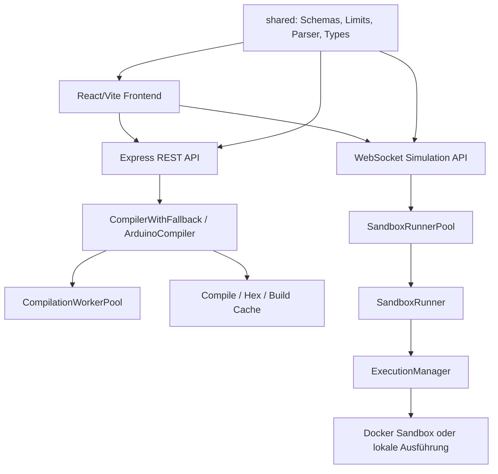

# UnoSim Projektanalyse

Status: planning

**Datum:** 2026-09-04  
**Repository:** `MoDevIO/UnoSim`  
**Branch:** `main`  
**Analysemodus:** Read-only-Auswertung der Architektur, Code-Struktur, Dokumentation, Konsistenz und Qualitätsmetriken.

## 1. Kurzfazit

UnoSim ist ein technisch solides TypeScript-Projekt mit klarer Grundstruktur, strikter Typisierung, gemeinsamer Schema-Schicht und einer breiten Test- und Analyse-Infrastruktur. Die statische Qualitätslage ist stark: Das SonarQube Quality Gate ist grün, es gibt keine offenen Bugs, Vulnerabilities oder Security Hotspots, und die Duplikationsrate ist sehr niedrig.

Die wichtigsten Risiken liegen weniger in fehlender Basisqualität, sondern in gewachsener Komplexität: Mehrere zentrale Dateien übernehmen sehr viele Aufgaben, einige Begriffe und Wrapper existieren parallel, und die Dokumentation enthält sowohl aktuelle als auch historische Aussagen. Dadurch ist das Projekt funktional gut aufgestellt, aber für neue Entwicklerinnen und Entwickler nicht immer leicht zu verstehen.

## 2. Qualitätslage

| Metrik | Wert |
| --- | ---: |
| SonarQube Quality Gate | OK |
| Lines of Code | 25.850 |
| Komplexität | 4.592 |
| Cognitive Complexity | 3.406 |
| Coverage | 77,1 % |
| Duplicated Lines Density | 0,5 % |
| Violations | 0 |
| Bugs | 0 |
| Vulnerabilities | 0 |
| Security Hotspots | 0 |

**Bewertung:** Die Messwerte sprechen für eine gute technische Basis. Die niedrige Duplikation und das grüne SonarQube-Gate sind starke Signale. Die hohe absolute Komplexität zeigt aber, dass zentrale Orchestrierungsdateien künftig gezielt entlastet werden sollten.

## 3. Architektur

### 3.1 Gesamtbild

Die Architektur folgt einer sinnvollen Trennung:



### 3.2 Stärken

- Klare Top-Level-Trennung in `client/`, `server/` und `shared/`.
- Gemeinsame Schemas in `shared/schema.ts` reduzieren Protokolldrift.
- Zentrale Eingabelimits in `shared/input-limits.ts` verbessern Sicherheit und Konsistenz.
- `server/config.ts` bildet die wesentlichen Betriebsmodi nachvollziehbar ab.
- Compile- und Simulationspfade sind konzeptionell getrennt.
- `CompilerWithFallback` und `CompilationWorkerPool` kapseln Kompilierungsstrategie und Worker-Verwaltung gut.
- Die Sandbox-Architektur ist in der aktuellen Dokumentation gut beschrieben.
- Frontend-Seitenkomponente `ArduinoSimulatorPage.tsx` ist bewusst schlank gehalten.

### 3.3 Schwächen

Die Architektur hat gute Bausteine, aber mehrere Bausteine sind zu groß und übernehmen zu viele Rollen.

| Datei | Beobachtung |
| --- | --- |
| `server/routes/simulation.ws.ts` | Bündelt WebSocket-Transport, Session-State, Message-Routing, Runner-Pool-Anbindung, Serial-Batching und Lifecycle. |
| `server/services/arduino-compiler.ts` | Kombiniert Kompilierung, Caching, Dateisystem, Header-Verarbeitung, CLI-Auswertung und Fehleraufbereitung. |
| `server/services/sandbox/execution-manager.ts` | **Phase 2.6:** Prepare-Phase extrahiert (`prepare-phase.ts`), weitere Phasen in Decomposition (Cleanup, Timeout, Stream, Start, Router). |
| `client/src/hooks/useArduinoSimulatorPage.tsx` | Ist Composition Root, enthält aber zusätzlich viele Zustandsableitungen und Seiteneffekte. |
| `client/src/hooks/use-compile-and-run.ts` | **Phase 2.1 abgeschlossen:** 4 Sub-Hooks extrahiert (`use-compile-controller`, `use-simulation-controller`, `use-ui-feedback-adapter`, Lifecycle). |
| `shared/code-parser.ts` | **Phase 2.10 abgeschlossen:** 5 Parser-Module extrahiert (Hardware-Compatibility, Pin-Conflicts, Structure, Performance, Serial-Configuration). |

**Kernbefund:** Die Modulgrenzen sind vorhanden, aber zentrale Orchestratoren sind noch zu breit. Dadurch ist das Projekt zwar gut lauffähig, aber Änderungen an Kernflüssen sind schwerer sicher umzusetzen.

## 4. Modularisierung und Verantwortlichkeiten

### 4.1 Backend

Das Backend ist fachlich gut segmentiert. Routen, Compiler, Sandbox, Pooling und Security sind grundsätzlich getrennt. Besonders positiv ist die Entwicklung weg von monolithischen Routen hin zu spezialisierten Modulen wie `compiler.routes.ts` und eigenen Security-Komponenten.

**Phase 2.6 Decomposition:** `execution-manager.ts` wird schrittweise decomposed:
- ✅ `prepare-phase.ts` extrahiert (Compilation mit Gatekeeper, 95.7% Coverage)
- ✅ `cleanup-phase.ts`, `router-phase.ts`, `start-phase.ts`, `stream-phase.ts`, `timeout-phase.ts` vorhanden
- 🔄 Weitere Extraktionen in Planung

**Phase 2.10 Parser-Extraktion:** `code-parser.ts` erfolgreich decomposed:
- ✅ `hardware-compatibility-parser.ts` (13.097 Zeilen → 380 Zeilen extrahiert)
- ✅ `pin-conflicts-parser.ts` (Pin-Konflikte, Mehrfachverwendung)
- ✅ `structure-parser.ts` (Setup/Loop-Struktur)
- ✅ `performance-parser.ts` (Timing-Muster)
- ✅ `serial-configuration-parser.ts` (Baud-Rate, Serial-Konfiguration)
- ✅ `code-parser.ts` auf 68 Zeilen reduziert (von 835 Zeilen)

Verbesserungspotenzial besteht bei der Laufzeit- und WebSocket-Schicht. `simulation.ws.ts` sollte langfristig nicht gleichzeitig Transport, Session-Management und Simulationssteuerung enthalten. Eine mögliche Zielstruktur wäre:

- `simulation-message-router`
- `simulation-session-manager`
- `simulation-output-buffer`
- `simulation-runner-adapter`
- `simulation-client-registry`

### 4.2 Frontend

Das Frontend ist komponentenorientiert und nutzt Hooks zur Kapselung von Verhalten. Die Page-Komponente ist gut lesbar, aber der zentrale Hook `useArduinoSimulatorPage.tsx` ist sehr breit. Er verbindet unter anderem WebSocket, Compile/Run, Pin-State, Backend-Health, File-System, externe API, Serial IO, Mobile Layout und Output-Panel.

**Phase 2.1 Hook-Extraktion abgeschlossen:**
- ✅ `use-compile-controller.ts` (Compile-Mutation, Parser-Messages, I/O-Registry, 94% Coverage)
- ✅ `use-simulation-controller.ts` (Simulation-State, WebSocket-Commands, 100% Coverage)
- ✅ `use-ui-feedback-adapter.ts` (Toasts, Debug-Messages, Pin-Conflict, 98.8% Coverage)
- ✅ `use-simulation-lifecycle.ts` (Lifecycle-Automatik)
- ✅ Orchestrator `use-compile-and-run.ts` auf 361 Zeilen reduziert (von 748 Zeilen)

Sinnvolle weitere Zielgrenzen wären:

- Compile-Controller
- Simulation-Lifecycle-Controller
- WebSocket-Command-Sender
- UI-Notification-/Debug-Adapter
- Page-ViewModel-Composer

## 5. Komplexitätshotspots

Die größten produktiven Dateien sind:

| Datei | Zeilen | Risiko |
| --- | ---: | --- |
| `server/routes/simulation.ws.ts` | 1004 | Sehr breiter Backend-Orchestrator. |
| `server/services/sandbox/execution-manager.ts` | 674 | **Phase 2.6:** Prepare-Phase extrahiert, weitere Phasen in Decomposition. |
| `shared/code-parser.ts` | 68 | **Phase 2.10:** Von 835 auf 68 Zeilen reduziert (92% Verbesserung). |
| `server/services/arduino-compiler.ts` | 823 | Compiler, Cache, Dateisystem und CLI gekoppelt. |
| `client/src/hooks/useArduinoSimulatorPage.tsx` | 753 | Frontend-Composition plus Fachlogik. |
| `client/src/components/features/arduino-board.tsx` | 792 | Große UI-/Board-Komponente. |
| `server/services/registry-manager.ts` | 785 | Umfangreiche Registry-/Analyse-Logik. |
| `client/src/hooks/use-compile-and-run.ts` | 361 | **Phase 2.1:** Von 748 auf 361 Zeilen reduziert (52% Verbesserung). |
| `client/src/components/features/app-header.tsx` | 723 | Header mit vielen Zuständen. |
| `client/src/components/features/code-editor.tsx` | 688 | Editor-Integration komplex. |
| `client/src/components/features/parser-output.tsx` | 684 | Parserdarstellung umfangreich. |
| `shared/io-registry-parser.ts` | 665 | Parser-/Registrylogik umfangreich. |
| `shared/parsers/hardware-compatibility-parser.ts` | 380 | **Phase 2.10:** Extrahiert aus code-parser.ts.


**Bewertung:** Die Dateigröße ist nicht automatisch problematisch, korreliert hier aber oft mit gemischten Verantwortlichkeiten. Diese Dateien sollten bevorzugt durch Tests abgesichert und dann schrittweise entlastet werden.

## 6. Konsistenz

### 6.1 Positive Konsistenz

- Striktes TypeScript ist aktiviert.
- Die Aliase `@/*` und `@shared/*` sind klar und verständlich.
- Zod-Schemas und TypeScript-Typen werden gemeinsam genutzt.
- Vitest-Projekte trennen Unit-, Integrations-, Docker- und Load-Tests.
- SonarQube ist eingerichtet und liefert ein grünes Gate.
- Security- und Admin-Dokumentation sind umfangreich.

### 6.2 Inkonsistente Namen und Wrapper

Es gibt mehrere parallele Namensmuster:

| Thema | Beispiele |
| --- | --- |
| Hook-Dateinamen | `use-output-panel.ts`, `use-serial-io.ts`, aber auch `useArduinoSimulatorPage.tsx`, `useSimulatorFileSystem.ts`. |
| Ähnliche Begriffe | `useSimulationControllerState` und `useSimulatorControllerState`. |
| Doppelte Varianten | `useFileSystem` und `useSimulatorFileSystem`, `useOutputPanel` und `useSimulatorOutputPanel`. |
| Compile/Simulation-Wrapper | `useCompileAndRun`, `useCompilation`, `useSimulationControls`, `useSimulation`. |

**Risiko:** Die Auffindbarkeit leidet. Es ist nicht immer klar, ob ein Wrapper eine fachliche Variante, ein Adapter oder historischer Übergangscode ist.

### 6.3 Alte und neue Modelle parallel

`IOPinRecord` in `shared/schema.ts` enthält sowohl moderne Felder wie `pinId`, `pinModeLines`, `digitalReadLines`, `conflict` und `conflictMessage` als auch ältere Felder wie `pinMode`, `definedAt` und `usedAt`.

Das ist als Migrationszustand nachvollziehbar, sollte aber nicht dauerhaft unkommentiert bleiben. Eine klare Deprecation-Roadmap würde verhindern, dass neue Features versehentlich auf dem alten Modell weiterentwickelt werden.

### 6.4 Konfiguration

`server/config.ts` ist als zentrale Konfigurationsquelle angelegt. Gleichzeitig existieren noch harte Werte und direkte `process.env`-Zugriffe in anderen Modulen, insbesondere im Sandbox-/Docker-Umfeld.

**Empfehlung:** Konfigurationswerte konsequent aus `server/config.ts` beziehen oder Ausnahmen explizit dokumentieren.

## 7. Verständlichkeit

### 7.1 Gut verständlich

- Die Repository-Struktur ist logisch.
- Die Hauptdomänen Compile, Simulation, Sandbox, Parser und UI sind erkennbar.
- Viele Service-Namen sind sprechend.
- Gemeinsame Schemas und Limits machen Verträge explizit.
- Die Dokumentation enthält viel fachlichen Kontext.

### 7.2 Erschwerend

- Zu viele zentrale Dateien enthalten sowohl Orchestrierung als auch Detailverhalten.
- Frontend-Hooks bilden teilweise mehrere mentale Modelle für denselben Ablauf.
- Große Prop-Oberflächen erschweren das Verständnis der Page-Struktur.
- Historische Dokumente enthalten teils Aussagen, die inzwischen durch Codeänderungen überholt sind.
- Deprecated API-Felder und Legacy-Datenfelder haben keinen klaren Sunset-Pfad.

## 8. Dokumentation

`docs/archive/plans/project-analysis-action-plan-2026-09-03.md` ist wertvoll, aber als historische Quelle zu lesen. Einige dort genannte Probleme sind inzwischen behoben, zum Beispiel:

- Compile-Request-Validierung existiert.
- Richtungsspezifische WebSocket-Schemas existieren.
- Eingabelimits sind zentralisiert.
- Cache-Hash berücksichtigt inzwischen `fqbn` und sortierte `libraries`.
- Gateway-, Origin- und Security-Konzepte sind dokumentiert und implementiert.

Noch bestehende Dokumentationsabweichungen:

| Datei | Beobachtung |
| --- | --- |
| `README.md` | Teilweise ältere Begriffe wie `PooledCompiler`, obwohl der Code `CompilerWithFallback` und `CompilationWorkerPool` verwendet. |
| `README.md` | Docker-Image-Namen wirken teilweise uneinheitlich. |
| `README_ADMIN.md` | „Warm containers“ ist wahrscheinlich irreführend, weil der Pool Runner-Objekte vorhält, nicht zwingend laufende Container. |
| `docs/SCALABILITY_100_STUDENTS.md` | Enthält ältere Skalierungs- und Polling-Annahmen. |
| `ssot/` | Vermischt teils normative Spezifikation, Planung, erledigte Checklisten und historische Hinweise. |

## 9. Coverage-Hotspots

Die Gesamtcoverage ist solide. Verbesserungen sollten sich aber auf wichtige, komplexe oder schlecht getestete Bereiche konzentrieren.

| Datei | Coverage |
| --- | ---: |
| `client/src/components/features/examples-menu.tsx` | 0,5 % |
| `server/services/local-compiler.ts` | 14,4 % |
| `client/src/hooks/useSimulatorFileSystem.ts` | 13,7 % |
| `client/src/components/features/output-panel.tsx` | 33,8 % |
| `server/services/sandbox/execution-manager.ts` | 59,8 % |
| `client/src/hooks/useArduinoSimulatorPage.tsx` | 55,7 % |

## 10. Action-Plan

Die Reihenfolge ist bewusst so gewählt: zuerst schnell umsetzbare Verbesserungen, danach Maßnahmen mit hohem strukturellem Impact und zuletzt Punkte mit besonders hoher fachlicher oder betrieblicher Bedeutung.

### Phase 1: Low-Hanging Fruits

Diese Punkte sind vergleichsweise klein, verbessern aber sofort Lesbarkeit und Orientierung.

| Nr. | Maßnahme | Ziel | Erwarteter Aufwand |
| --- | --- | --- | --- |
| 1.1 | `docs/archive/plans/project-analysis-action-plan-2026-09-03.md` sichtbar als historische Analyse markieren. | Verhindert, dass alte Befunde als aktueller Fehlerbestand verstanden werden. | S |
| 1.2 | `README.md` auf aktuelle Begriffe prüfen und alte Bezeichnungen wie `PooledCompiler` ersetzen. | Konsistente Architekturbegriffe. | S |
| 1.3 | Docker-Image-Namen in README/Admin-Doku vereinheitlichen. | Weniger Verwirrung bei Setup und Deployment. | S |
| 1.4 | Begriff „warm containers“ in `README_ADMIN.md` präzisieren. | Korrekte Erwartung an SandboxRunnerPool. | S |
| 1.5 | Hook-Namenskonvention dokumentieren: kebab-case oder camelCase, aber nicht gemischt. | Bessere Auffindbarkeit. | S |
| 1.6 | Deprecated API-Felder `compile` und `pool` in `/api/status` mit Sunset-Hinweis dokumentieren. | Klarer Migrationspfad für Clients. | S |
| 1.7 | Legacy-Felder in `IOPinRecord` mit `@deprecated` und Zielmodell kommentieren. | Verhindert neue Abhängigkeiten vom alten Modell. | S |
| 1.8 | Client-Typen für WebSocket-Richtung enger benennen: `Incoming` und `Outgoing`. | Bessere Typklarheit. | S-M |
| 1.9 | Kleine README- oder `docs/ARCHITECTURE.md`-Skizze der aktuellen Datenflüsse ergänzen. | Schnellerer Einstieg. | M |
| 1.10 | Coverage-Hotspots als explizite Testziele in `docs/TESTING_STANDARDS.md` aufnehmen. | Refactoring-Vorbereitung. | S |

### Phase 2: Hoher Impact

Diese Maßnahmen verbessern Wartbarkeit und Änderbarkeit deutlich. Sie sollten schrittweise und testgestützt erfolgen.

| Nr. | Maßnahme | Ziel | Erwarteter Aufwand |
| --- | --- | --- | --- |
| 2.1 | `use-compile-and-run.ts` in Compile-Controller, Simulation-Controller und UI-Feedback-Adapter aufteilen. | Weniger Hook-Komplexität, klarere State Ownership. | L |
| 2.2 | `useArduinoSimulatorPage.tsx` auf reinen Composition Root reduzieren. | Page-State besser verständlich und testbar machen. | M-L |
| 2.3 | `ArduinoSimulatorPageState` in fachliche ViewModels gruppieren: `compile`, `simulation`, `serial`, `pins`, `files`, `connection`, `layout`. | Kleinere Prop-Oberflächen. | M |
| 2.4 | `server/routes/simulation.ws.ts` in Message-Router, Session-Manager und Output-Buffer trennen. | WebSocket-Lifecycle isolierbar machen. | L |
| 2.5 | `server/services/arduino-compiler.ts` in Cache, Temp-FS, Header-Verarbeitung, CLI-Aufruf und Ergebnisparser aufteilen. | Compiler leichter testen und ändern. | L |
| 2.6 | `ExecutionManager` nach Laufzeitphasen trennen: Vorbereitung, Start, Stream, Timeout, Cleanup. | Sandbox-Ausführung verständlicher und robuster machen. | L |
| 2.7 | Konfigurationszugriffe konsequent über `server/config.ts` bündeln. | Drift zwischen Doku, Docker und Code reduzieren. | M |
| 2.8 | Wrapper-Hooks prüfen und unnötige Durchreich-Layer entfernen. | Weniger Navigationskomplexität. | M |
| 2.9 | Characterization Tests für zentrale Flows ergänzen: Compile, Start, Stop, Pause, Resume, Serial Input. | Sichere Grundlage für Refactoring. | M-L |
| 2.10 | Parser-Dateien `shared/code-parser.ts` und `shared/io-registry-parser.ts` nach Regelgruppen aufteilen. | Parserlogik leichter wartbar machen. | M-L |

### Phase 3: Hohe Bedeutung

Diese Punkte haben hohe fachliche, sicherheitsbezogene oder betriebliche Relevanz. Sie sind nicht zwingend zuerst umzusetzen, sollten aber bewusst geplant werden.

| Nr. | Maßnahme | Ziel | Erwarteter Aufwand |
| --- | --- | --- | --- |
| 3.1 | Verbindliche Architektur-Dokumentation `docs/ARCHITECTURE.md` erstellen. | Eine aktuelle normative Quelle für Komponenten, Datenflüsse und State Ownership. | M |
| 3.2 | SSOT-Dateien bereinigen: normative Spezifikation von Roadmap, Historie und Post-Mortems trennen. | Weniger Widersprüche und klarere Entscheidungsgrundlagen. | M |
| 3.3 | Deprecation-Plan für Legacy-Modelle und Status-Aliasse festlegen. | API- und Datenmodell-Schulden kontrolliert abbauen. | M |
| 3.4 | Reproduzierbaren Lasttest für 50/100/200 Clients mit Hostmetriken etablieren. | Skalierbarkeitsaussagen belastbar machen. | L |
| 3.5 | Sandbox-Vertrag regelmäßig durch Docker-/Integrationstests verifizieren. | Sicherheitsannahmen dauerhaft absichern. | M-L |
| 3.6 | Coverage für kritische, aktuell schwächer getestete Dateien erhöhen. | Risiko bei Refactoring und Betrieb senken. | M-L |
| 3.7 | Release-Gate definieren: Typecheck, Unit, relevante Integration, Build, SonarQube, Security-Audit. | Reproduzierbare Qualität vor Releases. | M |
| 3.8 | Horizontale Skalierbarkeit bewusst entscheiden: Single Stateful Node dokumentieren oder Architektur für HA entwerfen. | Betriebsmodell ehrlich und belastbar machen. | L-XL |
| 3.9 | Observability-Konzept ausbauen: strukturierte Metriken für Queues, Runner, Compile-Slots, WS-Sessions, Timeouts. | Produktionsprobleme schneller erkennen. | L |
| 3.10 | Externe API und WebSocket-Protokoll versionieren. | Stabilere Integrationen und kontrollierbare Migrationen. | M-L |

## 10.1 Abhängigkeiten zwischen Maßnahmen

Folgende Maßnahmen sollten in dieser Reihenfolge umgesetzt werden:

| Abhängigkeit | Begründung |
| --- | --- |
| 1.7 → 2.3 | Legacy-Felder markieren, bevor ViewModels gruppiert werden |
| 2.7 → 2.6 | Konfiguration zentralisieren, bevor ExecutionManager getrennt wird |
| 2.1 → 2.2 | Hooks zerlegen, bevor Page-State reduziert wird |
| 2.9 → 2.4/2.5/2.6 | Characterization Tests vor allen großen Zerlegungen |
| 3.1 → 3.8 | Architektur dokumentieren, bevor Skalierbarkeitsentscheidung |
| 1.10 → 2.x | Coverage-Ziele definieren, bevor Refactoring startet |

## 10.2 Erfolgskriterien für Refactorings

Jede größere Refactoring-Maßnahme sollte folgende Ziele erfüllen:

| Maßnahme | Erfolgskriterium |
| --- | --- |
| 2.1 Hook-Zerlegung | Pro Sub-Hook <300 Zeilen, Coverage >80% |
| 2.4 WebSocket-Modularisierung | Pro Modul <400 Zeilen, isolierte Unit-Tests möglich |
| 2.5 Compiler-Aufteilung | Jede Schicht separat mockbar, Integrationstest grün |
| 2.6 ExecutionManager | Phasen einzeln testbar, Timeout-Tests deterministisch |
| 3.6 Coverage-Verbesserung | Alle Hotspots >60%, kritische >80% |
| Alle Refactorings | SonarQube Gate bleibt grün, keine neuen Issues |

## 10.3 Test-Anforderungen pro Phase

### Phase 1: Low-Hanging Fruits (Dokumentation, Typen, Konventionen)

| Maßnahme | Erforderliche Tests |
| --- | --- |
| 1.1–1.7, 1.9, 1.10 | Keine Code-Tests nötig; PR-Review auf Konsistenz |
| 1.8 WebSocket-Typen | **Typecheck:** `npm run check` muss grün bleiben<br>**Kompatibilität:** Bestehende WebSocket-Calls dürfen nicht brechen<br>**E2E-Rauchtest:** `npm run test:e2e` – mindestens Smoke-Test muss passieren |

**Gate vor Phase 2:** `npm run check`, `npm run test:unit`, `npm run test:e2e` (Smoke) müssen grün sein.

### Phase 2: Hoher Impact (Architektur-Refactorings)

| Maßnahme | Tests VOR dem Refactoring | Tests WÄHREND des Refactorings | Tests NACH dem Refactoring |
| --- | --- | --- | --- |
| 2.1 Hook-Zerlegung | Characterization Test: Compile→Run→Stop (E2E)<br>Bestehende Unit-Tests dokumentieren | Pro Sub-Hook: Unit-Tests mit >80% Coverage<br>Integrationstest: Hook-Zusammenspiel | `npm run test:unit` (alle)<br>`npm run test:e2e` (vollständig)<br>Coverage-Bericht: >80% pro Sub-Hook |
| 2.2 Page-Reduktion | E2E-Test: Page-Rendering, Mobile/Desktop-Layout | Unit-Tests für ViewModel-Gruppen<br>Visual-Regression-Tests (falls vorhanden) | `npm run test:unit` + `npm run test:e2e`<br>Keine visuellen Regressionen |
| 2.3 ViewModel-Gruppierung | Siehe 2.2 | Typ-Checks: Props müssen kompatibel bleiben<br>Unit-Tests pro ViewModel | Siehe 2.2 |
| 2.4 WebSocket-Modularisierung | Characterization Test: Session-Lifecycle (Connect, Start, Stop, Disconnect)<br>Integrationstest: WebSocket-Nachrichten | Pro Modul: Unit-Tests isoliert<br>Integrationstest: Modul-Zusammenspiel | `npm run test:integration`<br>`npm run test:e2e`<br>Latency-Metrik: Keine Verschlechterung |
| 2.5 Compiler-Aufteilung | Characterization Test: Realer Sketch kompilieren (lokaler + Docker-Modus)<br>Cache-Hit/Miss-Tests | Pro Schicht: Unit-Tests mockbar<br>Integrationstest: End-to-End-Compile | `npm run test:integration`<br>Cache-Hit-Rate dokumentiert<br>Compile-Zeit: Keine Verschlechterung |
| 2.6 ExecutionManager | Characterization Test: Start→Pause→Resume→Stop<br>Timeout-Test: Harter Abbruch<br>Stream-Test: Serial-Output vollständig | Pro Phase: Unit-Tests deterministisch<br>Integrationstest: Docker + Local | `npm run test:docker`<br>`npm run test:integration`<br>Timeout-Tests: Deterministisch bestanden |
| 2.7 Konfigurationsbündelung | Bestehende Integrationstests dokumentieren | Config-Drift-Test: Env → Config → Code<br>Unit-Tests für zentrale Config | `npm run test:unit` + `npm run test:integration`<br>Config-Linter: Keine direkten `process.env`-Zugriffe |
| 2.8 Wrapper-Entfernung | Bestehende Hook-Aufrufe dokumentieren | Unit-Tests: Refaktorierte Hooks<br>E2E: Bestehende Flows | `npm run test:unit` + `npm run test:e2e`<br>Knip: Keine neuen ungenutzten Exporte |
| 2.9 Characterization Tests | – | Tests schreiben VOR Refactoring<br>Tests müssen rot werden, wenn Code bricht | `npm run test:unit` + `npm run test:integration`<br>Alle Characterization Tests grün |
| 2.10 Parser-Aufteilung | Bestehende Parser-Tests sammeln | Pro Regelgruppe: Unit-Tests<br>Integrationstest: Parser-Gesamtverhalten | `npm run test:unit`<br>Parser-Output: Bit-identisch mit vorher |

**Gate vor Phase 3:** `npm run test:unit`, `npm run test:integration`, `npm run test:docker`, `npm run test:e2e` müssen grün sein. SonarQube: Keine neuen Issues, Coverage nicht schlechter als vorher.

### Phase 3: Hohe Bedeutung (Betrieb, Security, Skalierbarkeit)

| Maßnahme | Erforderliche Tests |
| --- | --- |
| 3.1 Architektur-Doku | Review: Doku stimmt mit Code überein<br>ADR-Prozess: Entscheidungen dokumentiert |
| 3.2 SSOT-Bereinigung | Review: Normative vs. historische Dokumente getrennt |
| 3.3 Deprecation-Plan | Migrationstest: Alte + neue Pfade parallel<br>E2E: Legacy-Client + moderner Client |
| 3.4 Lasttest | **Neu:** `npm run test:load:50`, `npm run test:load:100` und `npm run test:load:200`<br>Host-Metriken: CPU, RAM, WebSocket-Latenz<br>Dokumentation: Max Clients bei definierter Hardware |
| 3.5 Sandbox-Vertrag | **Neu:** Docker-Integrationstest: Security-Grenzen<br>Penetrationstest: Container-Escape-Versuche<br>Regelmäßig: Security-Audit |
| 3.6 Coverage-Verbesserung | Coverage-Bericht: Alle Hotspots >60%, kritische >80%<br>`npm run test:coverage` |
| 3.7 Release-Gate | **Neu:** CI-Pipeline: Typecheck, Unit, Integration, Build, SonarQube<br>Security-Audit: `npm audit` + manuelle Prüfung |
| 3.8 Skalierbarkeit | Lasttest: Siehe 3.4<br>HA-Test: Falls HA-Architektur, Failover-Tests |
| 3.9 Observability | Metriken: Im Produktiv-Logging sichtbar<br>Alert-Tests: Grenzwert-Überschreitungen melden |
| 3.10 Versionierung | API-Versionierung: Alte + neue Version parallel testbar<br>Migrationstest: Client-Migration dokumentiert |

**Release-Gate (3.7) vor jedem Produktiv-Release:**

```bash
npm run check              # Typecheck
npm run test:unit          # Unit-Tests
npm run test:integration   # Integrationstests
npm run test:docker        # Docker-Tests (falls zutreffend)
npm run test:e2e           # E2E-Tests
npm run build              # Produktionsbuild
npm run sonar              # SonarQube-Analyse
npm audit                  # Security-Audit
```

Alle Schritte müssen erfolgreich sein. Bei Fehlschlag: Kein Release.

## 11. Empfohlene erste Umsetzungsschritte

Für den nächsten kleinen Arbeitsblock empfiehlt sich folgende Reihenfolge:

1. Dokumente als aktuell oder historisch kennzeichnen.
2. Architekturbegriffe in `README.md` und `README_ADMIN.md` korrigieren.
3. WebSocket-Clienttypen in `Incoming` und `Outgoing` schärfen.
4. Legacy-Felder in `IOPinRecord` mit Deprecation-Hinweisen versehen.
5. Einen ersten Characterization-Test für einen zentralen Compile-und-Run-Flow ergänzen.
6. Danach mit der Zerlegung von `use-compile-and-run.ts` beginnen.

### 11.1 Git-Strategie für Nachvollziehbarkeit

Jede Maßnahme sollte mit klarer Git-Historie umgesetzt werden:

| Prinzip | Umsetzung |
| --- | --- |
| **Atomare Commits** | Pro Unteraufgabe ein Commit, keine gemischten Änderungen |
| **Aussagekräftige Messages** | Format: `[Phase X.Y] Kurzbeschreibung` z. B. `[Phase 1.2] Replace PooledCompiler with CompilerWithFallback in README` |
| **Branch-Strategie** | Pro Phase einen Feature-Branch: `feature/refactor/phase-1-low-hanging`, `feature/refactor/phase2-hooks` |
| **PR-Reviews** | Jede Phase als Pull Request, auch bei kleinen Änderungen |
| **Doku-Update** | Commit enthält immer Code + aktualisierte Dokumentation |
| **Test-First** | Characterization Tests im separaten Commit vor dem Refactoring |

**Beispiel-Commit-Historie für Phase 1:**

```
[Phase 1.1] Archive project-analysis-action-plan-2026-09-03.md as historical
[Phase 1.2] Update README.md: replace PooledCompiler with current terms
[Phase 1.3] Unify Docker image names in documentation
[Phase 1.4] Clarify "warm containers" terminology in README_ADMIN
[Phase 1.5] Document hook naming convention in TESTING_STANDARDS
[Phase 1.6] Add deprecation notice to /api/status legacy fields
[Phase 1.7] Add @deprecated JSDoc to IOPinRecord legacy fields
[Phase 1.8] Rename WebSocket types: Incoming/Outgoing ArduinoMessage
[Phase 1.9] Add architecture diagram to docs/ARCHITECTURE.md
[Phase 1.10] Add coverage targets to TESTING_STANDARDS.md
```

## 12. Risiken und Gegenmaßnahmen

| Risiko | Wahrscheinlichkeit | Impact | Gegenmaßnahme |
| --- | ---: | ---: | --- |
| Refactoring unterbricht laufenden Betrieb | Mittel | Hoch | Feature-Flags, parallele Pfade, Canary-Deployments |
| Testsuite wird während Zerlegung rot | Hoch | Mittel | Characterization Tests zuerst, inkrementelle Migration |
| Dokumentation driftet erneut | Mittel | Mittel | Docs as Code, PR-Check für Doku-Aktualität |
| Konfigurationswerte driften auseinander | Mittel | Hoch | 2.7 priorisieren, Config-Linter einführen |
| Security-Lücken durch Refactoring | Niedrig | Hoch | Security-Review nach Phase 2, Pen-Test vor Go-Live |
| Git-Historie wird unübersichtlich | Mittel | Niedrig | Atomare Commits, klare Branch-Strategie, PR-Templates |

### 12.1 Betriebsrisiken im aktuellen Zustand

| Risiko | Beschreibung | Empfohlene Priorität |
| --- | --- | ---: |
| Maximale Client-Anzahl unbekannt | Keine belastbaren Lasttests für 50+ Clients | Phase 3.4 |
| Ausfallzeit bei Refactoring | Kein klares Rollback-Konzept für große Änderungen | Phase 2.9 + 11.1 |
| Konfigurationsdrift | Harte Werte neben `server/config.ts` | Phase 2.7 |
| WebSocket-DoS-Anfälligkeit | Große zentrale Datei, schwer zu härten | Phase 2.4 |
| Legacy-Modell wird dauerhaft | `IOPinRecord` ohne Deprecation-Pfad | Phase 1.7 + 3.3 |

## 13. Gesamturteil

UnoSim hat eine gute technische Basis und wirkt deutlich professioneller als ein typischer Prototyp. Die vorhandene Struktur, die strikte Typisierung, die gemeinsame Schema-Schicht und die Qualitätssicherung sind klare Stärken.

Der nächste Reifegrad entsteht nicht durch neue Infrastruktur, sondern durch Reduktion von Komplexität: zentrale Orchestratoren verkleinern, State Ownership klarziehen, Dokumentation aktualisieren und Legacy-Pfade aktiv auslaufen lassen.

**Wichtigster Erfolgsfaktor:** Inkrementelle Umsetzung mit klarer Git-Historie. Jede Phase sollte als abgeschlossenes, getestetes und dokumentiertes Inkrement geliefert werden. Big-Bang-Refactorings vermeiden.
