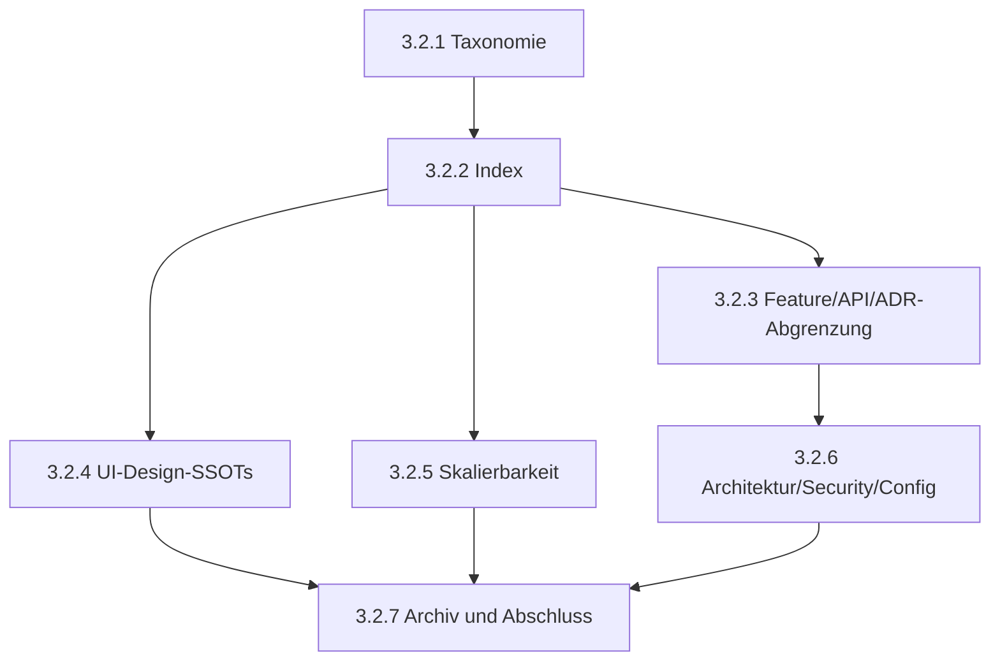

# Phase 3.2: SSOT-Struktur und Architektur-Governance Konsolidierung

**Status:** completed  
**Datum:** 2026-09-05  
**Branch:** `feature/phase-3-architecture-hardening`  
**Ziel:** SSOT-Struktur und Architektur-Governance konsolidieren, ohne Produktivcode zu ändern.

---

## 1. Scope / Non-Scope

### Scope

- Inventarisierung der aktuellen SSOT-, Architektur-, ADR-, API-, Testing-, Skalierungs- und Archivdokumente.
- Trennung von normativer Spezifikation, Architekturentscheidung, Plan, Historie, Test-Gate und Archivhinweis.
- Festlegung verbindlicher Ziel-SSOTs pro Thema.
- Identifikation von Duplikaten, Konflikten und Merge-/Archiv-Kandidaten.
- Erstellung kleiner, unabhängig prüfbarer Teilsteps für die spätere Umsetzung.
- Dokumentations-Gates für jeden Teilstep.

### Non-Scope

- Keine Produktivcode-Änderungen.
- Keine Änderung an Tests, Testdaten oder CI-Konfiguration.
- Keine fachliche Neuspezifikation bestehender Features.
- Keine ADR-Umschreibung außer klar abgegrenzten Verweisen oder Statushinweisen.
- Kein Entfernen historischer Information ohne Archiv- oder Link-Erhalt.
- Keine Korrektur fachlicher Bugs außerhalb der Dokumentations-Governance.

---

## 2. Inventar

### 2.1 Normative und aktuelle Dokumente

| Datei | Aktueller Zweck | Phase-3.2-Rolle |
| --- | --- | --- |
| [`docs/ARCHITECTURE.md`](ARCHITECTURE.md) | Aktueller Architekturüberblick, Datenflüsse, State Ownership, Sicherheits-/Betriebsmodell | Architektur-Übersicht; darf auf Details verweisen, soll sie nicht vollständig duplizieren |
| [`docs/EXTERNAL_API.md`](EXTERNAL_API.md) | Normatives `postMessage`-Protokoll für iframe-Integrationen | Ziel-SSOT für externe API-Verträge |
| [`docs/TESTING_STANDARDS.md`](TESTING_STANDARDS.md) | Testkonventionen, Gates, Timing-Toleranzen, Coverage-Ziele | Ziel-SSOT für Test- und Validierungsregeln |
| [`docs/adr/0001-authentication-and-gateway-contract.md`](adr/0001-authentication-and-gateway-contract.md) | Akzeptierte Gateway-/Security-Entscheidung | Ziel-SSOT für Auth-/Gateway-Architekturentscheidung |
| [`docs/adr/0002-unified-scroll-area.md`](adr/0002-unified-scroll-area.md) | Akzeptierte Scroll-Area-Entscheidung | Ziel-SSOT für Scrollbar-/ScrollArea-Architekturentscheidung |

### 2.2 Planende Dokumente

| Datei | Aktueller Zweck | Phase-3.2-Rolle |
| --- | --- | --- |
| [`docs/PROJECT_ANALYSIS_REPORT_2026-09-04.md`](PROJECT_ANALYSIS_REPORT_2026-09-04.md) | Projektanalyse und priorisierte Maßnahmen | Nicht normativ; Quelle für Risiken und Maßnahmen |
| [`docs/SCALABILITY_100_STUDENTS.md`](SCALABILITY_100_STUDENTS.md) | Skalierbarkeitsanalyse und Mess-/Zielszenarien | Ziel-SSOT für Skalierungsplanung und Kapazitätsannahmen |
| [`docs/phase-3.1-architecture-documentation-plan.md`](phase-3.1-architecture-documentation-plan.md) | Abgeschlossener Phase-3.1-Plan | Historischer Plan; kein aktueller Architektur-SSOT |
| `docs/phase-3.2-ssot-governance-plan.md` | Dieser Plan | Verbindlicher Umsetzungsplan für Phase 3.2 |

### 2.3 SSOT-Verzeichnis

| Datei | Aktueller Inhalt | Zielklassifikation |
| --- | --- | --- |
| [`../ssot/ssot_agent_policy.md`](../ssot/ssot_agent_policy.md) | Agenten-Workflow, Git-/Test-Governance, Runtime-Evidence-Regeln | Governance-Policy; normativ für Agentenarbeit, aber abzugrenzen von Repo-Dokumentation |
| [`../ssot/ssot_io-registry.md`](../ssot/ssot_io-registry.md) | Hybrid-I/O-Registry, statisches/dynamisches Parsing, Telemetrie, UI-Ansicht | Feature-SSOT; soll auf Code-/Schema-Quellen und Archivberichte verweisen |
| [`../ssot/ssot_function_definition_OutputPanel.md`](../ssot/ssot_function_definition_OutputPanel.md) | OutputPanel-Autoverhalten, Größenlogik, Persistenz, Tests | Feature-SSOT; ScrollArea-Aspekte müssen auf ADR 0002 verweisen |
| [`../ssot/ssot_function_definition_PauseResume.md`](../ssot/ssot_function_definition_PauseResume.md) | Pause/Resume-Verhalten, Backend-/Frontend-Skizzen, Einschränkungen | Feature-SSOT; externe API-Verträge müssen auf `EXTERNAL_API.md` verweisen |
| [`../ssot/ssot_function_definition_Typography.md`](../ssot/ssot_function_definition_Typography.md) | UI-Font-Scale, CSS-Variable, Tastenkürzel, Roadmap | UI-Design-SSOT; Roadmap/Historie trennen |
| [`../ssot/ssot_function_description_Buttons.md`](../ssot/ssot_function_description_Buttons.md) | Button-Komponente, API, Varianten, Status, Testdetails | UI-Design-SSOT; erledigte Implementierungs-/Testhistorie auslagern |
| [`../ssot/ssot_function_description_scalability.md`](../ssot/ssot_function_description_scalability.md) | Skalierungsbeschreibung, Modusachsen, Queueing, Laufzeit | Merge-/Archiv-Kandidat zugunsten `SCALABILITY_100_STUDENTS.md` |
| [`../ssot/ssot_function_description_serial_output.md`](../ssot/ssot_function_description_serial_output.md) | Serial-Output-Protokoll, Batching, Baudrate, Cleanup-Liste | Feature-SSOT; WebSocket/API-Details und ScrollArea-Aspekte abgrenzen |

### 2.4 Archiv und historische Quellen

| Datei/Ordner | Rolle |
| --- | --- |
| [`docs/archive/README.md`](archive/README.md) | Einstiegspunkt für historische Dokumente; nicht normativ |
| [`docs/archive/plans/`](archive/plans/) | Historische oder supersedierte Pläne |
| [`docs/archive/reports/`](archive/reports/) | Historische Umsetzungs-, Performance- und Analyseberichte |
| [`docs/archive/legacy/`](archive/legacy/) | Alte Architektur- und Refactoring-Entwürfe |

---

## 3. SSOT-Matrix

| Thema | Ziel-SSOT | Unterstützende Quellen | Nicht-normative Quellen |
| --- | --- | --- | --- |
| Gesamtarchitektur | `docs/ARCHITECTURE.md` | ADRs, aktuelle Tests, Code | Projektanalyse, abgeschlossene Phase-Pläne |
| Externe iframe-API | `docs/EXTERNAL_API.md` | `shared/schema.ts`, externe API Tests | Pause/Resume-SSOT, alte Reports |
| Gateway/Auth/Security | `docs/adr/0001-authentication-and-gateway-contract.md` | `README_SECURITY.md`, `docs/ARCHITECTURE.md` | Projektanalyse, Phase-Pläne |
| ScrollArea-Architektur | `docs/adr/0002-unified-scroll-area.md` | OutputPanel-/Serial-UI-Docs | historische UI-Reports |
| Test-Gates | `docs/TESTING_STANDARDS.md` | npm-Skripte, Vitest-/Playwright-Konfiguration | Phase-Reports mit alten Gates |
| Skalierbarkeit | `docs/SCALABILITY_100_STUDENTS.md` | `server/config.ts`, Docker Compose, Lasttests | `ssot_function_description_scalability.md`, Performance-Archive |
| I/O-Registry | `ssot/ssot_io-registry.md` | Parser-/Registry-Code, Tests | Phase-2.10-Archive |
| Pause/Resume | `ssot/ssot_function_definition_PauseResume.md` | `EXTERNAL_API.md`, Simulation-Tests | historische Implementierungsnotizen |
| Serial Output | `ssot/ssot_function_description_serial_output.md` | `ARCHITECTURE.md`, Tests, Batcher-Code | Performance-Archive |
| OutputPanel | `ssot/ssot_function_definition_OutputPanel.md` | ADR 0002, UI-Tests | alte UI-Reports |
| Typography | `ssot/ssot_function_definition_Typography.md` | CSS-/Settings-Implementierung, UI-Tests | Roadmap-Abschnitte im selben Dokument |
| Buttons | `ssot/ssot_function_description_Buttons.md` | `client/src/components/ui/button.tsx`, UI-Tests | abgeschlossene Konvertierungsberichte |
| Agent Policy | `ssot/ssot_agent_policy.md` | Repo- und User-Instruktionen | projektspezifische Reports |
| Archiv-Navigation | `docs/README.md` und `docs/archive/README.md` | Datei-Systemstruktur | einzelne alte Pläne |

---

## 4. Konflikt-/Duplikat-Matrix

| Nr. | Bereich | Duplikat/Konflikt | Zielentscheidung | Risiko bei Nichtbehebung |
| ---: | --- | --- | --- | --- |
| 1 | SSOT-Grundstruktur | `ssot/` mischt Spezifikation, Roadmap, erledigte Checklisten und Historie | Jedes SSOT-Dokument erhält Status, Owner-Typ und klare Abschnitte `Normativ`, `Referenzen`, `Historie` oder Archiv-Verweis | Neue Arbeit nutzt historische Aussagen als aktuelle Vorgabe |
| 2 | Skalierbarkeit | `docs/SCALABILITY_100_STUDENTS.md` und `ssot_function_description_scalability.md` beschreiben ähnliche Betriebsachsen | `SCALABILITY_100_STUDENTS.md` wird Planungs-/Kapazitäts-SSOT; SSOT-Datei wird gemerged oder archiviert | Abweichende Limits, Modi oder Queueing-Aussagen |
| 3 | Pause/Resume | Feature-SSOT und `EXTERNAL_API.md` beschreiben Pause/Resume-Kommandos | `EXTERNAL_API.md` bleibt API-Vertrag; Feature-SSOT verweist darauf und beschreibt nur Verhalten/UX | API-Versionen oder Payloads driften |
| 4 | Serial Output | Serial-SSOT, Architektur und API-nahe WebSocket-Beschreibungen überlappen | Serial-SSOT beschreibt Feature-Verhalten; Architektur beschreibt nur Datenfluss; API-Verträge bleiben separat | Falscher Transport- oder Batching-Vertrag |
| 5 | OutputPanel/Scroll | OutputPanel-SSOT beschreibt UI-Verhalten, ADR 0002 entscheidet ScrollArea | OutputPanel darf keine alternative Scrollbar-Architektur spezifizieren; Verweis auf ADR 0002 | UI-Komponenten bauen parallele Scrolllösungen |
| 6 | Typography/Buttons | UI-Design-Regeln, CSS-Variablen und Implementierungshistorie liegen gemischt vor | Typography = Font-Scale-SSOT; Buttons = Button-Komponenten-SSOT; Historie/Testdetails archivieren | Design-Token und Komponentenregeln werden uneinheitlich gepflegt |
| 7 | Security/Gateway | Architektur, ADR 0001 und Security-READMEs enthalten Gateway-/Origin-Aussagen | ADR 0001 entscheidet Trust-Modell; Architektur referenziert; Security-README operationalisiert | Sicherheitsentscheidungen werden widersprüchlich interpretiert |
| 8 | Config-Zentralisierung | Architektur, Projektanalyse, Phase-2.7-Plan und Deferred-Liste nennen Status | Aktueller Status in Architektur nur knapp; Deferred-Liste enthält offene Phase-2.7-Reste | Abgeschlossene und offene Items werden vermischt |
| 9 | Phase-Status | Abgeschlossene Pläne enthalten historische Inventare und veraltete Status | Abgeschlossene Pläne bleiben `completed`; aktuelle Status nur in README/Architektur/Deferred-Doc | Alte Pläne werden als aktueller Arbeitsstand gelesen |
| 10 | Architektur-Zerlegung | `ARCHITECTURE.md` und Projektanalyse können unterschiedliche Decomposition-Stände enthalten | Architektur = Ist-Überblick; Projektanalyse = Planungs-/Risikoquelle | Refactoring-Prioritäten werden aus falschem Status abgeleitet |
| 11 | I/O-Registry | Registry-SSOT, Parser-Dokumentation und Phase-2.10-Reports überlappen | Registry-SSOT beschreibt fachlichen Vertrag; Parser-Archive bleiben historisch | Parser-Extraktion und Registry-Vertrag werden verwechselt |
| 12 | Test-Gates | `TESTING_STANDARDS.md`, Phase-Pläne und Reports nennen Validierungsregeln | `TESTING_STANDARDS.md` bleibt aktueller Gate-SSOT; Pläne enthalten nur teilstepspezifische Gates | Uneinheitliche Prüfpflichten vor Merge/Push |
| 13 | Archiv-Navigation | `docs/README.md` und `docs/archive/README.md` können Klassifikation doppelt pflegen | `docs/README.md` zeigt aktive Einstiege; Archiv-README listet historische Kategorien | Links und Statusklassen laufen auseinander |
| 14 | Agent Policy | Agenten-Regeln im SSOT-Verzeichnis können mit Repo-Instruktionen konkurrieren | `ssot_agent_policy.md` bleibt projektspezifische Policy, darf Tool-/Systemregeln nicht überschreiben | Agenten folgen falscher Priorität oder umgehen Gates |

---

## 5. Konsolidierungsentscheidungen

### 5.1 Status- und Ownership-Taxonomie

Jedes betroffene Dokument erhält oder behält einen expliziten Status:

| Status | Bedeutung |
| --- | --- |
| `current` | Aktuell gültige Dokumentation oder Spezifikation |
| `planning` | Aktive Analyse, Zielbild oder Umsetzungsplan |
| `completed` | Abgeschlossener Plan mit historischem Ist-Ergebnis |
| `archived` | Historische Quelle ohne normative Wirkung |
| `accepted` | ADR-Entscheidung mit Entscheidungscharakter |

Zusätzlich wird je SSOT-Thema eine Zielrolle festgelegt:

- `architecture-overview`
- `adr-decision`
- `external-contract`
- `feature-contract`
- `ui-design-contract`
- `testing-governance`
- `capacity-planning`
- `agent-governance`
- `archive-index`

### 5.2 Verweis-vor-Duplikat-Regel

Wenn zwei Dokumente dasselbe Thema berühren, bleibt nur das Ziel-SSOT ausführlich. Alle anderen Dokumente enthalten eine Kurzbeschreibung und einen Link. Beispiele:

- `ARCHITECTURE.md` beschreibt Gateway grob und verweist für Regeln auf ADR 0001.
- Pause/Resume-SSOT beschreibt Verhalten und verweist für `postMessage`-Kommandos auf `EXTERNAL_API.md`.
- OutputPanel-SSOT beschreibt Panel-Autoverhalten und verweist für Scrollbar-Architektur auf ADR 0002.

### 5.3 Archiv-vor-Löschung-Regel

Historische Informationen werden nicht gelöscht, wenn sie weiterhin nachvollziehbar sein müssen. Erlaubte Aktionen:

1. Abschnitt in ein Archivdokument verschieben.
2. Abschnitt im Ursprungsdokument durch Link auf Archiv ersetzen.
3. In `docs/archive/README.md` aufnehmen.
4. Nur offensichtlich redundante Duplikate entfernen, wenn Inhalt vollständig in Ziel-SSOT erhalten ist.

### 5.4 ADR-Stabilität

ADRs bleiben Entscheidungsdokumente. Phase 3.2 darf ADRs nicht in Feature-Spezifikationen umwandeln. Erlaubt sind nur:

- Link-/Kontext-Ergänzungen,
- eindeutige Status-/Normativitäts-Hinweise,
- neue ADRs, falls eine echte neue Architekturentscheidung nötig wird.

---

## 6. Teilsteps

### 3.2.1 — SSOT-Taxonomie und Dokumentstatus festlegen

| Feld | Inhalt |
| --- | --- |
| Ziel | Einheitliche Status-/Rollenlogik für `docs/` und `ssot/` festlegen |
| Betroffene Dateien | `docs/README.md`, alle `ssot/*.md` |
| Änderung | Statuszeile und Zielrolle je SSOT-Dokument ergänzen; keine fachliche Umschreibung |
| Ziel-SSOT | `docs/README.md` für Dokumentklassifikation; jeweilige SSOT-Datei für Feature-Regeln |
| Unverändert | Produktivcode, Tests, ADR-Entscheidungen |
| Gate | `npm run check:docs` |
| Commit-Grenze | Nur Status-/Klassifikationsänderungen |
| Commit-Message | `docs(ssot): define document taxonomy` |

### 3.2.2 — Dokumentationsindex und Navigationsmodell konsolidieren

| Feld | Inhalt |
| --- | --- |
| Ziel | Aktive, planende, abgeschlossene und archivierte Quellen eindeutig auffindbar machen |
| Betroffene Dateien | `docs/README.md`, `docs/archive/README.md` |
| Änderung | SSOT-Abschnitt ergänzen; Archivkategorien mit Zielrollen abgleichen; keine alten Pläne als current listen |
| Ziel-SSOT | `docs/README.md` für aktive Einstiege, `docs/archive/README.md` für Historie |
| Unverändert | Inhalte der Feature-SSOTs |
| Gate | `npm run check:docs` |
| Commit-Grenze | Nur Navigation und Statuslisten |
| Commit-Message | `docs(governance): consolidate documentation index` |

### 3.2.3 — Feature-SSOTs gegen API und ADRs abgrenzen

| Feld | Inhalt |
| --- | --- |
| Ziel | Pause/Resume, Serial Output und OutputPanel ohne Vertragsduplikate dokumentieren |
| Betroffene Dateien | `ssot/ssot_function_definition_PauseResume.md`, `ssot/ssot_function_description_serial_output.md`, `ssot/ssot_function_definition_OutputPanel.md`, optional `docs/EXTERNAL_API.md`, `docs/adr/0002-unified-scroll-area.md` |
| Änderung | API-Payloads nur referenzieren; ScrollArea-Entscheidung nur referenzieren; Feature-Verhalten behalten |
| Ziel-SSOT | `EXTERNAL_API.md` für externe API, ADR 0002 für ScrollArea, jeweilige SSOT-Datei für Feature-Verhalten |
| Unverändert | API-Version und Implementierungsverhalten |
| Gate | `npm run check:docs`; bei API-Textänderung zusätzlich `npm run check` |
| Commit-Grenze | Nur Feature-/API-Abgrenzung |
| Commit-Message | `docs(ssot): separate feature contracts from api decisions` |

### 3.2.4 — UI-Design-SSOTs bereinigen

| Feld | Inhalt |
| --- | --- |
| Ziel | Typography und Buttons als aktuelle UI-Design-Verträge schärfen |
| Betroffene Dateien | `ssot/ssot_function_definition_Typography.md`, `ssot/ssot_function_description_Buttons.md`, ggf. `docs/archive/reports/` |
| Änderung | Roadmap-, Testhistorie- und Abschlussberichte aus dem normativen Kern lösen; Verweise auf Codequellen beibehalten |
| Ziel-SSOT | Typography-SSOT für Font-Scale; Buttons-SSOT für Button-Komponente |
| Unverändert | CSS-/Komponentenimplementierung |
| Gate | `npm run check:docs` |
| Commit-Grenze | Nur UI-SSOT-Dokumente und optional Archivindex |
| Commit-Message | `docs(ui): separate design contracts from history` |

### 3.2.5 — Skalierbarkeits-SSOT konsolidieren

| Feld | Inhalt |
| --- | --- |
| Ziel | Genau eine aktive Skalierungsquelle definieren |
| Betroffene Dateien | `docs/SCALABILITY_100_STUDENTS.md`, `ssot/ssot_function_description_scalability.md`, `docs/archive/README.md` |
| Änderung | Inhalte aus SSOT-Skalierungsdatei gegen `SCALABILITY_100_STUDENTS.md` prüfen; eindeutige Quelle festlegen; Rest archivieren oder als Kurzverweis behalten |
| Ziel-SSOT | `docs/SCALABILITY_100_STUDENTS.md` |
| Unverändert | Docker-/Server-Konfiguration |
| Gate | `npm run check:docs` |
| Commit-Grenze | Nur Skalierungsdokumente |
| Commit-Message | `docs(scalability): consolidate capacity ssot` |

### 3.2.6 — Architektur-, Security- und Config-Grenzen korrigieren

| Feld | Inhalt |
| --- | --- |
| Ziel | `ARCHITECTURE.md` als Überblick halten und Detailentscheidungen auslagern |
| Betroffene Dateien | `docs/ARCHITECTURE.md`, `docs/adr/0001-authentication-and-gateway-contract.md`, `docs/archive/plans/phase-2-deferred.md`, `docs/PROJECT_ANALYSIS_REPORT_2026-09-04.md` |
| Änderung | Security/Gateway nur zusammenfassen und auf ADR 0001 verweisen; Config-Status knapp angeben und Deferred-Liste verlinken; Planungsbefunde als Planung kennzeichnen |
| Ziel-SSOT | ADR 0001 für Gateway, Architektur für Überblick, Deferred-Dokument für offene Phase-2.7-Reste |
| Unverändert | ADR-Entscheidung, Produktionscode |
| Gate | `npm run check:docs`; bei großen Architekturänderungen optional Review gegen Code-Dateiliste |
| Commit-Grenze | Architektur-/Security-/Config-Dokumente |
| Commit-Message | `docs(architecture): clarify governance boundaries` |

### 3.2.7 — Historie archivieren und Abschluss-Gates ausführen

| Feld | Inhalt |
| --- | --- |
| Ziel | Historische Checklisten, erledigte Testdetails und supersedierte Pläne sauber ablegen |
| Betroffene Dateien | alle in 3.2 geänderten Dokumente, `docs/archive/README.md` |
| Änderung | Archiv-Verweise ergänzen; Completion Report in diesem Plan nach Umsetzung aktualisieren |
| Ziel-SSOT | `docs/archive/README.md` für Historie, dieses Dokument für Phase-3.2-Abschluss |
| Unverändert | Produktivcode, Tests |
| Gate | `npm run check:docs`, `git status --short --branch`, SonarQube-Analyse der geänderten Markdown-Dateien falls verfügbar |
| Commit-Grenze | Abschluss- und Archivpflege |
| Commit-Message | `docs(governance): complete phase 3.2 ssot cleanup` |

---

## 7. Docs-Gates

Jeder Teilstep muss mindestens folgende Gates erfüllen:

1. **Status-Gate:** Jedes geänderte Dokument hat einen klaren Status oder behält eine dokumentierte Statusklasse.
2. **Link-Gate:** Alle relativen Links funktionieren mit `npm run check:docs`.
3. **Normativitäts-Gate:** Pro Thema ist genau ein Ziel-SSOT benannt.
4. **Historien-Gate:** Verschobene oder entfernte historische Inhalte bleiben über Archiv oder Git-Historie nachvollziehbar.
5. **ADR-Gate:** ADRs werden nicht in Feature-Dokumentation umgeschrieben.
6. **Code-Gate:** Keine Produktivcode-Änderungen in Phase 3.2 ohne neue explizite User-Freigabe.
7. **Review-Gate:** Jede Änderung ist einem Teilstep und einer Commit-Grenze zuordenbar.

Empfohlene Validierung pro Commit:

- `npm run check:docs`
- `git status --short --branch`
- Bei versehentlich berührtem TypeScript-Code zusätzlich `npm run check`

---

## 8. Archive-/Merge-Kandidaten

| Kandidat | Zielaktion | Zielort/Zieldokument | Begründung |
| --- | --- | --- | --- |
| `ssot/ssot_function_description_scalability.md` | Merge oder Archiv | `docs/SCALABILITY_100_STUDENTS.md`, danach ggf. `docs/archive/legacy/` oder Kurzverweis im SSOT | Skalierung ist Planung/Kapazität, nicht Feature-Funktionsvertrag |
| Roadmap-Abschnitte in `ssot_function_definition_Typography.md` | Auslagern oder als nicht-normativ markieren | `docs/archive/reports/` oder Abschnitt `Historie` | Normative Font-Scale-Regeln von Umsetzungsplan trennen |
| Testdetails/Abschlussnotizen in `ssot_function_description_Buttons.md` | Auslagern oder komprimieren | `docs/archive/reports/` | Button-SSOT soll API/Varianten/Regeln enthalten, nicht vollständige Historie |
| Cleanup-Liste in `ssot_function_description_serial_output.md` | Status prüfen und ggf. archivieren | `docs/archive/reports/` oder `PROJECT_ANALYSIS_REPORT_2026-09-04.md` als Planung | Cleanup-Aufgaben dürfen nicht als aktueller Vertrag missverstanden werden |
| Historische Feature-Skizzen in `ssot_function_definition_PauseResume.md` | Auf aktuelle Implementierung reduzieren; Historie verlinken | Archivbericht falls nötig | API-Vertrag liegt in `EXTERNAL_API.md`; Feature-SSOT soll Verhalten beschreiben |
| Doppelte Gate-Listen in Phase-Plänen | Nicht ändern, aber als historisch markieren | jeweiliger Plan bleibt `completed`/`archived` | Test-SSOT bleibt `TESTING_STANDARDS.md` |

---

## 9. Completion Criteria

Phase 3.2 gilt als abgeschlossen, wenn alle folgenden Kriterien erfüllt sind:

- Alle acht `ssot/*.md`-Dateien sind klassifiziert und haben eine eindeutige Zielrolle.
- `docs/README.md` unterscheidet aktive Dokumente, SSOTs, Planung, abgeschlossene Pläne und Archiv nachvollziehbar.
- Für jedes in der SSOT-Matrix genannte Thema existiert genau ein Ziel-SSOT.
- Konflikte aus der Konflikt-/Duplikat-Matrix sind entweder bereinigt, archiviert oder mit bewusstem Verweis dokumentiert.
- `docs/SCALABILITY_100_STUDENTS.md` ist die einzige aktive Skalierungs-/Kapazitätsquelle.
- `EXTERNAL_API.md` bleibt der einzige normative externe API-Vertrag.
- ADR 0001 und ADR 0002 bleiben die maßgeblichen Architekturentscheidungen für Gateway/Auth und UnifiedScrollArea.
- Historische Inhalte sind nicht verloren, sondern über `docs/archive/README.md` oder bestehende Archivpfade auffindbar.
- `npm run check:docs` ist grün.
- Es wurden keine Produktivcode-Dateien geändert.
- Der Abschlussbericht in diesem Dokument oder einem Folge-Commit nennt geänderte Dateien, verschobene Inhalte, verbleibende Risiken und Validierungsbefunde.

---

## 10. Reihenfolge und Abhängigkeiten

**Verbindliche Reihenfolge:** 3.2.1 und 3.2.2 zuerst. Danach können 3.2.3, 3.2.4 und 3.2.5 unabhängig umgesetzt werden. 3.2.6 folgt nach den Abgrenzungen. 3.2.7 schließt die Phase ab.

---

## 11. Abschlussbericht

**Status:** completed  
**Abschluss:** 2026-09-05

### Umgesetzte Teilsteps

| Teilstep | Ergebnis | Commit |
| --- | --- | --- |
| 3.2.1 | SSOT-Dateien mit Status und Zielrolle klassifiziert | `a945fa4c` |
| 3.2.2 | Dokumentationsindex und Archiv-Governance konsolidiert | `08a1b055` |
| 3.2.3 | Feature-SSOTs von externer API und ADR-Entscheidungen abgegrenzt; Pause/Resume-Timeout-Semantik auf tatsächliches Verhalten korrigiert | `48be1b80` |
| 3.2.4 | Typography- und Button-SSOTs in normativen UI-Vertrag und historische Nachweise getrennt | `e5c3d8bd` |
| 3.2.5 | `docs/SCALABILITY_100_STUDENTS.md` als einzige aktive Skalierungs-/Kapazitätsquelle festgelegt; frühere Skalierungs-SSOT-Datei archiviert-in-place | `9c7d6fb6` |
| 3.2.6 | Architekturüberblick, ADR-Grenzen, Deferred-Liste und Projektanalyse klar voneinander abgegrenzt | `ccc1c6ed` |
| 3.2.7 | Abschlussstatus, Archivverweise und Completion-Nachweis ergänzt | dieser Commit |

### Geänderte Dokumente

- `docs/README.md`
- `docs/archive/README.md`
- `docs/archive/plans/phase-2-deferred.md`
- `docs/ARCHITECTURE.md`
- `docs/PROJECT_ANALYSIS_REPORT_2026-09-04.md`
- `docs/SCALABILITY_100_STUDENTS.md`
- `docs/phase-3.2-ssot-governance-plan.md`
- `ssot/ssot_agent_policy.md`
- `ssot/ssot_io-registry.md`
- `ssot/ssot_function_definition_OutputPanel.md`
- `ssot/ssot_function_definition_PauseResume.md`
- `ssot/ssot_function_definition_Typography.md`
- `ssot/ssot_function_description_Buttons.md`
- `ssot/ssot_function_description_scalability.md`
- `ssot/ssot_function_description_serial_output.md`

### Verschobene oder archivierte Inhalte

- Es wurden keine Inhalte gelöscht.
- `ssot/ssot_function_description_scalability.md` wurde archiviert-in-place und verweist auf `docs/SCALABILITY_100_STUDENTS.md` als aktive Quelle.
- Roadmap-, Mess-, Test- und Abschlussabschnitte in den UI-SSOTs bleiben erhalten, sind aber ausdrücklich nicht normativ.
- Historische oder deferred Phase-2-Informationen bleiben in `docs/archive/plans/phase-2-deferred.md` nachvollziehbar.

### Verbleibende Risiken

- `docs/SCALABILITY_100_STUDENTS.md` bleibt ein Planungsdokument; belastbare 100/200-Client-Aussagen benötigen weiterhin reproduzierbare Lasttests.
- `PROJECT_ANALYSIS_REPORT_2026-09-04.md` bleibt als Planungs- und Risikoquelle erhalten und kann bewusst ältere Befunde enthalten.
- Phase 3.2 hat keine Produktivcode-, Test- oder CI-Änderungen vorgenommen.

### Validierungsbefunde

- `npm run check:docs` wurde nach jedem Teilstep ausgeführt und war grün.
- Commit-Hooks führten `npm run check` aus und waren bei den Teilstep-Commits grün.
- Für den zuvor geklärten Pause/Resume-Timeout-Konflikt wurden gezielt `tests/server/services/simulation-timeout-manager.test.ts` und `tests/server/services/sandbox/timeout-phase.test.ts` ausgeführt; 35 Tests bestanden.
