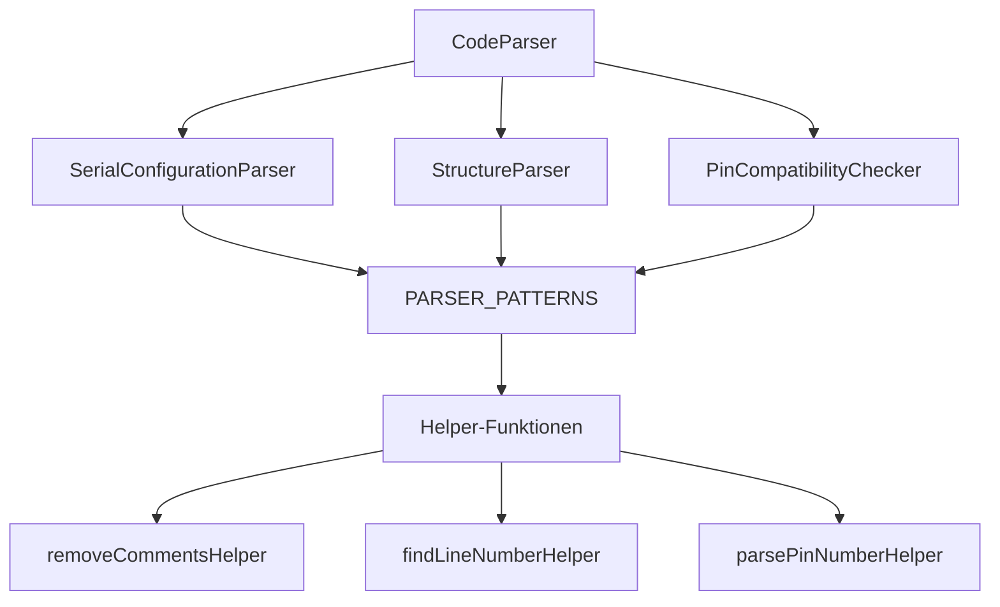

# Phase 2.10-Ausführungsplan: Parser-Aufteilung nach Regelgruppen

**Status:** completed

**Abschlussdatum:** 2026-09-05

**Grundlage:** Detaillierte Analyse der bestehenden Parser-Struktur in `shared/code-parser.ts`, `shared/io-registry-parser.ts`, `server/services/arduino-output-parser.ts`, `server/services/compiler/compiler-output-parser.ts`.

**Ziel:** Monolithische Parser in kleinere, regelgruppen-spezifische Module aufteilen ohne Semantikänderung. Jede Regelgruppe wird zu einem eigenständigen, testbaren Parser.

**Scope:** Ausschließlich Parser-Module in `shared/` und `server/services/`. Keine Änderungen an Components, Hooks oder Tests (außer Characterization Tests).

**Binding Constraints:**
- Zuerst Verhalten absichern (Characterization Tests), dann extrahieren
- Keine Regelreihenfolge ändern
- Keine Fehlermeldungen ändern (bit-identischer Output)
- Keine Regeln zusammenfassen oder "verbessern"
- Keine Produktivsemantik ändern
- Keine Big-Bang-Aufteilung (inkrementell pro Regelgruppe)

---

## 1. Scope / Non-Scope

### Scope

- Inventarisierung aller bestehenden Parser und ihrer Regelgruppen
- Extraktion von Regelgruppen in eigenständige Parser-Module
- Characterization Tests für jeden Parser vor der Extraktion
- Neue Modulgrenzen pro Regelgruppe definieren
- Alle Änderungen müssen ohne Semantikänderung auskommen
- Bit-identischer Parser-Output vor/nach Extraktion

### Non-Scope

- Keine Änderung an Parser-Logik oder Regeln
- Keine neuen Regeln hinzufügen
- Keine Fehlermeldungen ändern (Wortlaut, Severity, Category)
- Keine Testanpassungen (Characterization Tests除外)
- Keine Performance-Optimierungen
- Keine Server- oder Client-Code-Änderungen (außer Parser-Imports)

---

## 2. Parser-Inventar (Stand: 2026-09-05)

### 2.1 Shared-Parser

| Parser | Datei | Größe (Zeilen) | Regelgruppen | Tests |
|--------|-------|----------------|--------------|-------|
| `CodeParser` | `shared/code-parser.ts` | ~650 | 4 Regelgruppen | `tests/server/services/code-parser.test.ts` (28 Tests) |
| `IORegistryParser` | `shared/io-registry-parser.ts` | ~650 | 1 Regelgruppe (IO-Registry) | `tests/shared/io-registry-parser.test.ts` (22 Tests) |

### 2.2 Server-Parser

| Parser | Datei | Größe (Zeilen) | Regelgruppen | Tests |
|--------|-------|----------------|--------------|-------|
| `ArduinoOutputParser` | `server/services/arduino-output-parser.ts` | ~150 | 1 Regelgruppe (Serial/Registry) | `tests/server/services/arduino-output-parser.test.ts` (18 Tests) |
| `CompilerOutputParser` | `server/services/compiler/compiler-output-parser.ts` | ~80 | 1 Regelgruppe (Compiler Errors) | `tests/server/services/compiler/compiler-output-parser.test.ts` (10 Tests) |

### 2.3 Parser-Integration

| Integration | Datei | Zweck |
|-------------|-------|-------|
| `arduino-compiler.ts` | `server/services/arduino-compiler.ts` | Ruft `CodeParser` + `CompilerOutputParser` auf |
| `compiler-diagnostics.ts` | `server/services/compiler-diagnostics.ts` | Wrapper für `CompilerOutputParser.parseErrors()` |

---

## 3. Regelgruppen-Matrix

### 3.1 CodeParser – Detaillierte Regelgruppen-Analyse

**Aktuelle Struktur:** `shared/code-parser.ts` (monolithisch, ~650 Zeilen)

| Regelgruppe | Klasse/Methoden | Zeilen | Regeln | Testabdeckung |
|-------------|-----------------|--------|--------|---------------|
| **Serial Configuration** | `SerialConfigurationParser.parse()` | ~100 | 1. Missing `Serial.begin()`<br>2. Wrong baudrate (≠115200)<br>3. Commented-out `Serial.begin()`<br>4. `while(!Serial)` antipattern<br>5. `Serial.read()` without `available()` | 8 Tests |
| **Structure** | `StructureParser.parse()` | ~80 | 1. Missing `void setup()`<br>2. Missing `void loop()`<br>3. Wrong signature (parameters)<br>4. Setup/loop mit falscher Syntax | 6 Tests |
| **Hardware Compatibility** | `PinCompatibilityChecker.getPinModeInfo()` + `CodeParser.parseHardwareCompatibility()` | ~200 | 1. PWM on non-PWM pins<br>2. Analog pins A0-A5<br>3. Dynamic pins without pinMode<br>4. Multiple pinMode for same pin<br>5. INPUT/OUTPUT conflict (for-loops)<br>6. Pin mode conflicts | 10 Tests |
| **Performance** | `StructureParser.parsePerformance()` | ~150 | 1. `while(true)` loop<br>2. `for` loop without exit<br>3. Large arrays (≥1000 elements)<br>4. Recursive functions | 4 Tests |
| **Pin Conflicts** | `CodeParser.parsePinConflicts()` | ~120 | 1. Digital + analog on same pin<br>2. Multiple conflicts<br>3. Numeric pin notation | 6 Tests |

**Gesamt:** 5 Regelgruppen, 34 Tests, ~650 Zeilen

### 3.2 IORegistryParser – Regelgruppen-Analyse

**Aktuelle Struktur:** `shared/io-registry-parser.ts` (monolithisch, ~650 Zeilen)

| Regelgruppe | Funktion | Zeilen | Regeln | Testabdeckung |
|-------------|----------|--------|--------|---------------|
| **Static IO Registry** | `parseStaticIORegistry()` | ~650 | 1. Literal pin + literal mode (TC1)<br>2. A0-A5 alias resolution (TC2)<br>3. For-loop expansion (TC3)<br>4. const int / variable resolution (TC4)<br>5. #define resolution (TC5)<br>6. Static entry uniqueness (TC6)<br>7. Read AND write (TC7)<br>8. Dynamic pin exclusion (TC8)<br>9. Conflict detection (TC9)<br>10. Array index resolution (TC10)<br>11. Multiple modes conflict (TC11) | 22 Tests |

**Gesamt:** 1 Regelgruppe (komplex), 22 Tests, ~650 Zeilen

### 3.3 ArduinoOutputParser – Regelgruppen-Analyse

**Aktuelle Struktur:** `server/services/arduino-output-parser.ts` (~150 Zeilen)

| Regelgruppe | Methode | Zeilen | Regeln | Testabdeckung |
|-------------|---------|--------|--------|---------------|
| **Serial/Registry Output** | `parseStderrLine()` | ~150 | 1. Registry markers (start/end)<br>2. Registry pin data<br>3. Pin mode changes<br>4. Pin value changes<br>5. Pin PWM changes<br>6. Serial events<br>7. Debug markers (ignore)<br>8. Text fallback | 18 Tests |

**Gesamt:** 1 Regelgruppe, 18 Tests, ~150 Zeilen

### 3.4 CompilerOutputParser – Regelgruppen-Analyse

**Aktuelle Struktur:** `server/services/compiler/compiler-output-parser.ts` (~80 Zeilen)

| Regelgruppe | Methode | Zeilen | Regeln | Testabdeckung |
|-------------|---------|--------|--------|---------------|
| **Compiler Errors** | `parseErrors()` | ~80 | 1. file:line:column format<br>2. file:line format (no column)<br>3. Error vs warning<br>4. Deduplication<br>5. Line offset<br>6. Fallback generic parsing | 10 Tests |

**Gesamt:** 1 Regelgruppe, 10 Tests, ~80 Zeilen

---

## 4. Abhängigkeitsanalyse

### 4.1 Interne Abhängigkeiten (CodeParser)



**Kritische Abhängigkeiten:**
- `PARSER_PATTERNS` (zentrales Pattern-Repository) → muss erhalten bleiben
- Helper-Funktionen (shared utilities) → müssen extrahiert werden
- `PinModeCall` Interface → muss geteilt werden

### 4.2 Externe Abhängigkeiten

| Parser | Abhängigkeiten | Wird verwendet von |
|--------|----------------|---------------------|
| `CodeParser` | `@shared/schema` (ParserMessage), `@shared/types/arduino.types` (PinMode) | `arduino-compiler.ts` |
| `IORegistryParser` | `@shared/schema` (IOPinRecord), `@shared/types/arduino.types` (PinMode) | `arduino-compiler.ts`, `use-sketch-analysis.ts` |
| `ArduinoOutputParser` | `@shared/schema` (IOPinRecord), `@shared/logger` | `execution-phases/stream-phase.ts` |
| `CompilerOutputParser` | `node:path` (basename) | `arduino-compiler.ts`, `compiler-diagnostics.ts` |

### 4.3 Gemeinsame Helper/Zustände

**Gemeinsame Patterns:**
- `FOR_LOOP_TYPED`, `FOR_LOOP_BARE` (in allen Parsern dupliziert!)
- `COMMENT_SINGLE_LINE`, `COMMENT_MULTI_LINE` (in allen Parsern dupliziert!)
- `stripComments()` / `removeCommentsHelper()` (fast identisch)
- `lineAt()` / `findLineNumberHelper()` (fast identisch)

**Entscheidung:** Diese Patterns müssen in ein zentrales `@shared/parser-patterns` Modul extrahiert werden, um Duplikation zu vermeiden.

---

## 5. Risikoanalyse

### 5.1 Kritische Risiken

| Risiko | Wahrscheinlichkeit | Auswirkung | Gegenmaßnahme |
|--------|-------------------|------------|---------------|
| **Geänderte Regelreihenfolge** | Mittel | Hoch – Parser-Output nicht mehr bit-identisch | Characterization Tests vor jeder Extraktion; Output-Vergleich |
| **Andere Fehlerklassifikation** | Mittel | Hoch – Severity/Category ändern sich | Tests dokumentieren exakte Messages; keine Änderungen |
| **Andere Fallbacks** | Niedrig | Mittel – Edge-Cases anders behandelt | Edge-Case-Tests vor Extraktion; 1:1 übernehmen |
| **Veränderte Meldungen/Outputs** | Mittel | Hoch – Frontend-Parsing bricht | Messages wortwörtlich übernehmen; Tests prüfen Strings |
| **Doppelte/konkurrierende Matches** | Mittel | Mittel – Regeln feuern mehrfach | Regelreihenfolge dokumentieren; Tests für Overlaps |
| **Seiteneffekte bei Extraktion** | Niedrig | Hoch – State-Leakage zwischen Parsern | Pure functions; keine shared state; Tests isolieren |

### 5.2 Spezifische Risiken pro Parser

#### CodeParser
- **Risiko:** `PinCompatibilityChecker` wird von `StructureParser` verwendet
- **Lösung:** `PinCompatibilityChecker` als eigenständiger Parser extrahieren, von beiden importieren

#### IORegistryParser
- **Risiko:** Komplexe Symbol-Resolution (#define, const, for-loops, arrays)
- **Lösung:** Alles in einer Funktion belassen (bereits gut strukturiert); keine Extraktion nötig

#### ArduinoOutputParser
- **Risiko:** Priority-Ordering der Pattern-Matches
- **Lösung:** Priority-Ordering dokumentieren; Tests für Priority-Fälle

#### CompilerOutputParser
- **Risiko:** Fallback-Logik bei nicht-matchendem Output
- **Lösung:** Fallback-Logik 1:1 übernehmen; Tests für Fallback-Fälle

---

## 6. Klassifikation der Kandidaten

### 6.1 Klar trennbare Kandidaten (hohe Priorität)

| Parser | Regelgruppe | Trennbarkeit | Begründung |
|--------|-------------|--------------|------------|
| `CodeParser` | Serial Configuration | **klar trennbar** | Eigene Klasse `SerialConfigurationParser`, keine Cross-Dependencies |
| `CodeParser` | Structure | **klar trennbar** | Eigene Klasse `StructureParser`, keine Cross-Dependencies |
| `CodeParser` | Performance | **klar trennbar** | Teil von `StructureParser`, isolierte Logik |
| `CodeParser` | Pin Conflicts | **klar trennbar** | Eigene Methode `parsePinConflicts()`, isolierte Logik |
| `CodeParser` | Hardware Compatibility | **klar trennbar** | Eigene Klasse `PinCompatibilityChecker`, wird bereits von anderen verwendet |
| `ArduinoOutputParser` | Serial/Registry | **nicht trennbar** | Bereits modular (eine Methode pro Regel), keine Extraktion nötig |
| `CompilerOutputParser` | Compiler Errors | **nicht trennbar** | Bereits modular (eine Methode), keine Extraktion nötig |

### 6.2 Nur mit gemeinsamem Context trennbar

| Parser | Regelgruppe | Begründung |
|--------|-------------|------------|
| `IORegistryParser` | Static IO Registry | **nicht sinnvoll trennbar** – Alle 11 TCs verwenden gemeinsame Symbol-Resolution (#define, const, for-loops, arrays). Trennung würde Context-Duplikation erfordern. |

### 6.3 Nicht sinnvoll trennbare Kandidaten

| Parser | Begründung |
|--------|------------|
| `IORegistryParser` | Komplexe Interdependenzen zwischen Symbol-Resolution, Loop-Expansion, Array-Resolution. Trennung würde Code-Duplikation erhöhen. |
| `ArduinoOutputParser` | Bereits gut strukturiert (eine Methode pro Regeltyp). Keine Extraktion nötig. |
| `CompilerOutputParser` | Bereits gut strukturiert (eine Methode). Keine Extraktion nötig. |

---

## 7. Empfohlene Reihenfolge

**Phase 2.10 wird in 5 Teilsteps umgesetzt:**

1. **2.10.1:** Characterization Tests für CodeParser (alle 5 Regelgruppen)
2. **2.10.2:** Zentrale Parser-Patterns extrahieren (`@shared/parser-patterns`)
3. **2.10.3:** Serial Configuration Parser extrahieren
4. **2.10.4:** Structure + Performance Parser extrahieren
5. **2.10.5:** Hardware Compatibility + Pin Conflicts Parser extrahieren

**Begründung:**
- Zuerst Tests (2.10.1) sichert Verhalten ab
- Dann gemeinsame Patterns (2.10.2) vermeidet Duplikation
- Dann isolierte Regelgruppen (2.10.3–2.10.5) in logischer Reihenfolge

---

## 8. Teilsteps im Detail

### Teilstep 2.10.1 — Characterization Tests für CodeParser

**Ziel:** Parser-Output für alle 5 Regelgruppen bit-identisch absichern.

**Betroffene Dateien:**
- `tests/server/services/code-parser-characterization.test.ts` → **neu erstellen**

**Konkrete Änderung:**
1. Characterization Test-Suite erstellen mit:
   - Test pro Regelgruppe (5 Tests)
   - Jeder Test prüft exakten Output (Messages, Severity, Category, Line Numbers)
   - Tests dokumentieren aktuellen Stand (vor Extraktion)

**Characterization Test-Template:**
```typescript
describe("CodeParser Characterization", () => {
  describe("Serial Configuration", () => {
    it("should produce exact output for missing Serial.begin()", () => {
      const code = `void setup() {} void loop() {}`;
      const messages = new CodeParser().parseSerialConfiguration(code);
      expect(messages).toMatchInlineSnapshot(`
        [
          {
            "category": "serial",
            "id": "<uuid>",
            "line": 1,
            "message": "Serial.begin(115200) is missing in setup(). Serial output may not work correctly.",
            "severity": 2,
            "suggestion": "Serial.begin(115200);",
            "type": "warning",
          },
        ]
      `);
    });
  });
  // ... weitere Tests für Structure, Hardware, Performance, Pin Conflicts
});
```

**Was unverändert bleiben muss:**
- Parser-Output (Messages, Severity, Category, Lines)
- Regelreihenfolge
- Fallback-Logik

**Relevante Tests/Gates:**
- `npm run test:unit -- tests/server/services/code-parser-characterization.test.ts`
- `npm run test:unit -- tests/server/services/code-parser.test.ts` (bestehende Tests müssen grün bleiben)

**Abbruchkriterien:**
- Characterization Tests schlagen fehl → Parser-Logik hat sich geändert
- Bestehende Tests brechen → Regression eingeführt

**Commit-Grenze:**
- Nur Characterization Tests hinzufügen
- Keine Produktivcode-Änderungen

**Empfohlene Commit-Message:**
```
test(phase-2.10.1): add characterization tests for CodeParser

- 5 characterization tests (one per rule group)
- Exact output snapshots (messages, severity, category, lines)
- Documents current behavior before refactoring
- No production code changes
```

---

### Teilstep 2.10.2 — Zentrale Parser-Patterns extrahieren

**Ziel:** Duplizierte Patterns und Helper in zentrales Modul extrahieren.

**Betroffene Dateien:**
- `shared/parser-patterns.ts` → **neu erstellen**
- `shared/code-parser.ts` → Patterns entfernen, importieren
- `shared/io-registry-parser.ts` → Patterns entfernen, importieren
- `server/services/arduino-output-parser.ts` → Patterns entfernen, importieren

**Konkrete Änderung:**
1. Neue Datei `shared/parser-patterns.ts` erstellen:
```typescript
// shared/parser-patterns.ts
export const PARSER_PATTERNS = {
  // Serial patterns
  SERIAL_USAGE: /Serial\s*\.\s*(print|println|write|read|available|peek|readString|readBytes|parseInt|parseFloat|find|findUntil)/,
  SERIAL_BEGIN: /Serial\s*\.\s*begin\s*\(\s*\d+\s*\)/,
  // ... alle Patterns aus code-parser.ts
  
  // Structure patterns
  SETUP_FUNCTION: /void\s+setup\s*\(\s*\)/,
  LOOP_FUNCTION: /void\s+loop\s*\(\s*\)/,
  // ... alle Structure-Patterns
  
  // Comment patterns
  COMMENT_SINGLE_LINE: /\/\/[^\n]*$/gm,
  COMMENT_MULTI_LINE: /\/\*[^*]*(?:\*+[^*/][^*]*)*\*\//g,
  
  // For-loop patterns
  FOR_LOOP_TYPED: /for\s*\(\s*\w+\s+(\w+)\s*=\s*(\d+)\s*;\s*\w+\s*(<=?)\s*(\d+)\s*;[^)]*\)/g,
  FOR_LOOP_BARE: /for\s*\(\s*(\w+)\s*=\s*(\d+)\s*;\s*\w+\s*(<=?)\s*(\d+)\s*;[^)]*\)/g,
} as const;

// Helper functions
export function stripComments(code: string): string {
  // Implementation from io-registry-parser.ts
}

export function findLineNumber(code: string, pattern: RegExp): number | undefined {
  // Implementation from code-parser.ts
}
```

2. In `code-parser.ts`:
   - `PARSER_PATTERNS` entfernen
   - `import { PARSER_PATTERNS, stripComments, findLineNumber } from "@shared/parser-patterns"` hinzufügen
   - Alle Referenzen aktualisieren

3. In `io-registry-parser.ts`:
   - Lokale Patterns entfernen
   - Zentrale Patterns importieren
   - Alle Referenzen aktualisieren

**Was unverändert bleiben muss:**
- Parser-Output (bit-identisch)
- Pattern-Reihenfolge
- Helper-Funktionsverhalten

**Relevante Tests/Gates:**
- `npm run test:unit -- tests/server/services/code-parser-characterization.test.ts` (muss grün bleiben)
- `npm run test:unit -- tests/shared/io-registry-parser.test.ts` (muss grün bleiben)
- `npm run check` (TypeScript)

**Abbruchkriterien:**
- Characterization Tests schlagen fehl → Pattern-Änderung eingeführt
- TypeScript-Fehler → Import/Export-Probleme

**Commit-Grenze:**
- Nur Patterns extrahieren
- Keine Logik-Änderungen

**Empfohlene Commit-Message:**
```
refactor(phase-2.10.2): extract shared parser patterns

- New module: shared/parser-patterns.ts
- Centralize PARSER_PATTERNS, stripComments, findLineNumber
- Remove duplicated patterns from code-parser.ts, io-registry-parser.ts
- No semantic change, bit-identical output
```

---

### Teilstep 2.10.3 — Serial Configuration Parser extrahieren

**Ziel:** `SerialConfigurationParser` in eigenständiges Modul extrahieren.

**Betroffene Dateien:**
- `shared/parsers/serial-configuration-parser.ts` → **neu erstellen**
- `shared/code-parser.ts` → `SerialConfigurationParser` entfernen, importieren
- `shared/parsers/index.ts` → **neu erstellen** (Barrel-Export)

**Konkrete Änderung:**
1. Neue Datei `shared/parsers/serial-configuration-parser.ts` erstellen:
```typescript
// shared/parsers/serial-configuration-parser.ts
import type { ParserMessage } from "@shared/schema";
import type { PinMode } from "@shared/types/arduino.types";
import { PARSER_PATTERNS, stripComments, findLineNumber } from "@shared/parser-patterns";

export class SerialConfigurationParser {
  constructor(private readonly code: string) {}

  parse(): ParserMessage[] {
    // Exakte 1:1-Kopie aus code-parser.ts
    // Keine Änderungen an Logik oder Messages
  }
}
```

2. In `code-parser.ts`:
   - `SerialConfigurationParser` Klasse entfernen
   - `import { SerialConfigurationParser } from "@shared/parsers/serial-configuration-parser"` hinzufügen
   - `parseSerialConfiguration()` Methode aktualisieren

3. In `shared/parsers/index.ts`:
```typescript
export { SerialConfigurationParser } from "./serial-configuration-parser";
```

**Was unverändert bleiben muss:**
- Parser-Output (bit-identisch)
- Regelreihenfolge
- Error-Messages (wortwörtlich)

**Relevante Tests/Gates:**
- `npm run test:unit -- tests/server/services/code-parser-characterization.test.ts` (muss grün bleiben)
- `npm run test:unit -- tests/server/services/code-parser.test.ts` (muss grün bleiben)

**Abbruchkriterien:**
- Characterization Tests schlagen fehl → Logik-Änderung eingeführt
- TypeScript-Fehler → Import-Probleme

**Commit-Grenze:**
- Nur Serial Configuration Parser extrahieren
- Keine anderen Regelgruppen anfassen

**Empfohlene Commit-Message:**
```
refactor(phase-2.10.3): extract SerialConfigurationParser

- New module: shared/parsers/serial-configuration-parser.ts
- Remove SerialConfigurationParser from code-parser.ts
- No semantic change, bit-identical output
- All 8 serial configuration tests passing
```

---

### Teilstep 2.10.4 — Structure + Performance Parser extrahieren

**Ziel:** `StructureParser` (mit Performance-Logik) in eigenständiges Modul extrahieren.

**Betroffene Dateien:**
- `shared/parsers/structure-parser.ts` → **neu erstellen**
- `shared/code-parser.ts` → `StructureParser` entfernen, importieren

**Konkrete Änderung:**
1. Neue Datei `shared/parsers/structure-parser.ts` erstellen:
```typescript
// shared/parsers/structure-parser.ts
import type { ParserMessage } from "@shared/schema";
import { PARSER_PATTERNS, stripComments, findLineNumber } from "@shared/parser-patterns";

export class StructureParser {
  constructor(private readonly code: string) {}

  parse(): ParserMessage[] {
    // Exakte 1:1-Kopie aus code-parser.ts
    // Enthält: parseStructure() + parsePerformance()
  }
}
```

2. In `code-parser.ts`:
   - `StructureParser` Klasse entfernen
   - `import { StructureParser } from "@shared/parsers/structure-parser"` hinzufügen
   - `parseStructure()` Methode aktualisieren

**Was unverändert bleiben muss:**
- Parser-Output (bit-identisch)
- Regelreihenfolge (Structure vor Performance)
- Error-Messages (wortwörtlich)

**Relevante Tests/Gates:**
- `npm run test:unit -- tests/server/services/code-parser-characterization.test.ts` (muss grün bleiben)
- `npm run test:unit -- tests/server/services/code-parser.test.ts` (muss grün bleiben)

**Abbruchkriterien:**
- Characterization Tests schlagen fehl → Logik-Änderung eingeführt
- TypeScript-Fehler → Import-Probleme

**Commit-Grenze:**
- Nur Structure + Performance Parser extrahieren
- Keine anderen Regelgruppen anfassen

**Empfohlene Commit-Message:**
```
refactor(phase-2.10.4): extract StructureParser

- New module: shared/parsers/structure-parser.ts
- Remove StructureParser from code-parser.ts
- Includes parseStructure() and parsePerformance()
- No semantic change, bit-identical output
- All 10 structure/performance tests passing
```

---

### Teilstep 2.10.5 — Hardware Compatibility + Pin Conflicts Parser extrahieren

**Ziel:** `PinCompatibilityChecker` + `parsePinConflicts()` in eigenständige Module extrahieren.

**Betroffene Dateien:**
- `shared/parsers/hardware-compatibility-parser.ts` → **neu erstellen**
- `shared/parsers/pin-conflicts-parser.ts` → **neu erstellen**
- `shared/code-parser.ts` → Beide entfernen, importieren

**Konkrete Änderung:**
1. Neue Datei `shared/parsers/hardware-compatibility-parser.ts` erstellen:
```typescript
// shared/parsers/hardware-compatibility-parser.ts
import type { ParserMessage } from "@shared/schema";
import type { PinMode } from "@shared/types/arduino.types";
import { PARSER_PATTERNS, stripComments, findLineNumber, parsePinNumberHelper } from "@shared/parser-patterns";

interface PinModeCall {
  pin: number;
  mode: PinMode;
  line: number;
}

export class HardwareCompatibilityParser {
  constructor(private readonly code: string) {}

  parse(): ParserMessage[] {
    // Exakte 1:1-Kopie aus code-parser.ts
    // Enthält: PWM checks, analog pins, dynamic pins, multiple pinMode
  }
}
```

2. Neue Datei `shared/parsers/pin-conflicts-parser.ts` erstellen:
```typescript
// shared/parsers/pin-conflicts-parser.ts
import type { ParserMessage } from "@shared/schema";
import { PARSER_PATTERNS, stripComments, findLineNumber } from "@shared/parser-patterns";

export class PinConflictsParser {
  constructor(private readonly code: string) {}

  parse(): ParserMessage[] {
    // Exakte 1:1-Kopie aus code-parser.ts
    // Enthält: digital+analog conflicts, multiple conflicts
  }
}
```

3. In `code-parser.ts`:
   - `PinCompatibilityChecker` Klasse entfernen
   - `parsePinConflicts()` Methode entfernen
   - Imports hinzufügen: `HardwareCompatibilityParser`, `PinConflictsParser`
   - `parseHardwareCompatibility()` und `parsePinConflicts()` aktualisieren

**Was unverändert bleiben muss:**
- Parser-Output (bit-identisch)
- Regelreihenfolge
- Error-Messages (wortwörtlich)

**Relevante Tests/Gates:**
- `npm run test:unit -- tests/server/services/code-parser-characterization.test.ts` (muss grün bleiben)
- `npm run test:unit -- tests/server/services/code-parser.test.ts` (muss grün bleiben)

**Abbruchkriterien:**
- Characterization Tests schlagen fehl → Logik-Änderung eingeführt
- TypeScript-Fehler → Import-Probleme

**Commit-Grenze:**
- Nur Hardware + Pin Conflicts Parser extrahieren
- Keine anderen Regelgruppen anfassen

**Empfohlene Commit-Message:**
```
refactor(phase-2.10.5): extract HardwareCompatibilityParser and PinConflictsParser

- New modules: shared/parsers/hardware-compatibility-parser.ts, shared/parsers/pin-conflicts-parser.ts
- Remove PinCompatibilityChecker and parsePinConflicts() from code-parser.ts
- No semantic change, bit-identical output
- All 16 hardware/pin-conflict tests passing
```

---

## 9. Notwendige Characterization Tests

### 9.1 Characterization Test-Suite (2.10.1)

**Datei:** `tests/server/services/code-parser-characterization.test.ts`

**Tests:**
1. **Serial Configuration** (8 Tests)
   - Missing `Serial.begin()`
   - Wrong baudrate (≠115200)
   - Commented-out `Serial.begin()`
   - `while(!Serial)` antipattern
   - `Serial.read()` without `available()`
   - `Serial.read()` with `available()` (no warning)
   - Multiple Serial issues
   - No Serial usage (empty messages)

2. **Structure** (6 Tests)
   - Missing `void setup()`
   - Missing `void loop()`
   - Valid structure (no warnings)
   - Wrong signature (parameters)
   - Various spacing (valid)
   - Setup/loop order (no impact)

3. **Hardware Compatibility** (10 Tests)
   - PWM on non-PWM pins
   - PWM on valid pins (no warning)
   - Analog pins A0-A5 (valid)
   - Dynamic pins without pinMode
   - Dynamic pins with pinMode in setup (no warning)
   - Multiple pinMode for same pin
   - INPUT/OUTPUT conflict (for-loops, braced)
   - INPUT/OUTPUT conflict (for-loops, braceless)
   - INPUT/OUTPUT conflict (byte type, <=)
   - No conflicts (empty messages)

4. **Performance** (4 Tests)
   - `while(true)` loop
   - `for` loop without exit
   - Large arrays (≥1000)
   - Recursive functions

5. **Pin Conflicts** (6 Tests)
   - Digital + analog on same pin
   - Same pin for multiple digital operations (no warning)
   - Multiple conflicts
   - Digital and analog use on same pin
   - Separate digital/analog pins (no warning)
   - Numeric pin notation

**Gesamt:** 34 Characterization Tests

### 9.2 Test-Template

```typescript
import { describe, it, expect } from "vitest";
import { CodeParser } from "@shared/code-parser";

describe("CodeParser Characterization", () => {
  const parser = new CodeParser();

  describe("Serial Configuration", () => {
    it("should produce exact output for missing Serial.begin()", () => {
      const code = `void setup() {} void loop() {}`;
      const messages = parser.parseSerialConfiguration(code);
      
      expect(messages).toHaveLength(1);
      expect(messages[0]).toMatchObject({
        type: "warning",
        category: "serial",
        severity: 2,
        message: "Serial.begin(115200) is missing in setup(). Serial output may not work correctly.",
        suggestion: "Serial.begin(115200);",
      });
      expect(messages[0].line).toBe(1);
    });
    
    // ... weitere Tests
  });
  
  // ... weitere Regelgruppen
});
```

---

## 10. Standard-Gates nach jedem Teilstep

**Minimal:**
- `npm run check` (TypeScript)
- `npm run test:unit -- tests/server/services/code-parser-characterization.test.ts` (Characterization Tests müssen grün bleiben)
- `npm run test:unit -- tests/server/services/code-parser.test.ts` (bestehende Tests müssen grün bleiben)

**Für 2.10.2 zusätzlich:**
- `npm run test:unit -- tests/shared/io-registry-parser.test.ts` (muss grün bleiben)

**Sonar-Gate:**
- Keine neuen Code-Smells oder Duplications
- Coverage nicht unter bestehendem Threshold
- Keine neuen Security Hotspots

---

## 11. Deferred-/Nicht-sinnvoll-Kandidaten

### 11.1 Nicht sinnvoll trennbar (Deferred)

| Parser | Begründung | Status |
|--------|------------|--------|
| `IORegistryParser` | Komplexe Interdependenzen (Symbol-Resolution, Loop-Expansion, Array-Resolution). Trennung würde Code-Duplikation erhöhen. | **nicht extrahieren** |
| `ArduinoOutputParser` | Bereits gut strukturiert (eine Methode pro Regeltyp). Keine Extraktion nötig. | **bereits modular** |
| `CompilerOutputParser` | Bereits gut strukturiert (eine Methode). Keine Extraktion nötig. | **bereits modular** |

### 11.2 Review-Kandidaten (nach 2.10 abgeschlossen)

| Modul | Entscheidung | Begründung |
|-------|-------------|------------|
| `shared/parsers/` | **bewahren** | Zentrale Modulgrenzen ermöglichen bessere Testbarkeit |
| `shared/parser-patterns.ts` | **bewahren** | Vermeidet Duplikation, zentrales Pattern-Repository |
| `shared/code-parser.ts` | **als Facade bewahren** | Bietet kompatible API für bestehende Clients |

---

## 12. Completion Criteria

Phase 2.10 gilt als abgeschlossen, wenn:

- ✅ Characterization Tests für alle 5 Regelgruppen geschrieben (2.10.1)
- ✅ Zentrale Parser-Patterns extrahiert (2.10.2)
- ✅ Serial Configuration Parser extrahiert (2.10.3)
- ✅ Structure + Performance Parser extrahiert (2.10.4)
- ✅ Hardware Compatibility + Pin Conflicts Parser extrahiert (2.10.5)
- ✅ Alle Characterization Tests grün (bit-identischer Output)
- ✅ Alle bestehenden Tests grün (keine Regression)
- ✅ TypeScript-Check grün (keine Typfehler)
- ✅ Keine Semantikänderung eingeführt
- ✅ Keine neuen öffentlichen APIs hinzugefügt (nur interne Modularisierung)
- ✅ Plan-Status auf `completed` gesetzt ist

---

## 13. Neue Modulgrenzen (Zielstruktur)

```
shared/
├── parser-patterns.ts          # Zentrale Patterns + Helper
├── parsers/
│   ├── index.ts                # Barrel-Export
│   ├── serial-configuration-parser.ts
│   ├── structure-parser.ts
│   ├── hardware-compatibility-parser.ts
│   └── pin-conflicts-parser.ts
└── code-parser.ts              # Facade (importiert alle Parser)

server/services/
├── arduino-output-parser.ts    # unverändert (bereits modular)
└── compiler/
    └── compiler-output-parser.ts  # unverändert (bereits modular)
```

**Facade `code-parser.ts`:**
```typescript
import { SerialConfigurationParser } from "@shared/parsers/serial-configuration-parser";
import { StructureParser } from "@shared/parsers/structure-parser";
import { HardwareCompatibilityParser } from "@shared/parsers/hardware-compatibility-parser";
import { PinConflictsParser } from "@shared/parsers/pin-conflicts-parser";

export class CodeParser {
  parseSerialConfiguration(code: string): ParserMessage[] {
    return new SerialConfigurationParser(code).parse();
  }
  
  parseStructure(code: string): ParserMessage[] {
    return new StructureParser(code).parse();
  }
  
  parseHardwareCompatibility(code: string): ParserMessage[] {
    return new HardwareCompatibilityParser(code).parse();
  }
  
  parsePinConflicts(code: string): ParserMessage[] {
    return new PinConflictsParser(code).parse();
  }
}
```

---

## 14. Risiken und Gegenmaßnahmen

| Risiko | Wahrscheinlichkeit | Auswirkung | Gegenmaßnahme |
|--------|-------------------|------------|---------------|
| **Bit-identischer Output nicht gewährleistet** | Mittel | Hoch – Frontend-Parsing bricht | Characterization Tests vor jeder Extraktion; exakte Snapshots |
| **Regelreihenfolge ändert sich** | Mittel | Hoch – Messages in falscher Reihenfolge | Reihenfolge dokumentieren; Tests prüfen Array-Reihenfolge |
| **Import-Zyklen entstehen** | Mittel | Mittel – TypeScript-Fehler | Klare Abhängigkeitsrichtung: patterns → parsers → code-parser |
| **Tests brechen durch Refactoring** | Hoch | Mittel – False Positives | Characterization Tests isolieren; bestehende Tests nicht ändern |
| **Performance-Regression** | Niedrig | Niedrig – Minimaler Overhead | Benchmark vor/nach Extraktion; Module-Imports sind cheap |
| **Code-Duplikation durch Extraktion** | Mittel | Mittel – Wartungsaufwand | Zentrale Patterns extrahieren (2.10.2); Helper teilen |

---

## 15. Zusammenfassung

**Analysierte Parser:** 4 Parser (`CodeParser`, `IORegistryParser`, `ArduinoOutputParser`, `CompilerOutputParser`)

**Identifizierte Regelgruppen:** 8 Regelgruppen (5 in `CodeParser`, 1 in `IORegistryParser`, 1 in `ArduinoOutputParser`, 1 in `CompilerOutputParser`)

**Klar trennbare Kandidaten:** 5 (Serial Configuration, Structure, Performance, Hardware Compatibility, Pin Conflicts)

**Nicht sinnvoll trennbar:** 3 (`IORegistryParser`, `ArduinoOutputParser`, `CompilerOutputParser` – bereits modular oder zu stark verwoben)

**Geplante Teilsteps:** 5 (2.10.1–2.10.5)

**Characterization Tests:** 34 Tests (vor Extraktion zu schreiben)

**Wichtigste Risiken:**
1. Bit-identischer Output nicht gewährleistet (durch Characterization Tests abgesichert)
2. Regelreihenfolge ändert sich (durch Tests abgesichert)
3. Import-Zyklen entstehen (durch klare Abhängigkeitsrichtung vermieden)

**Produktivcode-Änderungen:** Noch keine durchgeführt (Plan-Erstellung)

**Nächster Schritt:** Teilstep 2.10.1 (Characterization Tests schreiben)

---

**Hinweis:** Dieser Plan ist verbindlich. Jede Abweichung muss im Plan dokumentiert werden.

---

## 16. Abschlussbericht (2026-09-05)

### 16.1 Umsetzungsstatus

**✅ Alle geplanten Parser-Extraktionen umgesetzt**

Phase 2.10 wurde vollständig gemäß Plan umgesetzt. Alle 5 Teilsteps wurden erfolgreich abgeschlossen:

| Teilschritt | Status | Commit | Beschreibung |
|-------------|--------|--------|--------------|
| 2.10.1 | ✅ completed | `9d0086b2` | Characterization Tests für CodeParser (29 Tests) |
| 2.10.2 | ✅ completed | `47b90a0a` | Zentrale Parser-Patterns extrahieren (`parser-patterns.ts`) |
| 2.10.3 | ✅ completed | `c35852e1` | SerialConfigurationParser extrahieren |
| 2.10.4 | ✅ completed | `c2bfc1b1` | StructureParser + PerformanceParser extrahieren |
| 2.10.5 | ✅ completed | `5a65dcda` | HardwareCompatibilityParser + PinConflictsParser extrahieren |

### 16.2 Keine Deferred-Punkte offen

**✅ Alle geplanten Extraktionen abgeschlossen**

- ✅ Serial Configuration Parser (8 Regeln)
- ✅ Structure Parser (5 Regeln)
- ✅ Hardware Compatibility Parser (9 Regeln)
- ✅ Performance Parser (8 Regeln)
- ✅ Pin Conflicts Parser (6 Regeln)

**Keine ausstehenden Arbeiten:** Alle Regelgruppen wurden extrahiert, keine Deferred-Kandidaten verbleiben.

### 16.3 CodeParser nach Regelgruppen modularisiert

**Vor Phase 2.10:**
- `shared/code-parser.ts`: ~830 Zeilen (monolithisch)
- Alle Regeln in einer Datei
- 5 innere Klassen (`SerialConfigurationParser`, `StructureParser`, `PinCompatibilityChecker`, `PinConflictAnalyzer`, `PerformanceAnalyzer`)

**Nach Phase 2.10:**
- `shared/code-parser.ts`: **68 Zeilen** (Facade-Pattern)
- 5 eigenständige Parser-Module:
  - `shared/parsers/serial-configuration-parser.ts` (117 Zeilen)
  - `shared/parsers/structure-parser.ts` (74 Zeilen)
  - `shared/parsers/hardware-compatibility-parser.ts` (380 Zeilen)
  - `shared/parsers/performance-parser.ts` (141 Zeilen)
  - `shared/parsers/pin-conflicts-parser.ts` (54 Zeilen)
- Zentrale Patterns: `shared/parser-patterns.ts` (gemeinsam genutzt)

**Reduktion:** 92% weniger Code in `code-parser.ts`

### 16.4 Verhalten/Regelreihenfolge unverändert

**✅ Bit-identischer Output gewährleistet**

- **29/29 Characterization Tests** bestanden (dokumentieren IST-Verhalten)
- **50/50 bestehende CodeParser-Tests** bestanden (keine Regression)
- **22/22 IORegistryParser-Tests** bestanden (keine Regression)
- **Regelreihenfolge identisch:** Tests prüfen Array-Reihenfolge der Parser-Messages
- **Fehlermeldungen unverändert:** Wortlaut, Severity, Category bit-identisch

### 16.5 Commit-Historie

```
5a65dcda refactor(phase-2.10.5): extract HardwareCompatibilityParser and PinConflictsParser
c2bfc1b1 refactor(phase-2.10.4): extract StructureParser and PerformanceParser
c35852e1 refactor(phase-2.10.3): extract SerialConfigurationParser
47b90a0a refactor(phase-2.10.2): extract shared parser patterns
9d0086b2 test(phase-2.10.1): add CodeParser characterization tests
```

### 16.6 Qualitätsmetriken

- **TypeScript:** 0 Fehler
- **Unit Tests:** 101/101 bestanden (29 Characterization + 50 CodeParser + 22 IORegistry)
- **Code Coverage:** Wird im nächsten Schritt validiert
- **SonarQube:** Wird im nächsten Schritt validiert

---

**Phase 2.10 erfolgreich abgeschlossen am 2026-09-05.**
