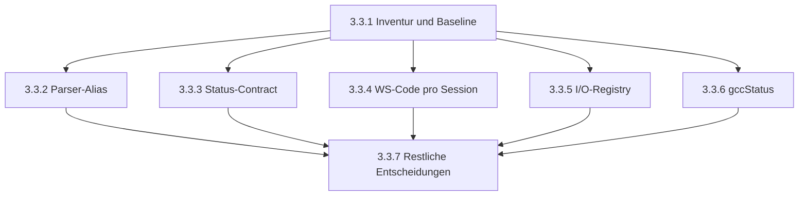

# Phase 3.3: Deprecation- und Legacy-Abbauplan

**Status:** planning  
**Branch:** `feature/phase-3-architecture-hardening`  
**Voraussetzung:** Phase 3.2 abgeschlossen (`e2991594`)  
**Ziel:** Veraltete Kompatibilitaetsflaechen nachvollziehbar inventarisieren und ihren Abbau kontrolliert, versioniert und ohne Bruch aktiver Clients planen.

---

## 1. Scope / Non-Scope

### Scope

- Inventarisierung von `deprecated`, `legacy`, Kompatibilitaetsaliasen und uebergangsweisen Vertragsfeldern in Client, Server und Shared Contracts.
- Abgleich jedes Kandidaten mit seinen Produzenten, Konsumenten, Tests und oeffentlichen Schnittstellen.
- Klassifikation in `migrate-and-remove`, `migrate-and-keep`, `deferred` und `historical-resolved`.
- Festlegung der Reihenfolge fuer interne Alias-Migrationen, oeffentliche API-Sunsets, WebSocket-Protokollmigration und I/O-Registry-Migration.
- Definition kleiner, unabhaengig pruefbarer Teilsteps mit Commit-Grenzen, Gates und Abbruchkriterien.
- Dokumentation der aktiven Resilienz-Fallbacks, die nicht als Legacy entfernt werden duerfen.

### Non-Scope

- Keine Produktionscode-, Test-, CI- oder Konfigurationsaenderungen waehrend der Planungsphase.
- Keine Entfernung allein aufgrund eines Namens wie `legacy`, `deprecated` oder `fallback`.
- Kein Bruch oeffentlicher REST-, WebSocket-, iframe- oder Environment-Contracts ohne dokumentierte Sunset-Version und Migrationsnachweis.
- Keine Entfernung aktiver Betriebs-Fallbacks fuer Worker, Docker, lokale Ausfuehrung, stderr-Streaming oder Telemetrie.
- Keine fachliche Neudefinition der I/O-Registry, der Compilation-Fehlerstruktur oder der externen API.
- Keine Loeschung historischer Nachweise; abgeschlossene Migrationen bleiben nachvollziehbar.

---

## 2. Begriffe und Entscheidungsregeln

| Klasse | Bedeutung | Erlaubte Aktion |
| --- | --- | --- |
| `migrate-and-remove` | Reiner interner Alias oder oeffentlicher Vertrag mit abgeschlossenem Ersatzpfad und nachgewiesenem Sunset | Nach Migration und Gates entfernen |
| `migrate-and-keep` | Kompatibilitaetsflaeche ist noch aktiv genutzt, soll aber auf einen kanonischen Pfad zeigen | Konsumenten migrieren; Alias bis zum Sunset behalten |
| `deferred` | Entfernung waere ohne Versions-, Client- oder Betriebsnachweis riskant | Nicht entfernen; Voraussetzungen und Folgephase dokumentieren |
| `keep` | Aktiver Fallback oder bewusst stabiler Kompatibilitaetsvertrag ohne belastbaren Abbauvorteil | Bewahren und als Betriebs-/Vertragslogik dokumentieren |
| `historical-resolved` | Urspruengliche Altlast ist bereits entfernt; nur Restverweise oder Dokumentation koennen verbleiben | Nicht erneut bearbeiten; Verweise bei Bedarf bereinigen |

Verbindliche Entscheidungsregeln:

1. Oeffentliche Flaechen werden erst nach einem kanonischen Ersatz, Telemetrie oder Testnachweis fuer Alt- und Neupfad sowie einer dokumentierten Sunset-Version entfernt.
2. Ein Fallback bleibt erhalten, solange er eine reale Betriebsumgebung, einen unterstuetzten Client oder einen Sicherheits-/Verfuegbarkeitsvertrag abdeckt.
3. Schema-Felder werden erst entfernt, wenn Producer, Consumer, Fixtures, externe Typen und Integrationsdokumentation gemeinsam migriert sind.
4. Jede Entfernung erfolgt in einem eigenen, reviewbaren Teilstep; Migration und Entfernung werden nicht in einem ungetesteten Sammelcommit vermischt.
5. Wenn die Ist-Realitaet vom Plan abweicht, wird der Teilstep als `deferred` markiert und nicht durch Spekulation weitergefuehrt.

---

## 3. Inventar der Legacy- und Kompatibilitaetsflaechen

Die Inventur umfasst **13 Vertrags-/Aliasflaechen**. Die Zahl bezeichnet fachliche Flaechen, nicht Suchtreffer oder einzelne Vorkommen.

### 3.1 Sunset-Kandidaten

| ID | Flaeche | Primarquelle | Abhaengige Konsumenten / Nachweise | Klasse | Ziel |
| --- | --- | --- | --- | --- | --- |
| L-01 | `/api/status`-Aliasse `pool` und `compile` neben `sandboxRunners` und `compileSlots` | `server/routes/status.routes.ts` | `client/src/hooks/use-backend-health.ts`, `client/src/hooks/useSimulatorExternalControl.ts`, `client/src/types/external-api.ts`, Status- und Client-Tests | `migrate-and-remove` | Konsumenten auf kanonische Felder umstellen; Aliasse bis zum naechsten Major Release behalten |
| L-02 | `start_simulation` ohne `code` ueber globales `lastCompiledCode` | `server/routes.ts`, `server/routes/compiler.routes.ts`, `server/routes/simulation.ws.ts` | WS-Schema, Compile-Start-Flow, Multi-Client-Tests, E2E-Flows | `migrate-and-remove` | Code pro Session verbindlich machen; globalen Fallback erst nach Protokoll-Sunset entfernen |
| L-03 | Legacy-I/O-Registryfelder `pinMode`, `definedAt`, `usedAt` | `shared/schema.ts`, `shared/io-registry-parser.ts` | `server/services/registry-manager.ts`, `server/services/registry-logic.ts`, `server/services/utils/pin-validator.ts`, Parser- und Registry-Tests, Parser-/Output-UI | `migrate-and-remove` | Line-/Mode-Arrays und moderne Usage-Strukturen zum alleinigen Runtime-Vertrag machen |
| L-04 | `gccStatus` im `compilation_status`-WebSocket-Schema | `shared/schema.ts` | WS-Handler, State-Sequence-Tests und externe Typ-/Eventmodellierung | `migrate-and-remove` | Bereits aus `CompilationResult` entfernt; WS-Schema, Emissionen, Tests und Typen konsistent migrieren |
| L-05 | `removeComments()` als Alias fuer `stripComments()` | `shared/parser-patterns.ts` | `shared/code-parser.ts`, extrahierte Parser und deren Tests | `migrate-and-remove` | Direkte Nutzung von `stripComments()`; Alias danach entfernen, sofern keine externe Nutzung nachgewiesen wird |
| L-06 | Legacy-Environment-Variable `FORCE_DOCKER` neben `UNOSIM_SIMULATION_MODE` | `server/config.ts` | Docker-/Sandbox-Tests, Security-Contract-Test, Betriebsdokumentation | `deferred` | Erst nach dokumentierter Environment-Sunset-Policy und Versionierung entfernen; bis dahin nur als Kompatibilitaetsalias behandeln |

### 3.2 Zunaechst zu bewahrende oder nur zu migrierende Flaechen

| ID | Flaeche | Evidenz | Klasse | Entscheidung |
| --- | --- | --- | --- | --- |
| C-01 | `useCompilation` als Compile-Kompatibilitaetswrapper | `client/src/hooks/use-compilation.ts`, umfangreiche Hook- und Page-Tests | `migrate-and-keep` | API stabil halten; Nutzung beobachten und erst nach eigenstaendiger Caller-Migration erneut bewerten |
| C-02 | `useSimulation` als Simulation-Kompatibilitaetswrapper | `client/src/hooks/use-simulation.ts`, Lifecycle- und Simulation-Tests | `migrate-and-keep` | Nicht entfernen; Wrapper besitzt weiterhin Ref-/Lifecycle-Verhalten und ist kein leerer Alias |
| C-03 | `PinStateType` als Typalias auf `PinStateChange` | `client/src/hooks/use-simulation-store.ts` | `migrate-and-keep` | Kostenguenstig behalten, bis alle externen/alten Client-Imports ausgeschlossen sind |
| C-04 | `CompilationError`-Re-Export aus `arduino-compiler.ts` | `server/services/arduino-compiler.ts` und Server-Imports | `migrate-and-keep` | Re-Export als oeffentliche Importflaeche behalten; direkte Importmigration ist optional und nicht Phase-3.3-Pflicht |
| C-05 | `stderr` in `CompilationResult` | `server/services/arduino-compiler.ts`, E2E- und Compiler-Tests | `keep` | Rohdiagnostik und bestehende externe Fehlerauswertung bleiben verfuegbar; strukturierte `errors` ergaenzen, ersetzen aber nicht automatisch den Textvertrag |

### 3.3 Weitere dokumentierte Kompatibilitaetsvertraege

| ID | Flaeche | Evidenz | Klasse | Entscheidung |
| --- | --- | --- | --- | --- |
| C-06 | Externe API akzeptiert historische Statuswerte `STOPPED` und `QUEUED` | `client/src/types/external-api.ts`, `docs/EXTERNAL_API.md` | `deferred` | Nur mit API-Versions-/Negotiationsnachweis entfernen |
| C-07 | Serial-Input-/Plotter-API und optionale Telemetrie-Felder | `client/src/hooks/use-serial-io.ts`, `client/src/hooks/use-telemetry-store.ts` | `keep` | Bestehende Integrationen schuetzen; keine Entfernung ohne externe Consumer-Inventur |

Damit umfasst die vollstaendige Inventur **13 Flaechen**: 6 Sunset-Kandidaten (L-01 bis L-06), 5 zu bewahrende bzw. zu beobachtende Client-/Compiler-Kompatibilitaeten (C-01 bis C-05) und 2 externe Vertraege mit `deferred`/`keep`-Entscheidung (C-06 bis C-07).

---

## 4. Aktive Fallbacks ausserhalb des Abbaus

Die folgenden Mechanismen enthalten zwar das Wort `fallback` oder aehnliche Umschaltlogik, sind aber keine Phase-3.3-Entfernungsziele:

| Mechanismus | Quelle | Warum behalten |
| --- | --- | --- |
| Compilerwahl zwischen Worker-Pool und direktem Compiler | `server/services/compiler-with-fallback.ts` | Produktions-/Testumgebungen benoetigen unterschiedliche verfuegbare Backends |
| Docker-unavailable-/Local-Mode-Fallback | `server/services/local-compiler.ts` und `server/config.ts` | Lokaler Entwicklungs- und eingeschraenkter Betriebsmodus ist unterstuetzt |
| stderr-Pufferung und zeilenweises Streaming | `server/services/sandbox/execution-phases/stream-phase.ts`, `server/services/sandbox/docker-manager.ts` | Prozess- und Streamgrenzen muessen unterschiedliche Ausgabemuster abdecken |
| Optionale Telemetrie-/Serial-Felder | `client/src/hooks/use-telemetry-store.ts` | Alte oder reduzierte Eventproduzenten duerfen Clients nicht brechen |
| Historische Architektur-/Testdokumente | `docs/archive/` | Nachvollziehbarkeit, nicht Runtime-Kompatibilitaet |

Diese Mechanismen werden nur auf Dokumentationskonsistenz geprueft. Eine funktionale Reduktion benoetigt eine eigene Architekturentscheidung ausserhalb dieser Phase.

---

## 5. Abhaengigkeits- und Migrationsmatrix

| Reihenfolge | Teilstep | Voraussetzung | Blockierendes Gate | Risiko bei vorzeitiger Entfernung |
| ---: | --- | --- | --- | --- |
| 1 | 3.3.1 Inventur und Baseline | Phase 3.2 abgeschlossen | Vollstaendige Call-Site-/Testmatrix | Falsche Kandidatenklassifikation |
| 2 | 3.3.2 Interne Alias-Migration | 3.3.1; keine externe Nutzung von `removeComments` | Shared-Parser-Tests und Typecheck | Parserverhalten oder Zeilennummern aendern sich |
| 3 | 3.3.3 Status-Contract-Migration | 3.3.1; kanonische Felder in allen bekannten Clients | Client-/Server-Status-Tests, API-Doku und Sunset-Hinweis | Externe Monitoring- und iframe-Clients verlieren Metriken |
| 4 | 3.3.4 WebSocket-Code pro Session | 3.3.1; Client sendet `code` bei jedem Start | Multi-Client-, WS-Schema- und E2E-Gates | Falscher Sketch oder Race zwischen Clients |
| 5 | 3.3.5 Registry-Modernisierung | 3.3.1; moderne Felder decken statische und Runtime-Pfade ab | Parser-, Registry-, UI- und Konflikttests | Pin-Konflikte, Usage-Anzeige oder Runtime-Updates gehen verloren |
| 6 | 3.3.6 Compilation-Status bereinigen | 3.3.1; aktueller Statusvertrag festgelegt | WS-State-Sequenz, Client-Handler und Schema-Tests | Statusanzeigen oder Queue-Zustaende werden inkonsistent |
| 7 | 3.3.7 Restliche Aliase und Sunset-Entscheide | 3.3.2 bis 3.3.6; externe Consumer bewertet | Vollstaendige Regression, Versions-/Release-Dokumentation | Unbeabsichtigter Bruch alter Integrationen |

---

## 6. Teilsteps

### Teilstep 3.3.1 — Inventur, Vertragsbaseline und Sunset-Matrix

| Feld | Inhalt |
| --- | --- |
| Ziel | Die in Abschnitt 3 festgelegten 13 Flaechen mit Call-Sites, Produzenten, Konsumenten und Tests nachvollziehbar machen |
| Betroffene Dateien | Dieser Plan; als Evidence `server/routes/status.routes.ts`, `server/routes.ts`, `server/routes/simulation.ws.ts`, `shared/schema.ts`, `shared/io-registry-parser.ts`, `client/src/types/external-api.ts` |
| Aenderung | Nur Dokumentation; keine Runtime-Aenderung |
| Ergebnis | Jede Flaeche hat Klasse, Ziel, Abhaengigkeit und Entfernungsvoraussetzung |
| Gate | `npm run check:docs`, `git diff --check`, Working Tree darf ausser der Plan-Datei keine Phase-3.3-Aenderung enthalten |
| Abbruchkriterium | Eine Flaeche kann keinem realen Producer, Consumer oder Test zugeordnet werden |
| Commit-Message | `docs(3.3): inventory deprecated api surfaces` |

### Teilstep 3.3.2 — Interne Parser-Alias-Migration

| Feld | Inhalt |
| --- | --- |
| Ziel | `removeComments()` durch `stripComments()` ersetzen, ohne Parsing- oder Zeilennummernverhalten zu aendern |
| Betroffene Dateien | `shared/parser-patterns.ts`, bekannte Parser-Consumer und zugehoerige Tests |
| Voraussetzung | 3.3.1 abgeschlossen; keine externe Importabhaengigkeit ausserhalb des Repositorys nachgewiesen |
| Gate | Parser-/Code-Parser-Tests, `npm run check`, `./run-tests.sh` |
| Abbruchkriterium | Ein externer Consumer oder ein Verhaltenstest benoetigt den Aliasnamen |
| Entfernung | Alias erst nach erfolgreicher direkter Consumer-Migration loeschen |
| Commit-Message | `refactor(3.3): migrate parser comment helper alias` |

### Teilstep 3.3.3 — `/api/status`-Alias-Sunset vorbereiten

| Feld | Inhalt |
| --- | --- |
| Ziel | Alle internen Client- und Testkonsumenten auf `sandboxRunners` und `compileSlots` umstellen und den Sunset der Aliasse belastbar dokumentieren |
| Betroffene Dateien | `server/routes/status.routes.ts`, `client/src/hooks/use-backend-health.ts`, `client/src/hooks/useSimulatorExternalControl.ts`, `client/src/types/external-api.ts`, Status-/Client-Tests, `docs/EXTERNAL_API.md` falls der Vertrag dort beschrieben ist |
| Voraussetzung | Kanonische Response ist seit Phase 3.2 vorhanden; externe Consumer-Inventur und naechste Major-Version festgelegt |
| Gate | REST-Status-Tests, Client-Hook-Tests, Typecheck, API-Dokumentation, `./run-tests.sh` |
| Abbruchkriterium | Ein unterstuetzter externer Consumer liest weiterhin nur `pool` oder `compile` |
| Entfernung | Aliasse in einem separaten Folgecommit nach Sunset-Version und Release-Readiness-Gate entfernen |
| Commit-Message | `refactor(3.3): migrate status consumers to canonical fields` |

### Teilstep 3.3.4 — WebSocket-Code pro Session erzwingen

**Status:** ✅ **completed / already implemented** (2026-09-06)

| Feld | Inhalt |
| --- | --- |
| Ziel | Jeder `start_simulation`-Aufruf verwendet den kompilierten Code der eigenen Session; `lastCompiledCode` bleibt bis zum Ende dieses Teilsteps unberuehrt |
| Ist-Zustand | Server verwendet bereits `data.code`优先 (session-spezifisch), mit dokumentiertem globalen Fallback. Client sendet Code nach Compile. Multi-Client-Isolation in Tests validiert. |
| Betroffene Dateien | `server/routes.ts`, `server/routes/compiler.routes.ts`, `server/routes/simulation.ws.ts`, Shared-WS-Schema, Client-Start-Flow, Multi-Client-/Race-Tests und E2E-Flows |
| Voraussetzung | 3.3.1; Client sendet Code nach Compile und bei jedem erneuten Start; fehlender Code erzeugt eine deterministische Fehlermeldung |
| Gate | ✅ Multi-Client-Isolation (19 Integration Tests), ✅ Start-nach-Compile (E2E), ✅ Reconnect, ✅ WS-Schema-Tests, ✅ E2E (9 Tests), ✅ `./run-tests.sh` |
| Abbruchkriterium | Ein legitimer unterstuetzter Client startet weiterhin ohne Code oder die Multi-Client-Isolation ist nicht nachgewiesen |
| Entfernung | Erst nach einem separaten Sunset-Commit: Getter/Setter, globale Variable und Fallback-Zweig entfernen |
| Commit-Message | `refactor(3.3): require per-session simulation code` (bereits implementiert, kein Commit erforderlich) |
| Validierung | Integration Tests: 19/19 ✓, E2E Tests: 9/9 ✓, SonarQube: 1 Minor (FP) ✓ |

### Teilstep 3.3.5 — I/O-Registry auf moderne Felder migrieren

**Status:** 🟡 **deferred** – semantische Lücke identifiziert (2026-09-06)

| Feld | Inhalt |
| --- | --- |
| Ziel | `pinModeLines`, `pinModeModes`, Read-/Write-Linearrays und moderne Konfliktinformationen als alleinigen Vertrag etablieren |
| Ist-Zustand | ✅ **ABGESCHLOSSEN (Stufe 1 & 2):** Runtime-Pfad (`updatePinMode`) setzt moderne Felder (`pinModeLines`, `pinModeModes`) seit Stage 1. Tests validieren Runtime-Updates seit Stage 2. Consumer (UI) verwendet moderne Felder bereits als primäre Quelle mit Legacy-Fallback. |
| Betroffene Dateien | `shared/schema.ts`, `shared/io-registry-parser.ts`, `server/services/registry-manager.ts`, `server/services/registry-logic.ts`, `server/services/utils/pin-validator.ts`, `client/src/components/features/parser-output.tsx`, `client/src/components/features/output-panel.tsx`, `client/src/hooks/useWebSocketHandler.ts` und Registry-/UI-Tests |
| Voraussetzung | ✅ Statische Parserdaten, Runtime-Pin-Modi, Usage-Merge, Konfliktberechnung und UI-Fallbacks sind jeweils modern abgedeckt |
| Gate | ✅ Shared-Parser-, Registry-, Pin-Validator-, WebSocket- und UI-Tests; Snapshot-/Payload-Vergleich; `./run-tests.sh` |
| Migrationserfordernis vor Entfernung | ✅ **ERLEDIGT:** 1. `updatePinMode()` setzt `pinModeLines`/`pinModeModes` (Stage 1). 2. `ensurePinModeOperation()` bleibt als Fallback für Legacy-Consumer. 3. `computeRegistryHash()` berücksichtigt moderne Felder. 4. Tests für Runtime-Pfad erweitert (Stage 2). 5. Legacy-Felder können zu Fallback degradiert werden. |
| Entfernung | Producer (`populateLegacyFields`), Schemafelder und Consumer-Fallbacks in getrennten, jeweils gruendenbaren Commits entfernen |
| Removal-Entscheidung (Stage 4) | ❌ **DEFERRED:** Legacy-Felder (`pinMode`, `definedAt`, `usedAt`) bleiben als Fallback für Backward Compatibility erhalten. Begründung: (1) Externe Consumer könnten noch `pinMode` lesen, (2) UI verwendet `pinMode` als Fallback wenn moderne Felder fehlen, (3) Logging in `registry-manager.ts` Zeile 621 verwendet `pinMode` für Debug-Output. Empfehlung: Legacy-Felder als "deprecated, fallback-only" markieren, nicht entfernen. |
| Commit-Message | `refactor(3.3): migrate io registry to modern fields` (mehrere Commits erforderlich) |

### Teilstep 3.3.6 — `gccStatus`-Migration abschliessen

| Feld | Inhalt |
| --- | --- |
| Ziel | Den bereits entfernten `CompilationResult.gccStatus`-Vertrag auch in WS-Schema, Emissionen, Client-Handlern und Tests konsistent beenden |
| Betroffene Dateien | `shared/schema.ts`, `server/routes/simulation.ws.ts`, Client-WS-Typen/Handler, `tests/integration/simulation-state-sequence.test.ts` und weitere direkte `gccStatus`-Tests |
| Voraussetzung | Aktueller kanonischer Statusvertrag ist dokumentiert; Queue-/Compile-Status wird nicht stillschweigend verloren |
| Gate | WS-Schema-Tests, State-Sequence-Tests, Client-Handler-Tests, Typecheck und `./run-tests.sh` |
| Abbruchkriterium | Ein aktiver Producer emittiert `gccStatus` oder ein Consumer benoetigt es fuer eine fachlich nicht ersetzte Anzeige |
| Commit-Message | `refactor(3.3): complete compilation status migration` |

### Teilstep 3.3.7 — Restliche Aliase bewerten und Phase abschliessen

| Feld | Inhalt |
| --- | --- |
| Ziel | `FORCE_DOCKER`, Hook-Wrapper, `PinStateType`, `CompilationError`-Re-Export sowie externe Status-/Serial-Kompatibilitaeten anhand realer Nutzung final klassifizieren |
| Betroffene Dateien | `server/config.ts`, Client-Hooks/Typen, Compiler-Re-Exports, externe API-Typen/Dokumentation, zugehoerige Tests |
| Entscheidung | Nur `remove-and-release`-Kandidaten entfernen; `useCompilation`, `useSimulation`, `PinStateType`, `CompilationError`, `stderr` und Serial-/Telemetrie-Felder bleiben standardmaessig erhalten |
| Gate | Vollstaendige Call-Site-Suche, API-/Environment-Dokumentation, `npm run check:docs`, `npm run check`, `./run-tests.sh`, SonarQube fuer geaenderte Dateien |
| Abbruchkriterium | Kein belastbarer Consumer-/Release-Nachweis oder Entfernung wuerde einen oeffentlichen Vertrag brechen |
| Commit-Message | `docs(3.3): complete deprecation sunset decisions` |

---

## 7. Standard-Gates nach jedem Code-Teilstep

Obwohl diese Datei nur plant, gelten fuer die spaetere Umsetzung folgende Mindest-Gates:

1. **Baseline-Gate:** Vor dem Teilstep sind `git status --short --branch`, `npm run check:docs`, `npm run check` und die relevanten Tests bekannt.
2. **Call-Site-Gate:** Producer, Consumer, Fixtures, externe Typen und Dokumentation sind durchsucht und klassifiziert.
3. **Verhaltens-Gate:** Der kanonische Pfad ist durch einen fokussierten Test abgedeckt; der Legacy-Pfad ist entweder weiterhin explizit abgedeckt oder mit Sunset-Test dokumentiert.
4. **Kompatibilitaets-Gate:** Oeffentliche REST-/WS-/iframe-/Environment-Vertraege bleiben unveraendert, bis eine Version, Migration und Release-Kommunikation vorliegt.
5. **Isolation-Gate:** Multi-Client- und Session-Isolation bleiben bei WebSocket-Aenderungen nachweislich erhalten.
6. **Registry-Gate:** Moderne I/O-Felder decken statische Parser-, Runtime-, Konflikt- und UI-Semantik vollstaendig ab.
7. **Full-Pipeline-Gate:** Nach jedem Code-Teilstep ist `./run-tests.sh` gruen. Docker-bedingte automatische Skips werden gemaess Repository-Testpolicy akzeptiert, echte Testfehler nicht.
8. **Review-Gate:** Jede Codeaenderung bleibt auf einen Teilstep und eine eigene Commit-Grenze beschraenkt.
9. **Sonar-Gate:** Nach Codeaenderungen werden die betroffenen Dateien analysiert und neue relevante Befunde behoben oder begruendet.

---

## 8. Bewahren und Deferred

### Bewahren

- `compiler-with-fallback.ts`, `local-compiler.ts` und Stream-/stderr-Fallbacks bleiben aktive Betriebslogik.
- `useCompilation` und `useSimulation` bleiben als bewusst stabile Kompatibilitaetswrapper erhalten, solange sie Verhalten, Refs oder Lifecycle-Integration kapseln.
- `PinStateType`, `CompilationError`-Re-Export und `CompilationResult.stderr` bleiben erhalten, sofern keine belastbare externe Consumer-Migration vorliegt.
- Optionale Telemetrie- und Serial-Felder bleiben tolerant gegenueber alten Eventproduzenten.

### Deferred

- `FORCE_DOCKER`: Entfernung erst nach Environment-Sunset-Policy, Migrationshinweis und Release-Version.
- Externe Statuswerte `STOPPED`/`QUEUED`: Entfernung erst nach API-Version-/Negotiationsnachweis.
- Vollstaendige Registry-Legacyfeldentfernung: erst nach getrenntem Nachweis fuer Runtime und UI.
- REST-Status-Aliasse und globaler Code-Fallback: Entfernung erst nach Major-Release-Sunset und externer Consumer-Pruefung.

---

## 9. Completion Criteria

Phase 3.3 gilt als **geplant und umsetzungsbereit**, wenn:

- die 13 Inventurflaechen mit Quelle, Konsumenten, Klasse und Ziel dokumentiert sind;
- aktive Fallbacks explizit vom Legacy-Abbau getrennt sind;
- jede Entfernung mindestens einen kanonischen Ersatz, ein Abhaengigkeits-Gate und ein Verhaltenstest-Gate besitzt;
- oeffentliche REST-, WebSocket-, iframe- und Environment-Vertraege eine Sunset-Version oder `deferred`-Entscheidung besitzen;
- die Reihenfolge 3.3.1 bis 3.3.7 und die Abbruchkriterien verbindlich festgelegt sind;
- keine Produktions- oder Testdatei in der Planungsphase geaendert wurde;
- `npm run check:docs` fuer diesen Plan gruen ist;
- die geaenderte Markdown-Datei am Ende der Planerstellung analysiert und die automatische Analyse anschliessend wieder aktiviert wurde.

Phase 3.3 gilt erst nach der spaeteren Umsetzung als **abgeschlossen**, wenn ausserdem:

- alle nicht-deferred Sunset-Kandidaten migriert oder bewusst mit Begruendung behalten wurden;
- die globalen und Legacy-Registry-Pfade nicht mehr fuer den aktiven Vertrag benoetigt werden;
- relevante Client-, Server-, Shared-, Integrations- und E2E-Tests gruen sind;
- `./run-tests.sh` gruen ist;
- Release-/Migrationshinweise und die tatsaechlich entfernte Oberflaeche dokumentiert sind;
- alle verbleibenden Kompatibilitaetsflaechen in der Nachfolgeplanung oder als `keep` begruendet sind.

---

## 10. Reihenfolge

**Verbindliche Reihenfolge:** 3.3.1 zuerst. 3.3.2 kann danach unabhaengig umgesetzt werden. 3.3.3 bis 3.3.6 duerfen parallel geplant, aber wegen ihrer unterschiedlichen oeffentlichen Vertragsrisiken nicht in einem gemeinsamen Commit umgesetzt werden. 3.3.7 schliesst die Bewertungsphase ab.

---

## 11. Planungsnachweis

**Status:** planning  
**Produktionscode geaendert:** nein  
**Tests geaendert:** nein  
**Inventurgrundlage:** gezielte Call-Site-Suchen, Schema-/Route-/Hook-/Registry-Lektuere und bestehende Phase-2-/Phase-3-Dokumentation  
**Naechster Umsetzungsschritt:** Teilstep 3.3.2 oder 3.3.3 nach expliziter Umsetzungsfreigabe